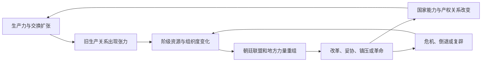

# 设计总纲：历史唯物主义、阶级斗争与长期博弈

## 1. 核心命题

玩家不是在真空中“点改革”，而是在既有生产方式、财政结构、组织技术和阶级力量的约束下，尝试重组国家与社会。每次改革都会重新分配收入、权利、暴力和晋升机会，从而制造受益者、受损者、结盟者与反扑者。

本 Mod 的核心循环是：

这不是单向进步条。任何阶段都可能形成稳定但有代价的均衡，也可能因战争、灾荒、财政崩溃、继承危机或组织创新跳入新的斗争阶段。

## 2. 玩法优先级

1. **可博弈**：重要决策至少存在两种可行路线，不能有永远正确的单选答案。
2. **长期反馈**：收益可以立即出现，但结构性代价应在数年内逐步暴露。
3. **力量可见**：玩家能够看到主要阶级、政治集团和制度的力量来源，而不是面对黑箱随机事件。
4. **非一边倒**：强势集团拥有资源，也会产生内部裂缝、腐败、代理成本和合法性负担。
5. **可抽象**：优先模拟关键矛盾，不逐户、逐县、逐商品计算。
6. **可实现**：所有变量必须能映射到 CK3 的人物、头衔、修正、变量、法律、契约、事件或界面。

## 3. 三层状态模型

为控制复杂度与性能，状态分为帝国层、区域层和人物/集团层。

### 3.1 帝国层

建议把以下指标存放在最高统治头衔或皇帝上，取值统一为 `0-100`，显示值与内部值分开：

| 指标 | 含义 | 主要用途 |
|---|---|---|
| 生产力 | 农业剩余、手工业、能源、工具、运输和知识的综合能力 | 决定可供分配的社会剩余和产业升级上限 |
| 商品化 | 土地、劳动力、产品和货币进入市场交换的程度 | 推动商人/雇佣劳动者成长，也放大价格与银流冲击 |
| 国家汲取能力 | 中央将社会剩余转化为稳定财政的能力 | 支撑常备军、赈济、工程、官僚和战争 |
| 行政穿透力 | 国家越过宗族、地主、包税和地方中介直接治理的能力 | 决定改革执行率与地方反弹形式 |
| 暴力集中度 | 朝廷对军队、武器、城防和治安的控制 | 决定政变、兵变、民变与革命的胜负环境 |
| 制度适配度 | 生产关系、财政制度和当前生产力之间的适配程度 | 过低时积累结构性危机，不等于单纯“落后” |
| 统治合法性 | 各阶级接受现有统治的总和 | 与皇权不同；可以出现皇帝强而制度失去社会支持 |
| 社会动员度 | 国家和社会组织人口、物资与舆论的能力 | 同时增强战争能力与反对派组织能力 |
| 危机压力 | 财政、战争、灾荒、物价、失业、继承等压力的合成 | 决定常态政治是否转入危机博弈 |

### 3.2 区域层

不为每个伯爵领维护完整经济模拟。将大明划为约 8-12 个“宏观区域”，或用少数关键总督区/法理头衔承载聚合变量：

- 农业剩余与土地集中；
- 城镇化与手工业密度；
- 商路/海贸接入；
- 灾荒与治安压力；
- 地方士绅控制；
- 军事化程度；
- 雇佣劳动比例；
- 区域政治激进度。

区域只在年度脉冲和重大事件中更新。普通县级地产继续用 CK3 建筑、发展度、控制力和修正表现，避免双重模拟。

### 3.3 人物与集团层

只有政治相关人物进入细算：皇帝、储君、阁臣、九卿、监察官、督抚、将领、党魁、巨商、宗藩领袖和危机中的民众领袖。

普通人物使用特质、关系、职位和少量缓存变量决定倾向，不做月度全体扫描。

## 4. 阶级不是标签，而是“资源组合”

人物或集团的阶级位置由其控制的资源决定，可以变化，也可以具有矛盾身份。建议至少抽象以下力量：

| 力量 | 核心资源 | 常见诉求 | 内部矛盾 |
|---|---|---|---|
| 皇室—宫廷集团 | 法统、诏令、内帑、近侍、任免权 | 扩大直接支配、维持宗室与宫廷 | 皇帝、外戚、宦官、宗室之间争夺内廷资源 |
| 官僚—士绅集团 | 科举资格、官职、土地、宗族、地方信息 | 维护身份特权和地方中介权 | 清流/实务、中央/地方、寒门/世家、党派竞争 |
| 勋贵—军功集团 | 世袭身份、军功、军队关系、庄田 | 军费、爵赏、世袭和军事自主 | 京营/边军、世袭/新贵、职业化/私人化 |
| 地主与宗族势力 | 地租、佃附、乡约、宗祠、基层暴力 | 低税、保佃、地方自治与司法影响 | 大地主和中小地主利益并不一致 |
| 商人—手工业主 | 货币、信用、物流、作坊和信息网络 | 财产安全、市场统一、融资和政策准入 | 官商、海商、行会、工场主之间竞争 |
| 城镇劳动者 | 技能、集体停工、城市网络 | 工价、粮价、就业和人身自由 | 熟练/非熟练、本地/流动劳动者分化 |
| 农民—佃户—军户 | 劳动、粮食、人数、地方共同体 | 生计、减租减税、土地和免役 | 自耕农、佃农、流民、军户诉求不同 |
| 边疆与属地集团 | 地方武力、贸易节点、身份与地缘 | 自治、贸易、承认、减轻征发 | 本地精英与普通民众、合作派与抵抗派冲突 |

阶级力量建议拆成四个维度，而不是一个总分：

`阶级力量 = 经济资源 × 组织度 × 政治入口 × 动员条件`

实现时不用直接相乘，可使用加权分与阈值，防止数值爆炸。四个维度允许出现“富而无权”“有官无财”“人数多但组织弱”“组织强但缺乏合法入口”等有趣局面。

## 5. 力量对比如何变化

### 5.1 年度更新

年度脉冲聚合以下变化：

- 建筑、发展度、贸易和战争改变经济资源；
- 科举、官职、学校、行会、军队和宗族改变组织度；
- 法律、契约、政体和皇权改变政治入口；
- 灾荒、物价、失业、征发和思想传播改变动员条件；
- 镇压会短期降低公开组织，长期可能提高激进度和地下组织；
- 妥协会降低即时危机，但可能承认对方的永久政治入口。

### 5.2 重大事件中的临时联盟

阶级不按预设阵营自动行动。每次危机计算议题联盟：

- 商人与皇权可能联合打击地方关卡，也可能因强制借款反目；
- 士绅可能支持限制宦官，也可能与宫廷共同镇压减租运动；
- 军功集团可能保卫王朝，也可能因欠饷和削藩发动兵变；
- 农民起事可能要求改朝换代，也可能只要求赈济、减税和返乡；
- 新产业主可能支持法治和市场，也可能依赖官营特许形成权贵资本。

### 5.3 强势集团的自限机制

任何集团过强都会触发新的内生问题：

- 宫廷过强：信息闭塞、诏令拥堵、官僚消极执行；
- 官僚过强：党争、程序否决、地方利益俘获；
- 军事集团过强：军头化、财政挟持、政变风险；
- 地主过强：税基流失、土地兼并、流民与消费不足；
- 商人资本过强：垄断、价格冲击、官商勾结、劳动冲突；
- 民众动员过强：多中心领导、供给困难、路线分裂与地方割据。

这保证“赢得斗争”只改变下一阶段的问题，不等于结束游戏。

## 6. 历史阶段模型

阶段由状态组合与阈值触发，不由年份硬切。初版阶段如下：

| 阶段 | 结构特征 | 主要矛盾 | 典型政治问题 |
|---|---|---|---|
| A. 财政—地租型农业帝国 | 农业税与役为主，官僚依赖地方中介 | 中央汲取与地方占有剩余的矛盾 | 清丈、役法、军饷、宗藩和地方隐匿 |
| B. 商业化与白银化 | 长途贸易、货币税和城市消费上升 | 货币收入与实物生计、市场扩张与旧身份制冲突 | 银荒、商税、海禁、矿税、粮价和债务 |
| C. 原工业化扩张 | 农村副业、手工业网络和包买制成长 | 工商业扩张与行会/身份/土地束缚冲突 | 工场、技术扩散、流动人口、官营与民营 |
| D. 工场资本与财政军事国家 | 集中生产、信用和常备军需求上升 | 新资本与旧特权、中央集权与社会动员冲突 | 国债、银行、军工、税制、产权和代表权 |
| E. 工业转型危机 | 机械化与能源体系突破，劳动关系重组 | 资本积累与劳动保障、国家建设与大众政治冲突 | 工人组织、失业、教育、城市治理和宪制 |
| F. 革命/反革命双重危机 | 旧合法性崩解，多种主权方案竞争 | 谁控制国家、土地、军队和生产资料 | 制宪、土地革命、军管、复辟、内战与联合政府 |

### 6.1 非线性规则

- 阶段可以并存：沿海进入 C，内陆仍处于 A；帝国显示“主导阶段 + 区域例外”。
- 阶段可以倒退：长期战争摧毁市场与生产力，但已产生的思想和组织经验不会完全清零。
- 制度可以混合：官营军工、商人承包和宗族劳动力可能共同存在。
- 不预设单一终点：宪政君主制、官僚国家资本主义、商人寡头制、农民革命政权、军政现代化或复辟体制都可形成可玩的暂时均衡。

### 6.2 阶段转移的判定框架

不使用一个“现代化进度条”。每次年度评估检查四类门槛：

1. **物质条件**：生产力、城市化、商品化、交通或能源；
2. **关系张力**：制度适配度下降、土地集中、劳动冲突、财政失配；
3. **组织条件**：某些阶级的组织度与政治入口；
4. **触发危机**：战争、财政违约、灾荒、继承危机或重大改革。

满足物质条件但缺乏组织条件，只会形成“被压抑的转型”；组织先行但物质条件不足，可能形成激进动员后治理失败。

## 7. 改革、革新与革命的区分

| 类型 | 主要手段 | 成功判据 | 固有风险 |
|---|---|---|---|
| 改革 | 在现有合法框架内调整税制、官制、军制和权利 | 提高制度适配度且维持联盟 | 被既得利益掏空、执行折损、成本后置 |
| 革新 | 引入新技术、组织、金融或传播方式 | 改变生产力或组织能力 | 新旧部门失衡、失业、债务、知识垄断 |
| 革命 | 改变主权归属、土地关系或生产资料控制 | 建立可持续的新国家能力和联盟 | 内战、供应崩溃、路线分裂、反革命 |
| 反革命/复辟 | 恢复或重组旧统治联盟 | 重新垄断暴力并恢复汲取 | 无法消除已变化的社会结构，只能选择性改造旧制度 |

革命不是“攒满革命点数按按钮”。它是多重危机下，旧制度无法容纳已经形成的阶级力量时出现的竞争性国家建构过程。

## 8. 非一边倒的重大事件博弈模板

每个重大事件至少包含：

1. **结构原因**：不是随机坏运气，而是之前的生产、财政、阶级和制度选择累积；
2. **公开议题**：玩家能理解各方争什么；
3. **隐藏底线**：集团愿意妥协到哪里，由利益和组织状态决定；
4. **三类工具**：让利/结盟、制度改革、强制镇压；
5. **反制窗口**：受损方有组织反扑的时间与方式；
6. **短期结果**：财政、秩序、官职与人物命运；
7. **长期沉淀**：阶级力量、政治入口、意识形态和制度先例；
8. **失败可玩性**：失败转入新局面，不直接用无提示的游戏结束代替。

## 9. 意识形态的物质基础

意识形态不应是凭空出现的“理念卡”。每种思潮由以下来源加权：

- 哪些阶级从中获益；
- 哪些传播网络承载它（书院、科举、宗族、军队、商路、城市社团）；
- 它如何解释现实危机；
- 它是否提供可执行的组织方案；
- 国家是吸纳、审查、改造还是镇压。

同一思想可以被不同力量改造。例如“经世”既可服务官僚强化国家，也可为商人争取统一市场；“民本”既可用于王朝自我修复，也可被激进力量解释为重新分配土地和政治权利。

## 10. CK3 实现原则（初版）

- 帝国指标：最高统治头衔或皇帝变量 + 可见修正；
- 阶级力量：全局/头衔变量保存聚合值，关键人物用特质、关系、职位和集团成员关系表达；
- 区域状态：少数宏观区域头衔变量或区域修正，不逐县做完整人口经济；
- 历史阶段：法律/政体标志 + 全局变量 + 游戏概念文本；
- 改革：决议或大型工程作为长期项目，事件和互动负责谈判、任命与反制；
- 组织：参考模组朋党关系、职位影响力、人物池与 GUI 的实现方式，但扩展为阶级和议题联盟；
- 更新频率：年度聚合、季度危机推进、事件驱动即时修正；禁止无条件的全人物月度扫描；
- 数值缓存：复杂公式集中在 `script_values` 和年度效果中，GUI 读取缓存结果；
- AI：用少量战略姿态决定路线，不让 AI 每次事件重新遍历全国状态。

这些选型将在本体与参考模组脚本核对后，写入正式技术规格。

## 11. 从《变身大明》借鉴与超越

### 可借鉴

- 流官系统把“官职”从装饰变为升迁、考课和退休的持续流程；
- 皇权系统把破坏制度惯例抽象成有成本的资源；
- 朋党系统用实际职务计算影响力，并通过阈值制造失衡状态；
- 科举、主考、门生、吏兵二部任命形成可操作的人事网络；
- 军功既有来源，也能兑换爵位、世券、恩荫和死后荣誉。

### 必须扩展

- 政治力量不能只来自官职，还要纳入土地、资本、军队、组织网络和大众动员；
- 朋党不能只做人物关系网，还要有议题、阶级基础、分裂和重组；
- 皇权不能等同于合法性、国家能力或暴力能力，四者必须分开；
- 经济不能只是金币和建筑加成，要通过少数聚合变量改变阶级力量和国家形态；
- 改革结果不能永久静态，要有执行、适应、规避、反扑和新矛盾。

## 12. 设计验收问题

任何新机制进入编码规格前，必须回答：

1. 它改变了谁控制的哪种资源？
2. 哪些阶级短期受益、长期受损，是否存在内部派别？
3. 玩家看到哪些信号后可以做出判断？
4. 至少有哪些两种可行路线和一种妥协路线？
5. 强势路线的内生代价是什么？
6. 失败会导向什么可玩的新状态？
7. AI 如何选择并执行？
8. 使用哪些 CK3 对象、触发器、效果和 UI？
9. 更新频率和最坏遍历规模是多少？
10. 能否复用本体/指定 DLC/参考模组资产，不新增 3D 依赖？
