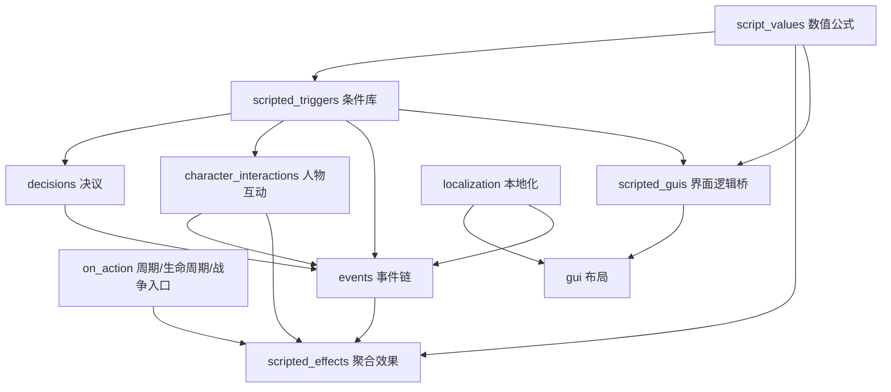

# 《变身大明》机制总览与源码导航

## 1. 分析范围与版本

- 参考模组：Steam Workshop `2713348525`，描述符名称因编码显示异常，实际为《变身大明》；
- 模组声明兼容版本：`1.19.0.6`；
- 当前脚本规模：437 个逻辑文本文件、约 46.2 万行、9015 个顶层脚本项、12098 个本地化键；
- 其中 30 个文件与 CK3 本体存在完全相同的相对路径，需要视作潜在覆盖；
- 作者附带《变身大明机制百科 2025.04.23》，共 34 页，主要明确流官、军功、皇权、朋党四个核心系统。

下表是第一轮“机制→源码”导航。**S2** 表示作者说明已确认但调用链仍需逐项追踪；**S1 初步** 表示源文件和入口已经定位，尚未完成全部条件/效果的语义复核。

## 2. 核心机制地图

| 机制簇 | 当前确认的玩法 | 主要 CK3 承载机制 | 关键源码入口 | 证据 |
|---|---|---|---|---|
| 流官官僚体系 | 入仕出身、文武宦官路线、品级、职衔、升迁、考课、贬谪、罢黜、致仕、追赠 | 宫廷职位、特质、人物记忆、变量、事件、人物互动、人物池 | `common/court_positions/types/liuguan_court_position.txt`；`common/traits/liuguan_traits.txt`；`common/scripted_effects/liuguan_effects.txt`；`common/scripted_triggers/liuguan_triggers.txt`；`events/liuguan_events.txt`；`events/shouguan_events.txt` | S2 + S1 初步 |
| 科举与官员入口 | 科举取士、主考、考试名次、进士/监生等出身、门生关系 | 决议、事件链、特质、关系、记忆、人物生成 | `events/keju_events.txt`；`events/guozijian_events.txt`；`common/decisions/liuguan_decision.txt`；`common/scripted_relations/99_yan_relations.txt` | S2 + S1 初步 |
| 考成与监察 | 京察、大计、军政考选、官员考核、弹劾与审办 | 周期事件、互动、职位、罪名、监禁/罢官效果 | `events/KaoKe_events.txt`；`events/GM_Tanhe_events.txt`；`events/xingbushenban_events.txt`；`common/character_interactions/Jinyiwei_interaction.txt`；`events/yanjinyiwei_events.txt` | S2 + S1 初步 |
| 中枢官制 | 内阁大学士、六部九卿、司礼监、锦衣卫及其他中央职位 | 宫廷职位、议会职位、GUI 窗口、脚本 GUI、任命互动 | `common/court_positions/types/99_yan_court_positions.txt`；`common/council_positions/01_ministry_positions.txt`；`gui/jiuqing_windows.gui`；`gui/neiting_windows.gui`；`gui/hanlinyuan_windows.gui` | S2 + S1 初步 |
| 皇权 | 皇帝破例干预的可消耗资源；受君主状态、君权、内阁、财政、九卿、属国、党派平衡影响 | 人物变量/修正、脚本数值、季度脉冲、互动和事件成本、人物界面 | `common/script_values/GM_core_value.txt`；`common/on_action/GM_value_on_action.txt`；`common/scripted_guis/GM_gui.txt`；`gui/GM_window_character.gui` | S2 + S1 初步 |
| 朋党 | 最多四党、党魁/党徒/中立派、职位影响力、失衡阈值、权臣、扶弱抑强 | 脚本关系、人物变量、周期效果、互动、事件、党魁 GUI | `common/scripted_effects/pengdang_effects.txt`；`events/GM_Pengdang_events.txt`；`common/character_interactions/Dangzheng_interactions.txt`；`common/on_action/GM_value_on_action.txt`；`gui/dangkui_windows.gui` | S2 + S1 初步 |
| 军功与勋贵 | 战斗、攻城、从征、镇守、运筹获得军功；兑换爵位、世券、恩荫、追赠 | 人物变量、战争 on_action、爵位互动、特质、事件 | `common/on_action/GM_liuguan_on_action.txt`；`common/scripted_effects/GM_war_effects.txty`；`common/character_interactions/99_yan_fengjue.txt`；`common/traits/gongchen.txt`；`gui/gongchen_windows.gui` | S2 + S1 初步 |
| 地方官与督抚 | 布政、镇戍、文武地方官、总督巡抚、署理/待升迁/阁臣出镇/军府出镇 | 政体、头衔称谓、官职、特质/修正、头衔互动 | `common/governments/99_yan_government_types.txt`；`common/flavorization/99_yan_title_holders.txt`；`events/shouguan_events.txt`；`events/tuiju_events.txt` | S2 + S1 初步 |
| 宗藩与勋爵 | 宗室待遇、晋封、迁徙、裁撤/设立藩国、爵位升降与世袭 | 人物互动、头衔、政府、继承法、修正 | `common/character_interactions/99_yan.txt`；`common/character_interactions/99_yan_fengjue.txt`；`events/yan_fengjue_events.txt`；`gui/zongfan_windows.gui`；`gui/xungui_windows.gui` | S1 初步 |
| 司法与特务 | 弹劾、刑部审办、锦衣卫、罪名、诏狱/处罚等 | 互动、事件、死亡原因、罪名变量、监禁与处刑 | `events/GM_Tanhe_events.txt`；`events/xingbushenban_events.txt`；`events/GM_zuiming_events.txt`；`common/character_interactions/Jinyiwei_interaction.txt`；`gui/zhaoyu_windows.gui` | S1 初步 |
| 官学与翰林 | 国子监/官学、翰林院、教育与选士相关界面 | 事件、GUI、脚本 GUI、职位 | `events/guozijian_events.txt`；`common/scripted_guis/guanxue_gui.txt`；`common/scripted_guis/hanlinyuan_gui.txt`；`gui/guanxue_hub.gui` | S1 初步 |
| 财政与部院工程 | 户部/内帑等财政状态、部院大型工程、建筑与中央项目 | 大型工程、建筑、修正、脚本数值、GUI | `common/great_projects/types/GM_ministry_projects.txt`；`common/great_projects/types/GM_great_project_types.txt`；`common/buildings/zz_yan_*.txt`；`gui/jiuqing_windows.gui` | S1 初步 |
| 贸易、药品与特殊商品 | 人物贸易/供给药品及其效果，可能含鸦片等内容 | 人物互动、事件、修正、死亡原因、好感 | `common/character_interactions/99_yan_maoyi.txt`；`events/yanmaoyi_events.txt`；`common/modifiers/yan_maoyi_modifiers.txt`；`common/traits/maoyi_traits.txt` | S1 初步 |
| 人口控制 | 独立决议、基础数值、周期入口与事件 | 决议、on_action、script_value、事件、本地化 | `common/decisions/GM_PopulationControl_Decisions.txt`；`common/script_values/GM_PopulationControl_basic_values.txt`；`common/on_action/GM_PopulationControl_on_actions.txt`；`events/GM_PopulationControl_Event.txt` | S1 初步 |
| 藩属国 | 属国契约、召集/内廷界面、外交与朝贡式关系 | 附庸契约、互动、GUI、宣战理由、修正 | `common/subject_contracts/contracts/GM.txty`；`common/character_interactions/FanShuGuo_interaction.txt`；`common/scripted_guis/shuguo_neiting_gui.txt`；`gui/fushuguo_windows.gui` | S1 初步 |
| 殖民地 | 设立/撤销殖民地、殖民地法律与政体、财富运回 | 政体、法律、互动、决议、称谓 | `common/governments/99_yan_zhimin_government_types.txt`；`common/laws/99_yan_zhimin_laws.txt`；`common/character_interactions/99_yan_zhimin.txt`；`common/decisions/99_yan_zhimin_decision.txt` | S1 初步 |
| 清与八旗 | 八旗政体/契约/数值/GUI、清相关宣战与事件 | 政体、附庸契约、脚本值、GUI、事件、特质 | `common/governments/99_yan_qing_government_types.txt`；`common/subject_contracts/contracts/baqi.txt`；`common/script_values/baqi_value.txt`；`common/scripted_guis/baqi_gui.txt`；`gui/baqi_hub.gui` | S1 初步 |
| 群友/召唤与特殊人物 | 特殊人物池、召唤、专属特质和界面 | 人物生成、人物池、特质、效果、GUI | `common/scripted_effects/qunyou_zhaohuan_effects.txt`；`common/pool_character_selectors/00_liuguan.txt`；`common/traits/qunyou.txt`；`gui/qunyou_hub.gui` | S1 初步 |
| 年号、庙号、谥号与字辈 | 年号管理、身后称号、宗族命名与字辈 | 动态本地化、特质、事件、GUI 输入 | `events/GM_Nianhao_events.txt`；`events/GM_Shihao_events.txt`；`common/traits/GM_miaohao_traits.txt`；`common/traits/GM_shihao_traits.txt`；`events/GM_zibei_events.txt` | S1 初步 |
| 生活方式与政治技能 | 自定义政治生活方式/重心/技能树 | lifestyle、focus、perk、GUI 覆盖 | `common/lifestyles/99_yan_lifestyles.txt`；`common/focuses/99_yan_lifestyle_focuses.txt`；`common/lifestyle_perks/00_politics_1_perks.txt`；`gui/window_character_lifestyle.gui` | S1 初步 |
| 文化、宗教与意识形态素材 | 华夏/满洲等文化、革新、白莲教等 | 文化、革新、宗教、特质、事件 | `common/culture/`；`common/religion/religion_types/bailianjiao.txt`；`common/traits/` | S1 初步 |
| 建筑、地产与大型工程 | 城市/城堡/关隘/紫禁城/兵仗局/制造局等 | 建筑、地产类型、特殊建筑、背景图、大型工程 | `common/buildings/`；`common/holdings/zz_yan_holdings.txt`；`common/great_projects/` | S1 初步 |
| 陆地与战争规则 | 自定义战争、靖难/属国/复兴等宣战理由和本体战争互动覆盖 | CB、互动、on_action、脚本规则 | `common/casus_belli_types/`；`common/character_interactions/00_war.txt`；`common/scripted_triggers/zz_war_and_peace_triggers.txt` | S1 初步，兼容风险高 |

## 3. 参考模组的基础架构

当前已确认的常见调用方向：

这一架构适合新 Mod 继续采用，但需要补充统一命名、变量所有权、缓存刷新和性能预算。

## 4. 当前已识别的高风险技术点

### 4.1 覆盖本体文件

已发现 30 个逻辑文件与本体路径完全相同，例如：

- `common/character_interactions/00_grant_titles_interaction.txt`；
- `common/character_interactions/00_war.txt`；
- `common/council_positions/00_council_positions.txt`；
- `common/factions/00_factions.txt`；
- `gui/window_character.gui`；
- `gui/window_council.gui`；
- `gui/window_inventory.gui`。

这类做法能实现深度定制，但容易与版本更新和其他大型 Mod 冲突。新项目应优先使用新增文件、scripted GUI 插槽、兼容补丁和最小覆盖；确需覆盖时，必须建立“本体版本基线 + 差异记录 + 回归测试”。

### 4.2 全人物扫描

`common/on_action/GM_value_on_action.txt` 已出现 `any_living_character` 与 `every_living_character`。这类逻辑若在季度/月度入口高频执行，规模会随存档人物数增长。后续会逐条统计入口频率、限制条件和最坏遍历规模，并给出缓存或角色池替代方案。

### 4.3 超大单文件

部分文件体积很大，例如 `common/character_interactions/99_yan.txt` 超过 7000 行。可运行不等于易维护。新项目应按稳定的机制边界拆分，并把公共条件/效果提取到脚本库。

### 4.4 GUI 深度覆盖

参考模组覆盖人物、议会、物品栏、生活方式等核心窗口。新项目会先评估是否可通过新增 hub、侧栏入口和 scripted GUI 达成，减少对核心 GUI 的直接覆盖。

## 5. 对新项目最有价值的实现样板

优先深挖顺序：

1. **朋党**：最接近“非战争内部博弈”，可扩展为阶级与议题联盟；
2. **流官/科举/考成**：提供政治精英再生产、晋升和清洗的完整管线；
3. **皇权**：可借鉴“破坏惯例需要资源”，但要拆分皇权、合法性、国家能力和暴力能力；
4. **军功**：展示事件行为如何积累为可兑换的政治资源；
5. **部院职位和大型工程**：适合承载改革项目及其执行者；
6. **属国/殖民/八旗契约**：可借鉴外围统治和差异化义务；
7. **GUI/脚本 GUI 桥**：借鉴信息呈现，不默认复制核心窗口覆盖策略。

## 6. 下一轮人工索引字段

每个机制条目最终都要补齐：

| 字段 | 含义 |
|---|---|
| 机制 ID | 策划和代码共同使用的稳定名称 |
| 玩家入口 | 决议、互动、界面、自动事件或职位行为 |
| 启动条件 | 完整触发器与前置状态 |
| 状态载体 | 变量、特质、修正、关系、头衔、法律或契约 |
| 调用链 | 入口 → 事件 → 效果 → 状态 → UI |
| AI 逻辑 | AI 是否可用、权重、目标选择与冷却 |
| 周期入口 | 月/季度/年度/战争/死亡/继承等 |
| 性能风险 | 遍历范围、随机列表、GUI 重算和缓存 |
| 覆盖风险 | 是否覆盖本体/DLC/其他 Mod 文件 |
| 可复用评级 | 直接复用、改造复用、仅借鉴、禁止复用 |
| 新项目映射 | 对应哪个阶级、历史阶段或改革机制 |

## 7. 尚未完成的核对

- 所有 on_action 的真实挂接关系与触发频率；
- 皇权、党派影响力和军功的具体变量名、公式与上下限；
- 流官授职、考课、升迁和退休的完整状态机；
- 所有 GUI 的 scripted GUI 调用与本体覆盖差异；
- 本体 1.19.0.3/1.19.0.6 文件差异和指定 DLC 的可用资产/接口；
- 参考模组中人口、贸易、殖民、银行/财政机制的实际完成度；
- AI 是否能完整使用主要系统以及哪些功能仅服务玩家。

这些项目会在后续分块文档中逐项从 **S1 初步** 提升为 **S1 - 脚本确认**。
