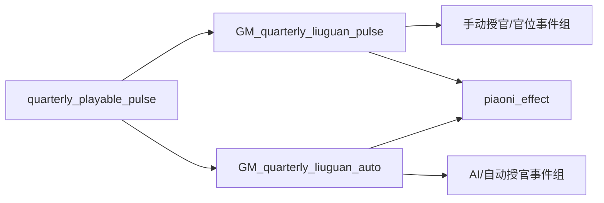
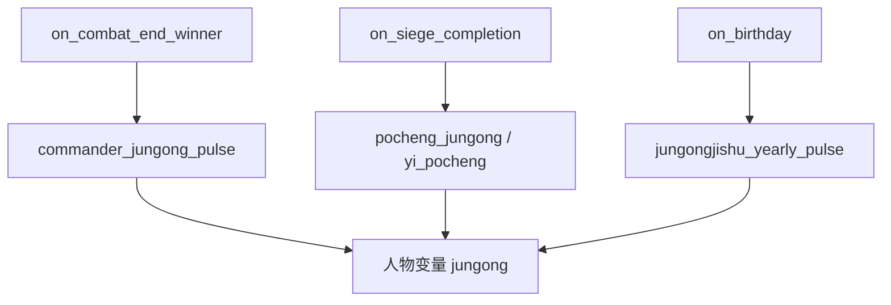
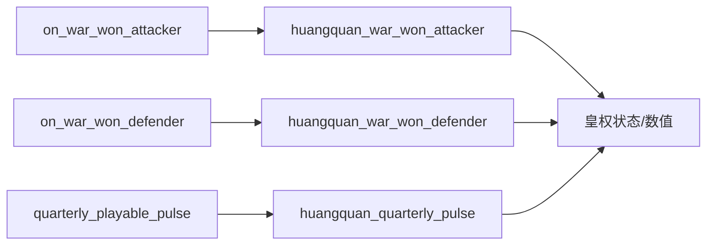

# 《变身大明》基础架构与触发入口

## 1. 结论先行

《变身大明》的逻辑不是围绕单一“总控制器”组织，而是使用 CK3 原生目录约定，将机制拆成以下层次：

1. 原生 `on_action` 接收季度、年度、生日、死亡、战争、头衔变化等入口；
2. 自定义 on_action/效果块先做精确条件过滤；
3. 事件、决议和人物互动承担玩家选择与叙事；
4. scripted trigger/effect/value 集中复用复杂条件、效果和公式；
5. 特质、修正、人物/全局变量、关系、职位、头衔、法律和契约保存状态；
6. scripted GUI 将脚本状态暴露给独立窗口或本体窗口覆盖；
7. 本地化提供动态称谓、概念说明和事件文本。

这是可运行的大型 CK3 Mod 常见架构，但当前项目存在高频入口过载、全人物扫描、本体核心文件覆盖、单文件过大和变量所有权不清等维护风险。新项目应借鉴“分层”，不照抄这些风险。

## 2. 模组描述符

`descriptor.mod` 声明：

- `supported_version="1.19.0.6"`；
- 标签包含 Events、Decisions、Character Interactions、Graphics；
- `remote_file_id="2713348525"`。

描述符没有声明显式依赖项。是否依赖用户所称《溥天之下》DLC/内容包，需要通过脚本中的 DLC 条件、资产路径和游戏实际加载测试继续核对，不能仅凭目录名推断。

## 3. 目录职责

| 目录 | 规模 | 架构职责 |
|---|---:|---|
| `common/` | 271 个文件 | 定义可复用规则对象、状态对象、数值、触发器、效果、互动、职位、政体等 |
| `events/` | 45 个文件 | 事件状态机、选择、叙事和 AI 选项 |
| `gui/` | 63 个文件 | 独立 hub、窗口、共享控件和本体窗口覆盖 |
| `localization/` | 58 个文件 | UI、事件、动态称谓和游戏概念文本 |
| `history/` | 1 个文件 | 历史初始化 |
| `map_data/` | 少量文本/大量地图资产 | 地图与地理表现 |
| `gfx/`、`fonts/`、`music/` | 3600 余文件 | 美术、字体和音频，不承担主要规则逻辑 |

精确文件、行数、顶层 ID 与本体路径冲突见 `01_参考模组源码文件索引.md` 和 `02_参考模组脚本ID定位索引.md`。

## 4. 原生入口总线

### 4.1 已使用的入口类型

第一轮脚本确认发现以下原生入口：

| 入口 | 典型用途 | 参考位置 |
|---|---|---|
| `quarterly_playable_pulse` | 流官补位、财政收支、皇权、宗藩、属国、摄政、职位修正 | `common/on_action/yan_on_action.txt:206`；`yan2_on_action.txt:30`；`yan3_on_action.txt:175` |
| `yearly_global_pulse` | 朋党随机事件、年号和少量全局修正 | `common/on_action/yan_on_action.txt:11` |
| `yearly_playable_pulse` | 人口控制入口 | `common/on_action/GM_PopulationControl_on_actions.txt:2` |
| `three_year_playable_pulse` | 大学士、宝物与废墟等低频事件 | `common/on_action/yan_on_action.txt:3`；`yan2_on_action.txt:2` |
| `on_birthday` | 官员考课、军功/功勋年计数、朋党补充、年号/字辈等 | `common/on_action/yan_on_action.txt:170`；`yan2_on_action.txt:65`；`yan3_on_action.txt:146` |
| `on_birthday_adulthood` | 取表字 | `common/on_action/yan3_on_action.txt:155` |
| `on_death` | 官职/爵位/党魁/大学士继承，丁忧，谥号，私产与家仆继承 | `common/on_action/yan_on_action.txt:102`；`yan2_on_action.txt:82`；`yan3_on_action.txt:90` |
| `on_title_gain/lost/destroyed` | 官位修正、年号、封地、退位、行朝 | `common/on_action/yan_on_action.txt:131`；`yan3_on_action.txt:108` |
| `on_war_started/on_join_war_as_secondary` | 战争封还、亲王/八旗参战 | `common/on_action/yan_on_action.txt:25` |
| `on_war_won_attacker/defender` | 皇权胜负变化 | `common/on_action/yan_on_action.txt:43` |
| `on_siege_completion` | 攻城军功池 | `common/on_action/yan_on_action.txt:57`；`yan2_on_action.txt:113` |
| `on_combat_end_winner/loser` | 主将/骑士军功、败将弹劾 | `common/on_action/yan_on_action.txt:64` |
| `on_marriage/on_divorce/on_birth_child` | 驸马、元配、王妃、嫡庶、宗室和籍贯 | `common/on_action/yan_on_action.txt:79`；`yan2_on_action.txt:98` |
| `on_join_court` | 京官/世袭武官身份修正 | `common/on_action/yan_on_action.txt:94` |
| `on_imprison/on_stress_level_3` | 特殊人物状态 | `common/on_action/yan3_on_action.txt:198` |
| `on_artifact_changed_owner/succession` | 世袭铁券等宝物继承 | `common/on_action/yan_on_action.txt:156` |

多个文件重复声明相同原生入口，说明项目依赖 CK3 对 on_action 定义的合并/加载行为。新项目若采用相同方式，必须以当前游戏版本实测加载次序，并避免不同模块用同一自定义 ID。

### 4.2 高频季度入口

`quarterly_playable_pulse` 是当前项目最繁忙的总线。已确认挂接内容包括：

- 流官手动/自动模块；
- 六科与盐法道职位维护；
- 皇权季度结算；
- 官位事件与错误修正；
- 国税、国库、缎匹、工料、军器、藏书、税粮收入和支出；
- 各项目支出；
- 高官置办田产；
- 宗藩、驸马、庶出与王府维护；
- 摄政开始/结束与政绩；
- 属国朝贡化/脱离；
- 朋党和大学士维护；
- 清廷官位冲突、AI 年号和流亡/无地主体修正。

问题不在“季度”本身，而在一个入口串联了大量互不相关的效果。每个效果即使有 trigger，也会产生条件检查成本和维护耦合。

### 4.3 生日作为年度人物入口

官员考课使用 `on_birthday` 而不是全体年度扫描，是一个值得借鉴的设计：每个人物在自己的生日被检查，负载自然分散到全年。

但当前生日入口挂接约二十项逻辑，除流官文官、武官、宦官考课外，还包含军功/功勋、巡按、党魁状态、籍贯、年号/字辈等。新项目应保留“生日分散更新”的思路，同时按人物类别建立更早的总触发过滤。

## 5. 典型调用链

### 5.1 手动与自动流官



脚本确认：

- 两条路径都要求 `Liuguan_Sys_switch = 1` 且角色为大明皇帝；
- 手动路径要求玩家且未开启 `Auto_tuiju`；
- 自动路径适用于 AI 或打开自动推举的角色；
- `global_var:Data_tuiju` 用作流程占用/互斥锁，防止新的授官流程与未结束流程重叠；
- 两条路径都延迟触发一组授官与官位事件，并调用票拟效果。

参考：`common/on_action/GM_liuguan_on_action.txt:2`、`:92`。

这是一个明确的“玩家交互模式/AI 自动模式双路径”样板，适合后续改革、预算、议会和危机系统复用。

### 5.2 文官考课

`on_birthday → liuguan_kaoke`。触发器先限制：

- 流官系统开启；
- 人物为非独立统治者；
- 使用三司制政体；
- 顶层领主是大明皇帝；
- 男性、未被囚禁；
- 当前没有全局推举流程占用。

效果再按县、府等头衔层级、官位特质 rank、年龄、丁忧与待升迁修正决定升迁、退休或继续任职。完整状态机将在流官专题中拆解。

参考：`common/on_action/GM_liuguan_on_action.txt:172`。

### 5.3 军功

军功至少有三条来源链：



已确认的具体规则：

- 胜方主将获得 2 军功；符合条件的参战骑士也会被遍历并加军功；
- 卫所官和五军相关职位按年获得从征/镇守/运筹军功；
- 年度增量按最高头衔级别约为 `0.25/0.5/1/1.5`，五军职位另有加成；
- 攻城建立 `jielue_jungongchi` 军功池，按县发展度和是否为公/王/帝国首府增加，再由后续逻辑分配。

参考：`common/on_action/GM_value_on_action.txt:29`、`:151`、`:246`；`common/on_action/yan2_on_action.txt:127`。

### 5.4 皇权



作者文档确认皇权用于支付违背惯例或臣子权利的皇帝特权；长期来源包括君主状态、君权、内阁、府库、九卿、属国和党派平衡，战争与科举/考核等事件产生短期变化。具体变量、公式和上下限仍待脚本追踪。

参考：`common/on_action/GM_value_on_action.txt:627`、`:669`、`:912`；作者说明书第 28-30 页。

### 5.5 人口控制

人口控制不是社会经济模拟，而是一个存档人物数量治理工具：

- `yearly_playable_pulse` 调用 `GM_Population_Control_effects`；
- 若启用全局开关且年度尚未执行，触发人口控制事件；
- 使用约 350 天的 `there_was_death` 全局变量防止同年多次触发；
- 预处理会检查年龄、家族成员、统治者亲属、继承顺位、玩家及其相关人物等豁免条件；
- 最终进入死亡筛选逻辑。

参考：`common/on_action/GM_PopulationControl_on_actions.txt:2`、`:8`、`:27`、`:161`。

此模块可以作为性能治理参考，但不能直接当作新项目的“人口阶级”系统。新项目的社会人口只做区域聚合，不用真实杀死人物代表人口变化。

## 6. 状态载体

### 6.1 人物变量

已确认示例：

- `jungong`：军功；
- `ren_qi`：巡盐御史等职位任期计数；
- `jielue_jungongchi`：攻城后的临时军功池；
- 其他官职、财政、朋党和皇权变量待数据字典汇总。

人物变量适合个人积累资源和短期流程状态。若需要跨继承延续，必须显式转移或改存头衔变量。

### 6.2 全局变量

已确认示例：

- `Data_tuiju`：推举/授官流程互斥状态；
- `there_was_death`：人口控制年度节流；
- 人口控制还使用多个临时全局变量保存年龄和家族计数。

临时计算使用全局变量容易发生并发污染。新项目应优先使用局部 saved scope、人物/头衔变量或明确的单实例流程锁，并给变量定义所有者、创建点、清理点和存档迁移规则。

### 6.3 特质与修正

参考模组大量使用：

- trait rank 表示官位品级；
- 特质表示出身、爵位、庙号、谥号、朋党/特殊身份；
- character modifier 表示待升迁、巡盐御史等可撤销状态；
- county modifier 和建筑表达地方经济/军事效果。

新项目中，频繁变化的连续数值不应做成大量特质；特质保留给玩家需要一眼识别、能进入人物叙事的离散身份。

### 6.4 关系、职位、头衔、法律和契约

- 朋党依赖 scripted relations 和党魁/党徒关系；
- 中枢机构通过 court/council position 实现；
- 地方官制和宗藩依赖政体、头衔与动态称谓；
- 属国、八旗和殖民地使用 subject contract/law/government；
- 大型工程与建筑承载长期项目和物质基础。

这些对象比纯变量更适合给玩家提供原生 UI 和 AI 语义，但定义和覆盖成本更高。

## 7. GUI 架构

### 7.1 独立机制窗口

已识别的独立 hub/窗口包括：八旗、官学、官衙、节略/军功、人物板、群友、刑赏、宗藩、勋贵、部院、内廷、翰林、功臣等。

`common/scripted_guis/*.txt` 负责 is_shown、按钮效果、列表数据和数值读取，`gui/*.gui` 负责布局与控件，`localization/*.yml` 负责文本。

### 7.2 本体窗口覆盖

模组直接覆盖或同路径提供以下核心窗口：

- `gui/window_character.gui`；
- `gui/window_council.gui`；
- `gui/window_inventory.gui`；
- `gui/window_character_lifestyle.gui`；
- `gui/window_army_select_commander.gui`；
- `gui/window_title_history.gui`；
- `gui/hud.gui`。

这使机制入口和信息能深度融入本体，但版本和兼容成本很高。新项目默认采用独立总面板 + 少量稳定入口，只有无法达成核心体验时才覆盖本体窗口。

## 8. 性能初判

| 模式 | 参考实例 | 风险 | 新项目规则 |
|---|---|---|---|
| 生日分散更新 | 流官考课、军功年计数 | 低至中，取决于入口前置过滤 | 推荐；首层 trigger 必须便宜且排除绝大多数人物 |
| 可玩角色季度更新 | 财政、皇权、宗藩、属国 | 中；每名可玩角色都会进入检查 | 只让最高目标统治者执行聚合结算 |
| `any_living_character` 后接 `every_living_character` | 盐法道任期 | 高；季度双重全人物扫描 | 改为保存职位持有者、角色池或从职位直接取 scope |
| 战斗遍历所有骑士 | 军功 | 中；事件驱动但大战频繁 | 可接受，需限制到参战方且避免重复复杂条件 |
| 攻城扫描 army/location | 军功池 | 中 | 缓存攻城主将/目标等级，避免同一效果多次重复 `any_army` |
| GUI 实时复杂条件 | 官职/多窗口 | 中至高 | GUI 只读缓存；复杂公式在季度/事件时刷新 |
| 年度人口清理 | 人物控制 | 高但低频 | 作为可选维护工具；与玩法模拟完全分离 |

## 9. 新项目的架构选型

### 9.1 推荐层次

```text
common/on_action/          只负责挂接和最便宜的首层过滤
common/scripted_triggers/  统一条件与状态判定
common/script_values/      公式和阈值，不产生副作用
common/scripted_effects/   原子效果、聚合刷新、状态转移
common/decisions/          长期项目和改革入口
common/character_interactions/ 人事、谈判、结盟、镇压入口
events/                    危机与多方博弈状态机
common/scripted_guis/      读取缓存、按钮合法性与执行桥
gui/                       总面板和专题页
localization/              概念、提示、动态文本
```

### 9.2 固定更新频率

- 年度：生产方式、阶级力量、历史阶段、区域聚合；
- 季度：正在进行的危机、改革项目、预算和联盟承诺；
- 月度：原则上不做全局模拟，只用于少数有时限的局部状态；
- 事件驱动：任免、战争、继承、法令、建筑完工和重大选择；
- GUI：只显示缓存，不负责模拟推进。

### 9.3 变量所有权

每个变量在编码规格中必须登记：

| 字段 | 要求 |
|---|---|
| 名称 | 统一项目前缀，禁止通用短名 |
| scope | 皇帝、帝国头衔、区域头衔、人物或全局 |
| 类型/范围 | 布尔、整数、定点数；合法上下限 |
| 创建点 | 初始化决议、开局事件或首次访问 |
| 修改点 | 允许哪些效果写入 |
| 读取点 | 哪些 GUI/trigger/value 使用 |
| 清理点 | 死亡、继承、项目结束、Mod 关闭或迁移 |
| 缓存周期 | 即时、季度或年度 |
| 存档迁移 | 版本升级时的缺省和转换规则 |

## 10. 下一步验证

1. 生成所有 on_action 的“原生入口→自定义块→事件/效果”机器辅助调用表；
2. 统计每个自定义块的遍历指令和触发频率，形成性能热区清单；
3. 为流官、皇权、朋党和军功建立完整变量/特质/关系数据字典；
4. 对 30 个本体同路径文件做差异归类：完整复制、局部改写、兼容补丁或纯覆盖；
5. 将 scripted GUI 与对应 GUI 控件配对，明确哪些数值已缓存、哪些实时计算；
6. 按 CK3 1.19 本体脚本实测合并语义和 DLC 门槛。
