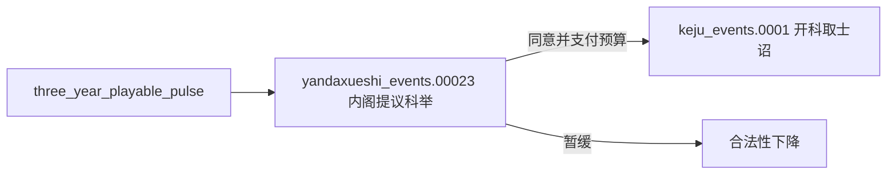
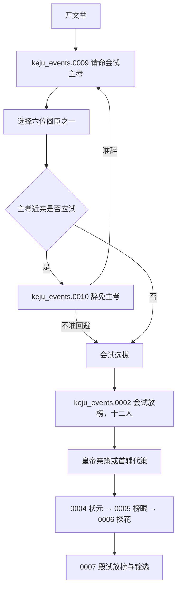
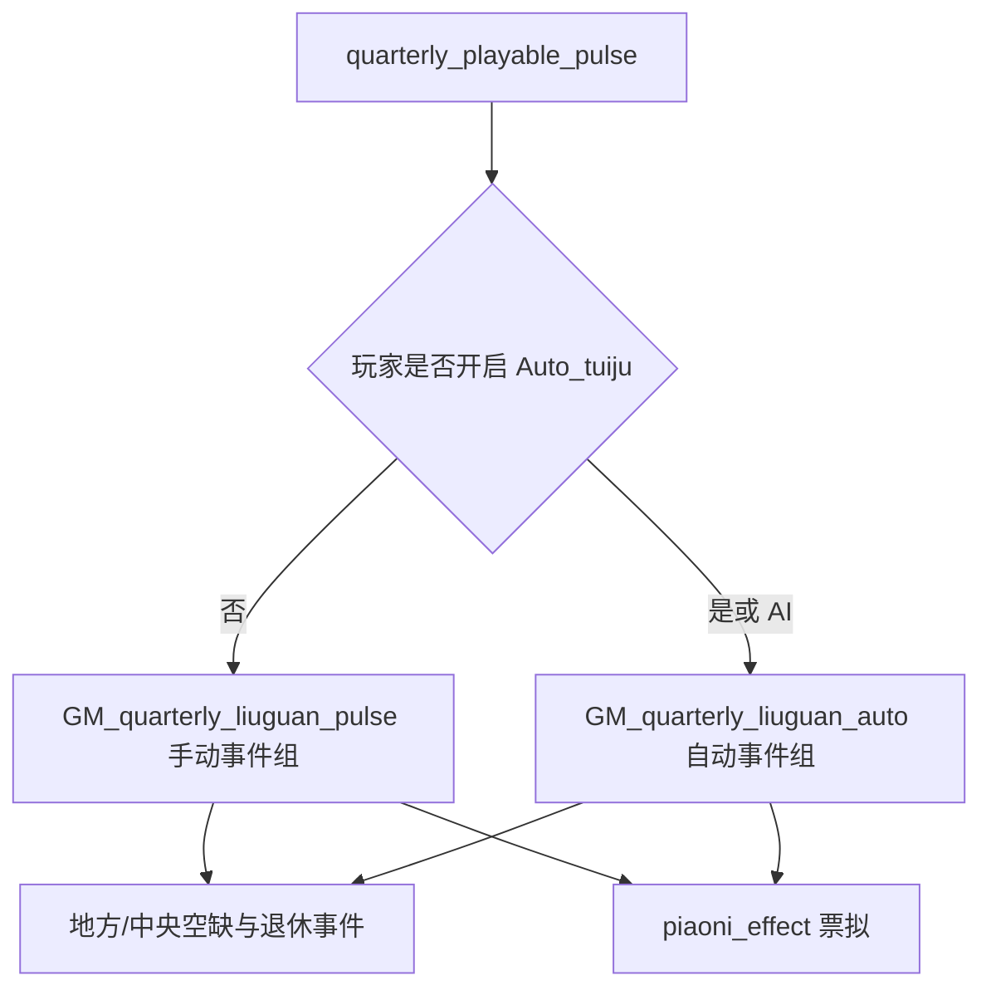
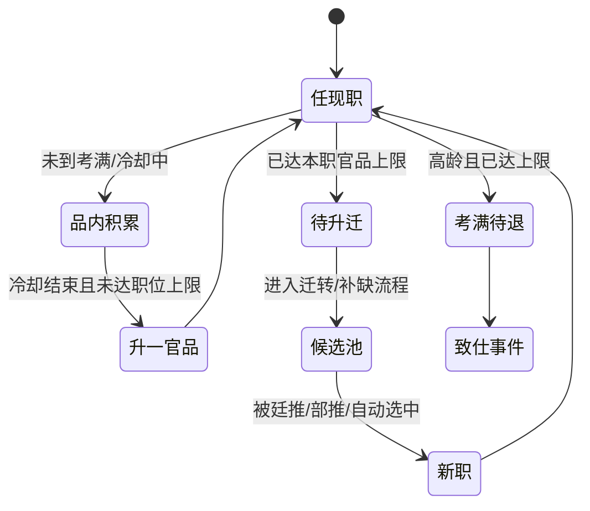

# 《变身大明》流官、科举、授官与考成系统

## 1. 系统定位

流官系统是《变身大明》把 CK3 封建人物关系改造成明代官僚政治的基础层。它负责：

- 谁能够进入统治集团；
- 官员属于文官、武官还是宦官路线；
- 官员具有何种出身、品级和实际职务；
- 空缺如何通过廷推、部推、特简或自动流程补充；
- 官员怎样考课、升品、迁转、降调、罢黜、丁忧、起复和致仕；
- 科举、门生、朋党和部院长官如何改变政治精英的再生产。

作者说明将其称为最基础、最核心机制。脚本验证支持这一判断：流官相关逻辑横跨特质、职位、人物记忆、脚本关系、数值公式、触发器、效果、决议、互动、on_action 和约 100 个直接相关事件。

## 2. 主要源码地图

| 层次 | 文件 | 用途 |
|---|---|---|
| 总开关 | `common/script_values/GM_core_value.txt:13` | `Liuguan_Sys_switch = 1`；关闭会禁用转迁、考课、科举、乞恩等流官功能 |
| 周期入口 | `common/on_action/GM_liuguan_on_action.txt` | 手动/自动授官、文武宦官考课、丁忧、继承、职位维护 |
| 等级与身份 | `common/traits/99_newtraits.txt:594`；`common/traits/liuguan_traits.txt` | 十八级官品；文武身份、科举/荐举/恩荫/监生出身、退休、丁忧等 |
| 实际职务 | `common/court_positions/types/liuguan_court_position.txt`；`common/court_positions/types/99_yan_court_positions.txt` | 巡盐、巡按、六科、翰林、司礼监、锦衣卫、六部九卿、五军都督府等 |
| 行政议会 | `common/council_positions/01_ministry_positions.txt` | 人事、司法、工程、军事等行政职位；与本体同路径，属覆盖风险 |
| 候选与公式 | `common/script_values/liuguan_values.txt` | 升迁、推荐、御史、主考、官序、候选人数、科举预算等分数 |
| 资格条件 | `common/scripted_triggers/liuguan_triggers.txt` | 文武官、不同层级、科举/举人/武进士、中央职位、实际职务等条件 |
| 原子效果 | `common/scripted_effects/liuguan_effects.txt` | 授品、迁转、降调、退休、丁忧、科举选拔、候选生成、履历写入 |
| 人物履历 | `common/character_memory_types/character_memories_liuguan.txt` | 品级、科举、爵位、九卿、大学士、五军、锦衣卫、丁忧等履历 |
| 玩家决议 | `common/decisions/liuguan_decision.txt:413` | 自动任免地方官、敕推阁臣等 |
| 人物互动 | `common/character_interactions/liuguan_interaction.txt` | 派御史、封爵、恩荫、廷推、军政考语等 |
| 科举事件 | `events/keju_events.txt`；`events/guozijian_events.txt` | 乡试、会试、殿试、武举、主考回避、藩属生员、入监 |
| 授官事件 | `events/shouguan_events.txt`；`events/tuiju_events.txt`；`events/liuguan_events.txt` | 廷推、部推、票拟、补官、外官迁转、升迁和举用贤才 |
| 考成事件 | `events/KaoKe_events.txt` | 京察大计与军政考选 |
| 退休事件 | `events/yanguanwei_events.txt` | 地方官和中央重臣乞休、准辞、留任与反复请辞 |

精确事件调用者和后继链见 `02A_参考模组全事件触发与调用索引.md`。

## 3. 官员数据模型

### 3.1 官品：十八级 trait group

模组把正一品至从九品定义为同一 `guanwei` trait group：

| group level | 官品 | group level | 官品 |
|---:|---|---:|---|
| 18 | 正一品 | 9 | 从五品 |
| 17 | 从一品 | 8 | 正六品 |
| 16 | 正二品 | 7 | 从六品 |
| 15 | 从二品 | 6 | 正七品 |
| 14 | 正三品 | 5 | 从七品 |
| 13 | 从三品 | 4 | 正八品 |
| 12 | 正四品 | 3 | 从八品 |
| 11 | 从四品 | 2 | 正九品 |
| 10 | 正五品 | 1 | 从九品 |

参考：`common/traits/99_newtraits.txt:594-1566`。

每个官品还能使用 trait `track` 保存品内积累。脚本以 `change_trait_rank` 升降官品，以 `GW_XP_Change` 修改品内经验。因此“升品”和“在本品积累考成”可以分开表现。

### 3.2 官身路线

| 路线 | 主要状态 | 典型作用 |
|---|---|---|
| 文官 | `wenguan` | 走科举、监生、荐举、恩荫和地方三司/中枢文职 |
| 武官 | `wuguan` trait group / 脚本中常以 `GP_wuguan` 判断 | 走武举、军功、卫所、五军和世袭武职 |
| 宦官 | `huanguan` | 独立考课，上限和中枢岗位不同 |

武官身份本身分级，`wuguan`、`wuguan_4`、`wuguan_3`、`wuguan_2`、`wuguan_1` 形成一组；文官是单一身份，再由官品与职务区分。

### 3.3 入仕出身

| 出身 | 状态 | 结构性优势 |
|---|---|---|
| 状元 | `jinshi_first` | 文官升迁基础分 +1000；主考等候选公式中最高 |
| 榜眼 | `jinshi_second` | +900 |
| 探花 | `jinshi_third` | +800 |
| 二甲进士 | `jinshi_erjia` | +600 |
| 三甲进士 | `jinshi_sanjia` | +400 |
| 国子监生 | `jiansheng` | +350 |
| 恩荫官 | `enyin_guan` | 文官 +300；武官公式中 +600 |
| 举人 | `juren` | +250，可参加会试 |
| 荐举官 | `jianju_guan` | 基础较低、升迁等待更长 |
| 武进士 | `wu_jinshi` | 武官升迁基础分 +1200 |
| 勋贵 | 流爵/世爵 trait group | 武官升迁约 +1100，并拥有军功—爵赏路径 |
| 世袭武官 | `GP_wuguan` 等 | 武官升迁约 +800 |

参考：`common/script_values/liuguan_values.txt:66-174`。

出身不是纯叙事标签，而是长期影响候选排序和升迁速度。它使科举成为统治阶级再生产机制，也产生明显的精英路径依赖。

### 3.4 实际职务与官品分离

模组没有把“官品”等同于“职位”。实际职权由多种 CK3 对象共同承载：

- 地方正官：有地头衔 + 三司制/卫所制等政体；
- 六部九卿：court position；
- 五军都督府：court position；
- 内阁大学士：scripted relation + 大学士 trait group；
- 巡按御史：由地方统治者雇佣的 court position；
- 京官/无土地官员：人物 flag、职位、动态称谓与廷臣身份；
- 监生、待升迁、降调、丁忧等临时状态：character modifier/flag；
- 官员任职史：character memory。

这种分离允许出现：品高职低、品低署理、兼衔、阁臣出镇、军府出镇和待升迁等情况。

### 3.5 履历

`character_memories_liuguan.txt` 有 17161 行，定义：

- 文武官每级官品履历；
- 革职、致仕、勒令致仕、丁忧、夺情、起复；
- 大量伯侯公爵位履历；
- 科举名次、举人、武举和国子监；
- 九卿、大学士、五军都督府、锦衣卫、巡按、六科；
- 实录纂修、攻城等功绩。

它让人物历史可读，但定义量和存档记忆量都很大。新项目只保存会改变后续政治权利或叙事的关键履历，不逐次记录所有常规考课。

## 4. 科举状态机

### 4.1 三年一次的内阁提议

入口：

触发条件包括：

- 流官系统启用；
- root 为大明皇帝；
- 至少有一名内阁大学士；
- 存在至少 12 名合格举人/生员候选；
- 候选位于大明政治范围，满足 `liuguan_juren_trigger` 等资格。

同意：支付 `keju_yusuan_value` 预算，30 日后开科，获得 240 正统性。暂缓：失去 120 正统性。AI 固定倾向同意。

参考：`events/yandaxueshi_events.txt:236-299`。

### 4.2 预算

`keju_yusuan_value` 遍历统治者的 `every_vassal_or_below`，每个至少伯爵级、使用三司制或卫所制的下属增加 2.3 预算。

参考：`common/script_values/liuguan_values.txt:1089-1101`。

这使考试成本随行政规模增长，但没有直接读取税收、人口或地区交通。玩法上简明，经济解释较弱。新项目建议：

`考试预算 = 基础成本 + 有效行政区数量 × 单区成本 × 腐败/交通修正`

并允许“压低预算”换取舞弊率、覆盖率或寒门录取率恶化，而不是只有举办/不举办。

### 4.3 文举与武举分流

`keju_events.0001` 提供文举和武举两条路线，结束后为皇帝设置 `kaishe_keju` 三年变量：

- 文举：各巡抚辖区进入乡试，同时中央进入会试主考选择；
- 武举：直接进入武试选拔链；
- 两条路线不是同一事件内同时举行，因此玩家在该轮会面对政治优先级选择。

参考：`events/keju_events.txt:3-77`。

### 4.4 乡试

每个巡抚级单位及中央分别触发隐藏的主考选择：

1. 尝试选择巡按作为监临官；
2. 按 `keju_zhukao_xiangshi_score` 排序主考候选；
3. 触发出题事件；
4. 主考从四份卷中选择；
5. 选出举人并写入考试/籍贯状态。

主考评分主要包括：

- 科举出身：状元 +1200，榜眼 +900，探花 +800，二甲 +600，三甲 +400，监生 +350，恩荫 +300，举人 +250；
- 学识：30/20/10 分别 +800/+400/+200；
- 提学官 +500；京官 +300；
- 与礼部尚书同党 +400；
- 玩家角色 +800；
- 高威望最高 +300。

参考：`common/script_values/liuguan_values.txt:770-910`。

该公式体现了“学术资格 + 行政位置 + 党派网络 + 声望”的共同作用，但给玩家固定 +800 会显著扭曲制度。新项目不应给玩家隐藏特权；若玩家要干预，应公开支付皇权、财政或政治承诺。

### 4.5 会试与殿试

主考从六名不同殿阁大学士中选择。主考亲属参加会试时会触发回避奏请，玩家可坚持任用或重新选择。由此产生程序公正与政治控制的选择。

会试使用 `keju_xuanba`：

- 清空临时/正式进士列表；
- `every_living_character` 扫描全部合格人物，加入候选列表；
- 从候选列表选择 12 人；
- 候选不足时创建新人物；
- 新人物基础属性较高，尤其学习可达 25-35；
- 殿试由玩家依次钦点状元、榜眼、探花，其余获得二/三甲路径；
- 通过 `clear_chushen_effect`、`zhuanqian_effect`、`memory_liuguan_level` 等清理旧身份、授予新出身并写入履历。

参考：`common/scripted_effects/liuguan_effects.txt:5031`；`events/keju_events.txt:392`、`:1809`、`:2444`、`:3163`、`:3894`。

### 4.6 会试资格

`liuguan_keju_trigger` 的主要条件：

- 成年、男性、非统治者、未被囚、55 岁以下、不在活动中；
- 大明范围内通常要求举人出身；
- 无官品或官品不高于正七品（rank ≤ 6）；
- 至少一项能力 ≥15；
- 排除皇族、已有中央职务/巡按/巡盐、丁忧、大学士、退休、罢黜、宗室、宦官、既有进士/武进士/恩荫/荐举身份、奴隶、驸马等；
- 根据主考信仰教义排除被视为通奸、鸡奸、乱伦、异端或食人者的候选；
- 藩属国若开放科举，可进入另一条资格路径。

参考：`common/scripted_triggers/liuguan_triggers.txt:1966-2129`。

### 4.7 社会流动的真实含义

该系统并非平均开放：

- 生员/监生/举人是前置门槛；
- 主考、礼部、阁臣和党派关系影响谁被看见；
- 一旦成为高名次进士，终身候选分显著领先；
- 科举把新人物吸收进官僚集团，但不会直接改变土地和财富分配；
- 主考—门生关系会给朋党提供未来成员。

因此它很适合作为“统治阶级吸纳与更新”模型，而不是简单的公平考试小游戏。

## 5. 其他入仕渠道

### 5.1 国子监与恩生

人物互动 `yinsheng_rujian` 触发 `guozijian_events.0001`，皇帝可准其入监或拒绝。准许后调用 `guozijian_shenxue_effect`，并通过隐藏事件继续学业/授官流程。

参考：`common/character_interactions/liuguan_interaction.txt:2578`；`events/guozijian_events.txt:3`；`common/scripted_effects/liuguan_effects.txt:979`。

### 5.2 恩荫

恩荫既是入仕渠道，也是高官把政治资本转给家族的制度。`shouguan_events.001` 系列包含：

1. 乞恩荫子；
2. 元辅分票；
3. 票拟批答；
4. 六科/程序封还。

这使恩荫不是点击即得，而是经过内阁和程序否决。

### 5.3 荐举、捐纳与吏员

- 荐举官拥有独立出身，升迁等待通常较长；
- `yanguanwei_events.001` 描述臣子试图捐纳，但静态扫描没有找到直接调用，可能是未接入内容；
- 吏员/杂流在作者说明中存在，脚本还通过 `liyuan` 等身份处理，但完整路线将在外围身份专题补充。

## 6. 授官与补缺

### 6.1 季度手动/自动双路径

两条路径都要求：

- `Liuguan_Sys_switch = 1`；
- root 为大明皇帝；
- 不存在 `global_var:Data_tuiju`。

`Data_tuiju` 是全局流程锁，用于避免多个授官/推举流程同时运行。玩家还可用 `NOT_Auto_tuiju_title_flag` 排除特定头衔的自动迁转。

参考：`common/on_action/GM_liuguan_on_action.txt:2`、`:92`；`common/character_interactions/liuguan_interaction.txt:3863`、`:3897`。

### 6.2 主要补官方式

| 方式 | 事件/入口 | 特征 |
|---|---|---|
| 自动地方官任免 | `liuguan_control` → `liuguan_events.020` | 玩家切换/指定自动迁转范围；AI 不使用该决议 |
| 廷推七卿 | `shouguan_events.002/003` | 阁议候选后交皇帝选择 |
| 廷推阁臣 | `tuiju_neige` → `shouguan_events.006/007` | 候选至少 3 人、内阁未满 6 人；AI 权重 1000 |
| 题补阁臣 | `shouguan_events.008` | 季度检查内阁空缺 |
| 部推 | `shouguan_events.013` | 吏部候选循环 |
| 推补科臣 | `shouguan_events.014` | 六科给事中 |
| 推补缇帅 | `shouguan_events.015` | 锦衣卫/缇帅 |
| 五军掌印 | `shouguan_events.018` | 五军都督府候选 |
| 御前廷推 | `tuiju_events.001` | 最终由皇帝从候选中选择 |
| 中旨/特简 | 多个人物互动与事件 | 跳过常规程序，但与皇权、封还和合法性相关 |

### 6.3 候选评分

`liuguan_shenqian_score` 组合：

- 入仕出身；
- 武官军功（`jungong × 10`）；
- 保举、待升迁、御史/给事中外转、回籍候调、丁忧起复；
- 京官身份和特旨起复；
- 与吏部/兵部尚书、六科和阁臣的朋党关系。

`liuguan_tuijian_score` 在升迁分上继续叠加：

- 与推荐人同党 +500；
- 朋友 +300，至交 +500；
- 仇敌 -300，死敌 -500；
- 推荐人直属下属 +300。

参考：`common/script_values/liuguan_values.txt:66-424`。

这使“人事权”成为可计算政治资源：掌握吏部、兵部和内阁不只是修正数字，而是实质改变同党升迁。

## 7. 考课与升迁状态机

### 7.1 生日分散更新

文官 `liuguan_kaoke`、武官 `wuguan_kaoke`、宦官 `huanguan_kaoke` 都挂在 `on_birthday`。每个人每年仅在生日处理一次，避免全体人物在同一天集中更新。

参考：`common/on_action/yan_on_action.txt:170`；`common/on_action/GM_liuguan_on_action.txt:172`、`:890`、`:1607`。

### 7.2 地方文官

流程抽象：

脚本使用：

- `kao_man` flag：考课冷却/考满窗口；
- `dai_shenqian` modifier：已达现职上限、等待迁转；
- `change_trait_rank`：直接升官品；
- `GW_XP_Change`：品内经验；
- `memory_liuguan_level`：记录升品履历；
- `shouguan_events.012`：显示晋品事件。

职位上限示例：

- 知县：正六品；
- 知州：正五品；
- 知府：正四品；
- 巡抚：正三品；
- 道员/兵备道：从二品；
- 具体总督、武职和兼衔另有条件。

参考：`common/on_action/GM_liuguan_on_action.txt:191-309`。

### 7.3 出身决定速度

地方文官每次升品后的考课冷却大致为：

| 出身 | 普通等待 | 与吏部尚书同党 |
|---|---|---|
| 进士 | 2-4 年 | 12-36 个月 |
| 举人/恩荫/监生 | 3-5 年 | 24-48 个月 |
| 荐举 | 4-6 年 | 36-60 个月 |
| 其他杂流 | 5-7 年 | 48-72 个月 |

参考：`common/on_action/GM_liuguan_on_action.txt:680-865`。

这直接模拟“正途/杂流”的晋升差距和朋党掌握吏部后的加速效果。

### 7.4 武官

武官使用相同骨架，但：

- 升迁上限按守备、游击、参将、副总兵等职位变化；
- 文官兼任军政职位和职业武官拥有不同上限；
- 武进士、勋贵、世袭武官和恩荫武官的等待不同；
- 与兵部尚书同党可缩短冷却；
- 军功进入升迁候选分。

例如最低层卫所职位中，文官可升至某一上限，武官可升至更高上限；武进士/进士/勋贵通常等待 2-4 年，同党时缩短为 12-36 个月。

参考：`common/on_action/GM_liuguan_on_action.txt:890-1604`。

### 7.5 宦官

宦官考课条件较简单：大明范围、成年男性、未被囚、拥有宦官 trait、官品低于正四品且无授官流程锁。每年生日有 33% 概率升一官品，最高正四品。

参考：`common/on_action/GM_liuguan_on_action.txt:1607-1639`。

### 7.6 退休与乞休

地方官达到职位上限且年龄较高后转入退休/迁转判断。作者说明给出的总体规则是地方官约 65 岁自动退休，中枢官约 70 岁上疏乞休；实际脚本在部分地方升迁标记中使用 `age >= 63` 预置考满状态，留出事件与替补时间。

退休事件提供：

- 准予致仕并补缺；
- 以地方多事、职任重要为由留任；
- 中枢重臣反复乞休；
- 赐金、驰驿与归乡谢恩；
- 留任可能积累新的政治与健康代价。

参考：`events/yanguanwei_events.txt`；`common/scripted_effects/liuguan_effects.txt:2488`。

### 7.7 丁忧、夺情与起复

父母死亡由 `on_death → Dingyou_on_action` 检查：

- 官员收到父母病故事件；
- 可回籍守制；
- 皇帝可夺情留任；
- 服除后起复；
- 升迁分分别对服除、守制和夺情给出不同加减值。

参考：`events/liuguan_events.txt:7442-7665`；`common/scripted_effects/liuguan_effects.txt:2637`、`:2744`；`common/script_values/liuguan_values.txt:229-251`。

## 8. 京察大计与军政考选

### 8.1 京察大计

入口为季度可玩角色脉冲中的 `kaoke_events.001`。主要链：

`京察大计 → 钦命主察 → 堂审具奏 → 遵例自陈/科道拾遗 → 处分或刑部审办 → 结束`

事件允许：

- 指定主察；
- 审查地方和中央官员；
- 罢黜、留任或移送刑部；
- 高级官员自陈；
- 科道官继续拾遗弹劾；
- 把考核变成党争清洗工具。

主要事件：`kaoke_events.001-.007`。

### 8.2 军政考选

主要链：

`军政考选 → 地方造册/自陈 → 兵部覆议 → 皇帝决定 → 处分`

主要事件：`kaoke_events.008-.013`。地方中低级武官通过册报和评分处理，高级武官进入自陈/兵部覆议链。皇帝横加干预会与兵部和制度惯例发生冲突。

### 8.3 玩法价值

考成系统把周期性“大清洗”变为多方博弈节点：主察人选、部院意见、党派关系、官员表现和皇帝干预共同决定结果。它比单纯年度效率修正更能制造政治故事。

## 9. 与朋党、皇权和阶级再生产的连接

### 9.1 朋党

- 主考选出的士子形成门生网络；
- 吏部/兵部尚书同党升迁更快；
- 推荐人与候选同党显著提高推荐分；
- 阁臣与六科可以支持或阻断人事案；
- 京察可扶弱抑强，也可被强党用于清洗。

科举和官员升迁因此不是中性人才系统，而是朋党政治影响力的长期生产线。

### 9.2 皇权

- 正常科举和考成强化统治正当性；
- 拒绝科举会直接损失正统性；
- 中旨、特简、拒绝自陈/退休等干预绕过程序，需要皇权或承受政治反弹；
- 皇帝可以改变个别人命运，但无法无成本控制整个官僚系统。

### 9.3 历史唯物主义解释

参考模组主要模拟统治阶级内部再生产。新项目需要再向下连接：

- 科举名额来自哪些地区和阶级；
- 教育成本、土地收入、商业财富怎样决定谁能成为生员；
- 国家扩张教育会削弱士绅垄断，还是扩大官僚供给过剩；
- 商人能否通过捐纳、书院和联姻转化经济资本；
- 官僚供给过剩是否形成清议、结社、地方自治或激进思想；
- 改革是否扩大寒门入口，同时制造旧士绅的反扑。

## 10. AI 行为

已确认：

- AI 皇帝走 `GM_quarterly_liuguan_auto`；
- 玩家开启 `Auto_tuiju` 后也走自动路径；
- 敕推阁臣决议 AI base 1000，并每 6 个月检查；
- 手动地方任免决议 AI base 0；
- 科举内阁提议中，AI 固定选择举办而非暂缓；
- 许多候选由分数排序或随机列表产生；
- 空缺填补事件对 AI 使用隐藏/自动分支。

问题：

- AI 对科举财政压力不做战略判断；
- AI 不会围绕党派平衡、官僚质量和地区代表性制定长期人事政策；
- 高权重自动补缺保障系统运转，但容易把政治选择退化为固定流程。

新项目应给 AI 设置少量稳定“用人路线”：技术官僚、党派平衡、宫廷亲信、军功优先、寒门扩张、地方妥协等，并让路线影响评分权重。

## 11. 性能与维护评估

### 11.1 主要热区

| 热区 | 当前实现 | 评估 |
|---|---|---|
| 会试候选 | `every_living_character` 扫描全部存活人物 | 三年一次尚可，但应先按大明范围建立候选池，避免全球扫描 |
| 乡试候选 | 地方廷臣 + `every_vassal_or_below` 下的廷臣 | 大国时昂贵；应按区域缓存生员/举人名单 |
| 季度补缺 | 两套流官事件组每季度检查大量空缺 | 可运行但事件噪声与 trigger 成本高；建议年度编制计划 + 事件驱动补缺 |
| 生日考课 | 每名人物按年执行 | 负载分散，设计优秀；首层条件仍应尽量便宜 |
| 人物记忆 | 17161 行定义、频繁写入 | 运行条件轻，但增加加载和存档历史体积；应只记录关键节点 |
| 全局流程锁 | `global_var:Data_tuiju` | 能防重入，但阻塞整个帝国；多个并行区域流程无法共存 |
| 本体覆盖 | council position 等与本体同路径 | 更新与兼容风险高 |

### 11.2 建议性能预算

- 三年科举：允许一次帝国级候选聚合，但目标人物上限建议 100-300；
- 区域乡试：每区域候选缓存上限 20-50；
- 季度补缺：只检查“编制空缺列表”，不遍历所有职位定义；
- 生日考课：只对拥有官身 trait 或官僚池 flag 的人物运行；
- 记忆：每人常规官品只保存首次入品、首次四品以上、入阁、九卿、致仕等关键节点；
- GUI：读取缓存候选与评分分解，不实时遍历全体官员。

## 12. 已发现的未接入或待核对内容

静态调用扫描没有找到以下事件的直接调用者：

- `keju_events.0014` 官员乞预会试；
- `keju_events.0015` 会试第一场；
- `liuguan_events.004`；
- `liuguan_events.035` 咨推将官；
- `tuiju_events.004`；
- `yanguanwei_events.001` 捐纳；
- `shouguan_events.016` 恭报大捷。

可能原因：尚未接入、通过动态/硬编码方式触发、旧内容遗留或静态扫描漏检。编码时不能把它们当作已运行机制，需实机日志或全文调用进一步验证。

## 13. 新项目的技术选型

### 13.1 保留

- 官品使用 ranked trait group；
- 品内资历使用 trait track 或单一变量；
- 实际职务与官品分离；
- 生日分散考课；
- 科举使用长期事件链，不做即时按钮；
- 正常程序与皇帝破例并存；
- 人事评分公开拆解为资格、能力、派系、地区和政策路线；
- 玩家与 AI 使用同一结果逻辑，只有交互层不同。

### 13.2 改造

- 用皇帝/帝国头衔保存一次考试流程，不使用通用全局临时变量；
- 候选按区域/阶级缓存，不扫描全球人物；
- 科举预算连接财政汲取能力、交通、教育覆盖和腐败；
- 党派加速必须产生公开政治债务，而不是隐藏缩短冷却；
- 官僚供给过剩、地域失衡和阶级封闭进入历史阶段模型；
- 记忆只记录关键履历；完整细节放在可缓存的官员档案界面。

### 13.3 新增

每次科举产生四个结构结果：

1. **官僚供给**：未来可填补职位的人数和能力；
2. **阶级开放度**：寒门、士绅、商人、军户等进入统治集团的比例；
3. **地区代表性**：录取区域分布及其政治后果；
4. **思想倾向**：主考、教材、危机与社会背景共同塑造新官僚的意识形态。

这些结果再反馈到朋党、改革执行、地方控制和历史阶段，而不是只生成一批高属性人物。

## 14. 可直接交给编码 AI 的边界

### MVP

- 18 级官品 trait group；
- 文官/武官/宦官三路线；
- 5-8 种入仕出身；
- 一套三年科举链；
- 地方与中枢职位空缺池；
- 生日考课与待升迁；
- 正常廷推和皇帝破例两条任命路径；
- 退休、丁忧、罢黜三种离职状态；
- AI 自动补缺；
- 总面板显示官僚供给、空缺、地区和阶级构成。

### 非 MVP

- 逐一复刻全部明代散官、勋官和数百条履历；
- 为每次常规升品建立独立事件；
- 同时实现全部六科、五军、翰林和地方杂职的专属玩法；
- 为每个县维护真实生员人口；
- 复制参考模组对本体人物/议会窗口的大规模覆盖。

### 验收条件

- 一轮科举从提议到放榜能完整结束并清理状态；
- 候选不足、阁臣不足、财政不足和皇帝未成年均有明确降级路径；
- AI 能举办考试、填补职位并处理退休；
- 同一职位不会重复任命；流程中断不会永久锁死；
- 官员死亡/继承后职务和官品状态能够正确清理；
- 科举和考课不进行季度全球人物扫描；
- 玩家能看见候选评分的主要来源与任命的政治后果。
