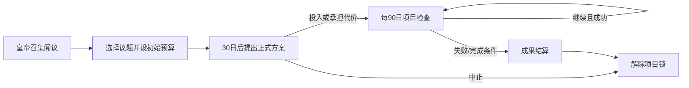
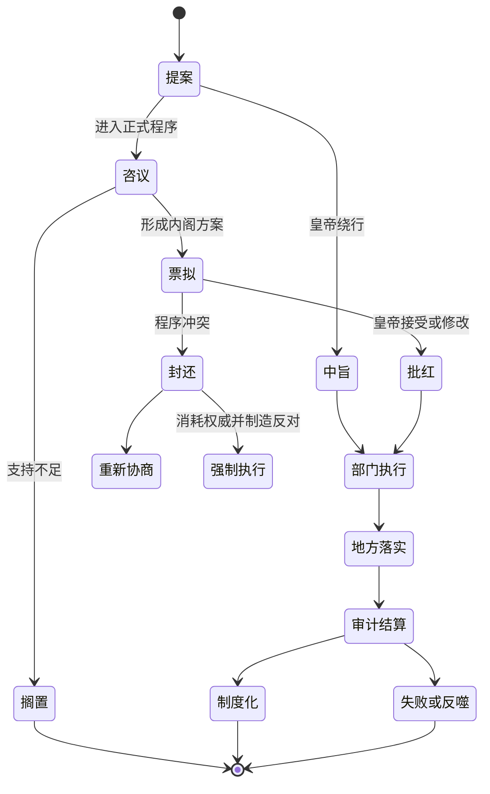

# 皇权、内阁与诏令：参考模组机制解析与新模组转译

> 本文分析对象为参考模组 `2713348525` 当前本地版本。重点是脚本实际行为，而不是只复述界面文字。
>
> 配套检索：[08A_皇权数值调用与门槛专项索引](08A_皇权数值调用与门槛专项索引.md)收录全部 204 个 `HQ_change` 调用和 162 个皇权直接门槛判断。

## 1. 本模块的核心结论

参考模组把“皇权”实现为一种可积累、可继承、可被战争与制度状态改变，并能用于突破常规政治程序的角色资源。它不是普通威望的别名，主要功能是：

1. 为皇帝的非常规任免、司法干预、特召、封爵、征伐等行为定价。
2. 将内阁、九卿、财政、君权法、党派平衡、战争胜负和御宝等系统接入同一政治资源。
3. 当皇权跌至零以下时，把首辅推入 CK3 的摄政／共治机制，使数值失败转化为权力结构变化。
4. 允许形成权臣的朋党封还诏旨，让皇帝在撤回政策与高成本强行推进之间选择。
5. 通过内阁议政和票拟事件，把一部分日常治理表现为“提出议题—追加投入—结果结算”的事件链。

这个结构最值得继承的不是具体数值，而是“越权必须消耗政治资源、资源不足会改变决策权归属”这一原则。

但其主要缺点也很明确：皇帝个人权威、国家执行能力、制度合法性、财政信用、军事威望和对官僚的控制被过度压缩进同一个变量。这样做易懂，却会让长期改革缺乏多维博弈。新模组应保留统一展示，底层则拆成数个彼此制约的状态量。

## 2. 源码导航

| 子系统 | 主要源码 | 关键入口或定义 |
|---|---|---|
| 皇权显示与季度公式 | `common/script_values/liuguan_values.txt:2257` | `huang_quan_value_kaiguo`、`huangquan_windows`、`huangquan_yingxiangli`、`huang_quan_score` |
| 皇权统一增减 | `common/scripted_effects/liuguan_effects.txt:8788` | `HQ_change` |
| 季度更新 | `common/on_action/GM_value_on_action.txt:912` | 季度对皇帝调用 `HQ_change = { CHANGE = huang_quan_score }` |
| 战争反馈 | `common/on_action/GM_value_on_action.txt:626` | `huangquan_war_won_attacker`、`huangquan_war_won_defender` |
| 皇位继承 | `common/on_action/GM_death_on_action.txt:142` | 新皇获得先帝皇权后除以三 |
| 内阁席位与首辅 | `common/traits/99_newtraits.txt:260` | 六级 `daxueshi` 特质组 |
| 阁臣任命 | `common/scripted_effects/liuguan_effects.txt:4821` | `daxueshi_renming` |
| 阁臣递升与公孤衔 | `common/scripted_effects/liuguan_effects.txt:9260` | `daxueshi_gonggu_change_effect`、`gonggu_guanwei_modifier_effect` |
| 皇帝—阁臣关系 | `common/scripted_relations/99_yan_relations.txt:1` | `diange_daxueshi` |
| 议政入口 | `common/scripted_guis/illusion_government_gui.txt:1051` | `GM_daxueshi_yizheng` |
| 议政事件 | `events/yandaxueshi_events.txt:1` | `yandaxueshi_events.0001` 至 `.00046` |
| 票拟随机入口 | `common/on_action/GM_liuguan_on_action.txt:3731` | `piaoni_effect` |
| 恩荫票拟链 | `events/shouguan_events.txt:445` | `.00110`、`.00120`、`.00130` |
| 举贤自代链 | `events/shouguan_events.txt:7003` | `.0171` 至 `.0174` |
| 弹劾封还 | `events/liuguan_events.txt:7313` | `liuguan_events.023` |
| 宣战封还 | `common/on_action/GM_liuguan_on_action.txt:2628`、`events/liuguan_events.txt:7371` | `war_fenghuan`、`liuguan_events.024` |
| 首辅摄政 | `common/scripted_effects/yan_effects.txt:3312`、`common/on_action/yan_shezheng_on_action.txt:4` | `shezheng_effect`、`fuhuangquan_shezheng`、`zhenghuangquan_qinzheng` |
| 摄政政绩 | `common/on_action/yan_shezheng_on_action.txt:62` | `shoufu_shezheng_zhengji` |
| 模组内说明 | `localization/simp_chinese/GM_game_concepts_l_simp_chinese.yml:94` | “皇权系统”概念说明 |

## 3. 皇权变量的生命周期

### 3.1 数据载体

皇权存放于皇帝角色变量：

```text
var:huang_quan_value
```

显示值 `huangquan_windows` 直接读取该变量；`huangquan_yingxiangli` 将其乘以 1.5，用于计算党派成为权臣所需跨越的总影响力阈值。换言之，皇权越高，朋党越难压倒皇帝；皇权越低，组织化官僚越容易取得事实上的议程控制权。

### 3.2 开国初值

`huang_quan_value_kaiguo = 80`。建立大明、某些改朝换代或相关建国效果都会通过 `HQ_change` 写入这项初值。

这代表开国军事—政治联盟带来的集中权威，但它仍被存放在角色上，没有区分“王朝创制遗产”和“开国者个人威望”。

### 3.3 皇位继承

在大明皇帝死亡且存在第一继承人时：

1. 继承人先获得先帝全部 `huang_quan_value`；
2. 随后将自己的皇权除以 3；
3. 先帝没有皇权变量时，新皇初始化为 0。

源码位于 `common/on_action/GM_death_on_action.txt:142-166`。

这实现了非常简洁的“个人权威不能完整继承”：先帝积累 300，新皇只继承 100；先帝为 -90，新皇则从 -30 起步。负面状态也会代际延续，因此危机不会因换君自动清零。

需要注意：若继承人在成为皇帝前已经持有皇权变量，`HQ_change` 会先把先帝值加到旧值上，再整体除以三。通常不会发生，但从数据规范看并不严谨。

### 3.4 上下界

统一效果 `HQ_change` 将皇权限制在：

- 上限：2000；
- 下限：-500。

只有 `CHECK` 参数为 `202301102000` 或 `437639088` 时才执行增减，这相当于作者给内部调用设置了一个简单的防误用签名。

每次变动后，若玩家是大明皇帝、皇权小于 0、且存在中极殿大学士，脚本会立即调用首辅摄政效果。

## 4. 季度皇权公式

`huang_quan_score` 每季度计算，随后由 `GM_value_on_action.txt` 加到皇帝身上。

| 条件 | 每季度变动 | 机制含义 |
|---|---:|---|
| 皇帝为可正常行动的成年人 | +0.10 | 最低限度的持续亲政能力 |
| 否则 | -1.20 | 未成年、无能等状态导致权力流失 |
| 皇帝被囚禁 | -5.00 | 统治中枢失去人身控制 |
| 君权一级 | +0.12 | 法定控制力 |
| 君权二级 | +0.25 | 法定控制力 |
| 君权三级 | +0.50 | 法定控制力 |
| 每名有效阁臣 | +0.25 | 内阁被视为皇权运行的行政支柱 |
| 阁臣少于三人 | -1.25 | 阁务缺员 |
| 阁臣为零 | 代码意图为 -2.50 | 实际被前一分支遮蔽，见下文 |
| 每名符合条件的九卿 | +0.10 | 中央部门齐备 |
| 每个带 `fushuguo` 标记的独立政权 | 按其每县 +0.02 | 朝贡／附属网络转化为天朝权威 |
| 存在未退出政治的 `quanchen` | -10.00 | 权臣形成直接侵蚀皇权 |
| 否则 | +0.50 | 党派未失衡的稳定奖励 |
| 全局不存在特定传国玺神器 | -3.00 | 御宝作为合法性符号 |

### 4.1 已确认的分支问题

内帑亏空代码依次判断：

```text
< 0       -> -0.3
<= -1000  -> -1
<= -5000  -> -2
<= -10000 -> -3
```

因为后三项是 `else_if`，任何小于等于 -1000 的数也先满足 `< 0`，故严重亏空分支静态上不可达。阁臣数量也先判断 `< 3`，再以 `else_if` 判断 `= 0`，所以零阁臣的 -2.5 同样会被 -1.25 抢先命中。

新模组应按最严重条件从高到低排列，或直接使用分段 scripted value，避免这一类静默失效。

### 4.2 作用域过宽

以下判断使用全局角色／统治者扫描，没有可靠限定为当前大明政治共同体：

- `any_living_character` 查找任何 `quanchen`；
- `every_independent_ruler` 查找任何主头衔带 `fushuguo` 变量者；
- 封还事件中的部分 `random_living_character` 只检查首辅特质；
- 宣战封还触发器检查世界上是否存在兼具 `dangkui` 与 `quanchen` 的角色。

单一大明世界中未必出错，但多帝国、改朝换代、旧角色残留或兼容其他模组时可能串台。新实现必须统一加上“所属政体／顶级领主／帝国头衔”限定。

## 5. 皇权的收入与支出结构

静态扫描共找到 204 个 `HQ_change` 调用。高频支出为：

| 变动 | 调用数 | 常见用途 |
|---:|---:|---|
| -5 | 45 | 中等任免、驳回、特权与事件选择 |
| -25 | 31 | 高级官职干预与重大越权 |
| -10 | 28 | 常见中旨、资源授予、政治处置 |
| -15 | 25 | 高级职位与封疆任免 |
| -30 | 10 | 强行对抗内阁等重大冲突 |
| -20 | 9 | 战败或较重制度干预 |
| -35 | 7 | 极高等级任免／处置 |

调用最集中的文件包括授官事件、人物互动、考课、流官事件、朝廷职位、锦衣卫和司法事件。这说明皇权实际上是多个子系统共同争用的“政治行动点”。

完整调用位置、门槛和上下文见配套专项索引，不在本文重复 366 行表格。

### 5.1 战争反馈

战争结束时的皇权变化为：

| 身份与结果 | 皇权 |
|---|---:|
| 大明皇帝作为进攻方获胜 | +10 |
| 大明皇帝作为防守方获胜 | +5 |
| 大明皇帝作为任一方战败 | -20 |

这种不对称设计很有价值：发动战争成功的政治收益高于被动防御，但失败损失远大于胜利收益，能阻止玩家用低风险战争无限刷权威。

### 5.2 “破坏规则”的官方定义

模组概念文本明确把皇权解释为皇帝亲自介入、侵犯臣子权利或突破朝廷基本制度的能力。由此可把支出划分为五类：

1. **程序绕行**：中旨任免、跳过铨选、直接提拔。
2. **组织压制**：罢黜阁臣、压制言官、对付朋党。
3. **司法非常权**：越过常规审判、使用厂卫或特旨。
4. **资源特许**：赐田、封爵、特殊职位和例外资格。
5. **战争决断**：无视内阁反对发动或维持战争。

这比把皇权做成永久属性加成更适合博弈，因为“拥有权力”与“使用权力”之间存在机会成本。

## 6. 内阁的角色化实现

### 6.1 六个席位

内阁席位由同一特质组 `daxueshi` 的六个等级表现：

| 等级 | 特质 | 政治位置 |
|---:|---|---|
| 6 | `zhongjidian_daxueshi` | 中极殿大学士，首辅 |
| 5 | `jianjidian_daxueshi` | 建极殿大学士，次辅 |
| 4 | `wenhuadian_daxueshi` | 文华殿大学士 |
| 3 | `wuyingdian_daxueshi` | 武英殿大学士 |
| 2 | `wenyuange_daxueshi` | 文渊阁大学士 |
| 1 | `dongge_daxueshi` | 东阁大学士 |

皇帝与每名阁臣还建立 `diange_daxueshi` scripted relation。这样既可用特质表达席次和人物履历，也可从皇帝快速枚举内阁成员。

### 6.2 任命效果

`daxueshi_renming` 的主要行为：

1. 先处理候选人的原职转迁；
2. 从最高空缺席位向下填充；
3. 与皇帝建立 `diange_daxueshi` 关系；
4. 将角色加入与席位对应的变量列表；
5. 首席阁臣同时出任 CK3 原生宰相 council position；
6. 禁止阁臣作为骑士；
7. 确保角色进入文官身份；
8. 按兼衔把官品补到正二、正三或正五品等最低要求。

这里同时复用了 CK3 的特质等级、关系、内阁职位、朝廷职位、人物变量列表和骑士资格。它证明“明代中枢职位”可以叠加在 CK3 人物系统上，而不必把每个部门都做成可持有领地。

### 6.3 席位递升与荣衔

阁臣达到高官品后，会通过 `daxueshi_gonggu_change_effect` 逐步增加 `gonggu` 荣衔，并由 `gonggu_guanwei_modifier_effect` 反向校正官品。不同阁席有不同荣衔上限，首辅最高。

这是“职务权力”和“身份荣誉”分离的雏形，但参考模组主要把它用于升迁奖励；新模组还应让荣衔成为政治信用、派系号召与退休安排的资源。

## 7. 内阁议政事件链

### 7.1 玩家入口

人物界面的 `GM_daxueshi_yizheng`：

1. 从皇帝廷臣中随机选一名带大学士特质者；
2. 保存为 `suiji_daxueshi`；
3. 触发 `yandaxueshi_events.0001`；
4. `GM_daxueshi_has_show` 要求至少有一名阁臣，且皇帝没有 `is_zhengwushishi` 标记。

标记承担项目互斥锁，避免同时启动多个议政工程。

### 7.2 可选议题

议政入口提供：

- 编修大典；
- 加征田赋；
- 推演边策；
- 修订律令；
- 疏浚河道；
- 取消。

科举议题不在手动菜单内，而由三年脉冲触发 `yandaxueshi_events.00023`。

### 7.3 通用项目结构



事件使用几个角色变量：

- `shizhengyusuan`：本轮投入或代价；
- `yaoqianlv`：随机延续判定；
- `zengyi`：项目累计轮次／成果倍率；
- `is_zhengwushishi`：皇帝当前已有政务项目。

项目可能持续多个 90 日周期，玩家不断追加预算，直到随机判定结束。最终效果按 `zengyi` 放大。

### 7.4 项目结果

| 议题 | 成本／过程 | 最终收益 |
|---|---|---|
| 编修大典 | 初始约 500–800，后续约 100–300 | 增加藏书相关全局变量、皇帝与廷臣学识 |
| 加征田赋 | 用威望损失表达政治代价 | 增加税粮存量与收入变量 |
| 推演边策 | 初始约 1000–1500，后续追加 | 武学生活方式点和军事能力 |
| 修订律令 | 初始约 500–800，后续追加 | 谋略生活方式点和谋略能力 |
| 疏浚河道 | 初始约 600–1000，后续追加 | 首都发展度进度 |
| 科举取士 | 按辖区规模计算贡举预算 | 进入完整科举链，并增减正统性 |

### 7.5 机制评价

优点：

- 把政务做成长达数月或数年的持续项目，而非点击即得奖励。
- 追加投入与随机工期制造沉没成本和继续／止损选择。
- 同一时间只允许一项政务，形成议程机会成本。
- 结果能接入财政、藏书、人才、军事、法律和城市发展系统。

不足：

- 议题主要由皇帝菜单选择，阁臣自身立场、部门利益、阶级支持和地方阻力很少进入项目状态。
- `suiji_daxueshi` 是随机阁臣，能力与派系不一定影响结果。
- 很多成果直接增加角色能力或全局存量，缺乏执行、审计和反作用阶段。
- 编典结算使用 `every_living_character` 再筛选皇帝廷臣，性能上应改为 `every_courtier`。
- 长循环靠事件反复触发，若作用域丢失或项目锁未清理，可能出现卡项目。

## 8. 票拟、批答与部覆

### 8.1 随机票拟入口

`piaoni_effect` 要求大明皇帝存在中极殿大学士，然后从首辅关系中随机触发两类事件：

1. 高官请求恩荫子弟；
2. 年老、病弱或失势高官举贤自代。

首辅先“分票”，不同阁臣再提出具体方案，最后送皇帝批答；某些选择还能进入封还或部覆环节。

### 8.2 恩荫票拟

`shouguan_events.00110 → .00120 → .00130` 的结构为：

1. 从符合官品与家庭条件的高官中选请恩者；
2. 确认其符合条件的成年男性子弟；
3. 各阁席可能提出国子监、百户、千户、中书、尚宝司或否决等方案；
4. 皇帝批答；
5. 与内阁冲突时进入“封还执奏”。

这条链把恩荫从一个按钮变成利益分配程序：高官家庭寻租、阁臣议程、皇帝裁决和制度反对都进入同一事件。

### 8.3 举贤自代

`shouguan_events.0171 → .0172 → .0173 → .0174` 的结构为：

1. 老病高官提出接替人；
2. 首辅将题本分给阁臣；
3. 辅臣拟票；
4. 皇帝选择是否采用；
5. 需要时由主管部门“部覆”；
6. 最终进入授官／调任事件。

这比直接任命多出一个非常关键的政治层：提名权、审议权、批准权和执行权不属于同一主体。

## 9. 封还诏旨：制度性否决

### 9.1 弹劾封还

`liuguan_events.023` 由若干弹劾事件调用。皇帝面对首辅封还时可：

- 接受封还：皇权 -5；
- 皇权至少 30 时强行推进：皇权 -30、暴政 +80，并罢黜所有大学士。

### 9.2 宣战封还

`war_fenghuan` 在朋党系统开启、皇帝作为进攻方开战，并存在已成为权臣的党魁时触发 `liuguan_events.024`。皇帝可：

- 接受：皇权 -5，并结束／退出进攻战争；
- 皇权至少 50 时强行推进：皇权 -50、暴政 +80，并罢黜阁臣。

### 9.3 设计价值

这不是简单的“内阁好感度不足”，而是：

- 权臣党派先通过组织化积累达到足够影响；
- 内阁才获得把特定决定送回的能力；
- 皇帝仍能强制执行，但要同时消耗权威、制造暴政并摧毁内阁班底；
- 接受封还也不是免费，会损失少量皇权，表示公开退让。

这种双向有成本的选择非常适合重大改革：反对方不能无条件否决，皇帝也不能无条件碾压。

### 9.4 源码风险

- 弹劾封还事件以全局 `random_living_character` 选首辅，未确认其就是当前皇帝的阁臣。
- 宣战封还触发器用全局 `any_living_character` 查权臣党魁，可能被其他政权角色误触发。
- 接受封还只扣 5 皇权，即使已经没有足够皇权仍可选择，随后可能立即进入摄政。这是可以成立的设计，但界面应明确提示权力转移后果。
- 强制选项罢黜所有大学士，缺少逐人站队；真实的内阁并不必然整体共进退。新模组应按派系、关系、程序立场生成支持者、辞职者与服从者。

## 10. 首辅摄政与亲政

### 10.1 进入条件

玩家大明皇帝在以下任一情况下，且存在中极殿大学士时进入首辅摄政：

- 皇权小于等于 0；
- 皇帝未成年；
- 皇帝直辖县级头衔超过 10；
- 同时不带 `no_tianming_modifier`。

脚本指定首辅为 diarch，启动 CK3 原生 `regency`，并把权力摆幅设置为 1000。

“直辖县过多导致首辅摄政”实际上把 CK3 直辖上限问题翻译成皇帝无法亲自处理庞大地方事务，思路很聪明，但阈值应采用清晰的领域容量判断，而不是固定县数。

### 10.2 首辅更替

已有摄政但当前首辅不再是皇帝的 diarch 时，脚本结束旧摄政、重新指定现任首辅并启动新摄政。因此摄政权绑定职位而非某一个终身人物。

### 10.3 解除摄政

玩家皇帝需要同时满足：

- 成年；
- 当前存在 active diarchy；
- 是大明皇帝；
- 直辖县不超过 5；
- 皇权大于 20；
- 没有 `no_tianming_modifier`。

满足后自动结束摄政。

### 10.4 摄政中的首辅行动

`shoufu_shezheng_zhengji` 在摄政期间按周期给予首辅实际施政行为，包括：

- 投资首都发展并花费皇帝金钱；
- 获得威望或私人财富；
- 提升官品、取得功臣身份、积累军功；
- 任命吏部、兵部、户部、都察院等关键官员；
- 为皇帝过多的直辖县创建官员并授予地方；
- 在财政条件合适时补充税粮；
- 安排宫廷女官与宗室婚姻等事务。

这使摄政不是一个静态负面修正，而是首辅利用国家机器建立功绩、私人资源和人事网络的窗口。它已经包含“代理统治者会同时生产公共成果和私人权力”的辩证关系。

### 10.5 明显边界

摄政进入、退出和政绩触发均带 `is_ai = no`，因此核心结构主要服务玩家皇帝，AI 大明未完整运行同一政治逻辑。新模组若要长期观察历史演化，必须让 AI 同样参与，只把复杂界面和事件文本限制给玩家。

## 11. 皇权与朋党的耦合

皇权不是孤立资源：

1. `huangquan_yingxiangli = 皇权 × 1.5` 被加入权臣阈值。
2. 某一朋党跨过阈值并形成 `quanchen` 后，季度皇权再受到 -10。
3. 皇权下降会进一步降低或改变权力平衡，并可能触发首辅摄政。
4. 权臣又能通过内阁封还弹劾与宣战诏旨。

因此形成正反馈：

```text
皇权下降
→ 权臣阈值相对降低
→ 朋党取得主导
→ 每季度皇权大幅下降
→ 内阁获得更强否决能力
→ 首辅摄政或皇帝以高成本清洗内阁
```

正反馈能制造政治危机，但缺少缓冲时会变成不可逆雪崩。参考模组用“无权臣时每季度 +0.5”、战争胜利、君权和完整中枢为恢复渠道；新模组还需要妥协政府、联合内阁、制度改革、财政复苏、社会联盟重组等非清洗式退出路径。

## 12. 使用的 CK3 原生机制

| CK3 机制 | 参考模组用途 | 可复用程度 |
|---|---|---|
| 角色变量 | 皇权与项目状态 | 高；个人状态合适，国家状态不宜全放角色 |
| scripted value | 季度公式、影响力换算 | 高 |
| scripted effect | 统一变动、摄政、任命 | 高 |
| on_action | 季度、战争结束、死亡继承 | 高，但需严格控制频率与作用域 |
| 特质与特质等级 | 六个阁席、官品、公孤衔 | 高 |
| scripted relation | 皇帝—阁臣集合 | 高 |
| council position | 首辅兼原生宰相 | 中高 |
| court position | 九卿与部门长官 | 高 |
| diarchy／regency | 首辅摄政 | 很高，是本模块最有价值的原生映射之一 |
| crown authority law | 皇权长期来源 | 中；新模组应补充自定义制度法 |
| character interaction | 越权任免与特权 | 高 |
| character event | 票拟、封还、议政 | 高，但不应承载全部常规计算 |
| character flag／variable | 项目锁、临时方案 | 高，需规定生命周期 |
| artifact | 御宝合法性 | 中 |
| legitimacy、tyranny | 正常开科、强行执政的外部代价 | 高 |
| prestige、gold、development | 项目成本与成果 | 中；应通过制度变量转接，避免只加人物数值 |
| scripted GUI | 人物界面显示皇权、议政按钮 | 高，但覆盖本体 GUI 有兼容成本 |

## 13. 性能评估

### 13.1 可接受部分

- 皇帝每季度计算一次 scripted value，成本可控。
- 内阁成员、九卿和皇帝廷臣集合规模较小。
- 皇权统一通过 `HQ_change` 写入，便于调试、限幅和日志化。
- 大型政治链主要由具体事件触发，而不是所有角色每月扫描。

### 13.2 风险部分

- 季度公式中的 `any_living_character` 权臣扫描。
- 议政结算用 `every_living_character` 再筛廷臣。
- 封还事件用全局随机角色寻找首辅。
- 某些科举、授官和党争机制也在全世界活人中查找；皇权与它们耦合后会放大总体成本。
- 204 个调用跨越许多文件，若没有统一语义表，很容易出现扣费门槛与实际扣费不一致。

### 13.3 新模组预算

建议限制：

- 国家级总量：每年完整重算一次；
- 政治危机和在途改革：每季度更新一次；
- 个人关系与任免：事件驱动；
- UI：只读取缓存值，不在 tooltip 中遍历大作用域；
- 活人全局扫描：核心循环中为零；
- 关键人物集合：皇帝、首辅、5–8 名中枢长官、4 个派系领袖、3–6 个地方代表即可；
- 社会阶级力量：按帝国或宏观区域聚合，不生成对应人口角色。

## 14. 历史唯物主义解释

“皇权”不能解释为皇帝天生拥有的神秘力量。脚本自身已证明它依赖：

- 官僚组织是否齐备；
- 财政是否有支付能力；
- 对军队与战争结果的控制；
- 对人事任免与信息渠道的掌握；
- 党派组织能否形成替代权力中心；
- 朝贡秩序和御宝等意识形态符号；
- 皇位继承造成的个人联盟断裂。

从历史唯物主义角度，皇权应定义为：

> 皇帝及其宫廷联盟调动财政、官僚、暴力、信息与象征资源，并使其命令被各级组织实际执行的能力。

内阁也不是抽象“臣权”。它是科举官僚、地方士绅、部门利益和知识生产体系在中央的组织化节点。首辅权力增长既可能提高国家治理能力，也可能把公共组织资源转化为派系任用、私人财富和家族再生产。

因此同一制度会同时具有两面：

| 制度 | 推动生产／治理的一面 | 固化支配关系的一面 |
|---|---|---|
| 完整内阁 | 提高信息处理与政策连续性 | 形成议程垄断和人事网络 |
| 科举 | 扩大人才汲取和统治联盟 | 再生产士绅文化资本与资格壁垒 |
| 皇帝越权 | 打破部门否决、推动紧急改革 | 摧毁程序信用、制造个人依附 |
| 首辅摄政 | 在弱君时维持行政运转 | 把国家职权转成派系资本 |
| 言官封还 | 限制任性战争和司法迫害 | 也可成为官僚集团阻挠改革的工具 |

新模组不能预设“皇权强就进步”或“官僚强就进步”。评价一项行动，要看它改变了谁掌握财政、组织、暴力、知识与动员渠道，以及收益和成本由哪些阶级承担。

## 15. 新模组的多维权力模型

### 15.1 不再用一个变量包办国家

建议至少拆成五项：

| 状态 | 建议作用域 | 含义 |
|---|---|---|
| 皇帝个人权威 `personal_authority` | 皇帝角色 | 私人威望、驾驭群臣、直接命令能力 |
| 中央国家能力 `central_capacity` | 大明帝国头衔 | 征收、统计、传达、执行和监督能力 |
| 程序合法性 `procedural_legitimacy` | 大明帝国头衔 | 官僚和社会对规则可预期性的信任 |
| 强制资源集中度 `coercive_control` | 大明帝国头衔 | 京军、边军、厂卫和地方武装服从结构 |
| 内阁议程权 `cabinet_agenda_power` | 大明帝国头衔或缓存变量 | 内阁筛选、起草、拖延和封还政策的能力 |

另设财政偿付、信息可见度、地方服从等已在总纲中定义的国家变量。界面仍可给玩家一个综合“皇权态势”，但任何重大选择都读写多个底层变量。

### 15.2 个人与制度的继承方式

- 皇帝个人权威：新皇继承 10%–35%，取决于继承顺序、遗诏、军权、太后与首辅支持。
- 中央国家能力：随皇位完整保留，只因内战、财政破产和机构清洗受损。
- 程序合法性：越权累积会跨代保留，不能靠换皇帝清零。
- 内阁议程权：随席位、派系组织和信息控制变化，不随单个人死亡完全消失。
- 强制资源：看军队指挥链和支付来源，而不是只看君主军事属性。

这能区分“弱君继承一个强国家”和“强人坐在一个空壳国家”两种完全不同的局面。

## 16. 重大政策的状态机

每项重大改革、战争动员或制度革命都走同一技术骨架：



### 16.1 四条程序路线

| 路线 | 速度 | 初始成本 | 长期效果 | 适用场景 |
|---|---|---|---|---|
| 正式票拟 | 慢 | 协商与预算 | 合法性高、执行稳定 | 常规改革 |
| 中旨绕行 | 快 | 个人权威 | 部门消极执行、程序合法性下降 | 时间紧迫或内阁阻挠 |
| 廷议／扩大联盟 | 很慢 | 让渡利益 | 社会基础广、妥协多 | 税制、土地、军制等结构改革 |
| 紧急授权／摄政 | 快且集中 | 权力让渡 | 代理人坐大、可能形成新集团 | 幼主、战争、财政崩溃 |

### 16.2 每个政策至少保存的字段

CK3 不适合动态创建大量政策对象，建议在帝国头衔上保存一个“当前重大议案槽”和少量排队槽：

```text
ming_policy_active_id
ming_policy_stage
ming_policy_progress
ming_policy_budget
ming_policy_emperor_support
ming_policy_cabinet_support
ming_policy_bureaucratic_support
ming_policy_local_elite_support
ming_policy_merchant_support
ming_policy_popular_support
ming_policy_coercion
ming_policy_corruption
ming_policy_deadline
```

具体政策的静态参数放在 scripted values／effects 中；变量只保存运行状态。普通小政策直接结算，不占重大议案槽。

## 17. 权力集团如何进入决策

重大政策不逐个遍历所有官员，而读取聚合力量和少数关键人物：

| 主体 | 控制资源 | 常见诉求 | 可用手段 |
|---|---|---|---|
| 皇帝与近侍 | 任命、宫廷财政、象征权威 | 维持最终裁决和私人控制 | 中旨、批红、厂卫、特许 |
| 首辅与内阁 | 议程、票拟、跨部门协调 | 政策连续性、派系人事 | 拖延、改稿、封还、辞职 |
| 六部九卿 | 专业信息、执行规则 | 部门预算、职业自治 | 部覆、技术性阻挠、选择性执行 |
| 言官系统 | 公开声誉、监察话语 | 程序正当性或派系攻击 | 弹劾、封驳、舆论动员 |
| 宦官与厂卫 | 宫廷信息、秘密强制 | 皇帝依赖和组织扩张 | 绕开官僚、侦缉、恐吓 |
| 军事集团 | 有组织暴力 | 军饷、军功、世袭利益 | 拒命、兵变、拥立 |
| 地方士绅地主 | 地方税源、宗族、基层知识 | 低税、土地与司法特权 | 隐匿、拖欠、地方抵制 |
| 商人／工场主 | 流通、信用、生产投资 | 市场、产权、特许与劳动力 | 贷款、停业、资助派系 |
| 城乡劳动者 | 劳动、粮食供给、群众动员 | 生计、租税、权利 | 逃亡、抗粮、罢市、起义 |

任何政策都应标明：谁提出、谁起草、谁付钱、谁执行、谁获益、谁承担风险、谁能否决、谁能在失败时组织反扑。

## 18. 长期博弈规则

### 18.1 皇帝强势不是免费优势

高个人权威可：

- 快速替换阁臣；
- 用中旨绕过程序；
- 在危机中集中军政资源；
- 压低短期派系否决。

但频繁使用会：

- 降低程序合法性；
- 使官员转向私人依附而非制度执行；
- 增加虚报、迎合与信息失真；
- 推高继承危机，因为个人网络难以传给下一代；
- 促使反对集团从公开程序转向密谋、地方抵制或革命动员。

### 18.2 内阁强势也不是天然进步

高内阁议程权可：

- 提升政策质量与连续性；
- 降低不必要战争和任性司法；
- 提高跨部门执行。

但也可能：

- 控制人事入口；
- 将技术问题包装成集团利益；
- 阻止触动士绅地主与官僚特权的改革；
- 通过程序拖延把社会危机转嫁给下层；
- 在摄政中积累足以架空皇帝的组织资源。

### 18.3 稳定来自暂时均衡

稳定不是某一方力量最大，而是：

```text
统治联盟可分配资源
+ 国家能兑现承诺
+ 反对集团尚未形成更高效组织
+ 被统治阶级的生计仍可维持
+ 主导意识形态仍能解释现实
```

生产力、商品化、财政需求和动员技术变化后，旧均衡会被打破。玩家只能重组联盟、修改制度或压制冲突；不存在永久解决按钮。

## 19. AI 规则建议

AI 不应只比较皇权点数，而应选择政治路线：

| AI 类型 | 倾向 |
|---|---|
| 宫廷集权型 | 优先积累个人权威，危机时中旨和厂卫，容忍低程序合法性 |
| 官僚合作型 | 让渡部分议程权，依靠正式票拟，追求执行稳定 |
| 财政改革型 | 接受商人和技术官僚联盟，以特许换取财政与投资 |
| 士绅保守型 | 维持低土地税和地方自治，阻止基层动员与产权重构 |
| 军事动员型 | 提高强制资源和军饷，容易形成军事集团债权 |
| 群众动员型 | 扩大基层组织与社会权利，但面对精英联合反扑 |

AI 决策评分至少包含：政策目标收益、短期时间压力、财政可付性、支持联盟、执行能力、失败后果、个人性格和既有承诺。AI 大明也必须运行同一聚合状态机，只省略玩家专用弹窗。

## 20. 可交给编码 AI 的实现边界

### 20.1 MVP 必须实现

1. 皇帝个人权威与国家能力分离。
2. 内阁六席、首辅、皇帝—阁臣关系与席次更替。
3. 一项重大议案状态机，支持正式票拟、中旨、封还、执行和结算。
4. 首辅摄政与亲政条件。
5. 至少四个聚合权力集团接入议案支持度。
6. 统一的变量增减 scripted effects，带上下界和调试日志。
7. AI 能独立选择程序路线并完成议案。
8. 所有季度检查限定为大明帝国和缓存集合，不扫描全世界活人。

### 20.2 第二阶段实现

1. 部覆、言官封驳与多部门执行。
2. 中旨任免、司法特旨与战争动员的统一越权成本。
3. 首辅摄政期间的公共政绩与私人网络双轨积累。
4. 政策失败后的辞职、清洗、结党、地方抵制与社会动员。
5. 多项改革之间的排队、互斥和行政容量竞争。

### 20.3 暂不实现

- 为每份普通奏疏生成独立事件链；
- 模拟每个县的真实文书流转；
- 给所有官员运行季度立场计算；
- 动态创建无限数量的政策对象；
- 把所有历史官名都做成独立 CK3 头衔；
- 用随机事件替代清晰可见的力量与执行公式。

## 21. 验收清单

本模块以后进入代码阶段时，至少应验证：

- [ ] 皇位继承后个人权威按规则衰减，国家能力不被错误清零。
- [ ] 内阁缺员会影响行政能力，但零阁臣分支能正确命中。
- [ ] 财政亏空分段从最严重到最轻正确执行。
- [ ] 权臣、附属国、首辅选择均限定于当前大明政治共同体。
- [ ] 中旨按钮显示完整的权威、合法性和执行代价。
- [ ] 封还时阁臣按立场分别支持、辞职或服从，而非无条件全体罢黜。
- [ ] 首辅摄政对玩家和 AI 都运行。
- [ ] 重大议案中断、皇帝死亡、首辅死亡、改朝换代时能清理或移交状态。
- [ ] UI tooltip 只读缓存，不触发全局枚举。
- [ ] 每个变量都有初始化、写入、限幅、继承、清理和调试入口。
- [ ] 用事件日志跑至少 50 年 AI 观察，确认不存在永久项目锁与不可逆权力雪崩。

## 22. 与后续文档的接口

本模块只解释“中央决策权如何形成与转移”。后续文档需要继续补全：

- 朋党、政治影响力和权臣形成；
- 六部九卿、言官、刑部—大理寺—都察院与厂卫的部门博弈；
- 财政、土地、商业和再工业化如何改变各集团资源；
- 地方官、督抚、卫所、宗族与城乡阶级怎样决定政策执行；
- 历史阶段变化如何重写议题、联盟和可用动员方式。

最终策划中，皇权模块应作为所有重大改革状态机的中央路由层，而不是一个可以无限刷取的万能货币。

