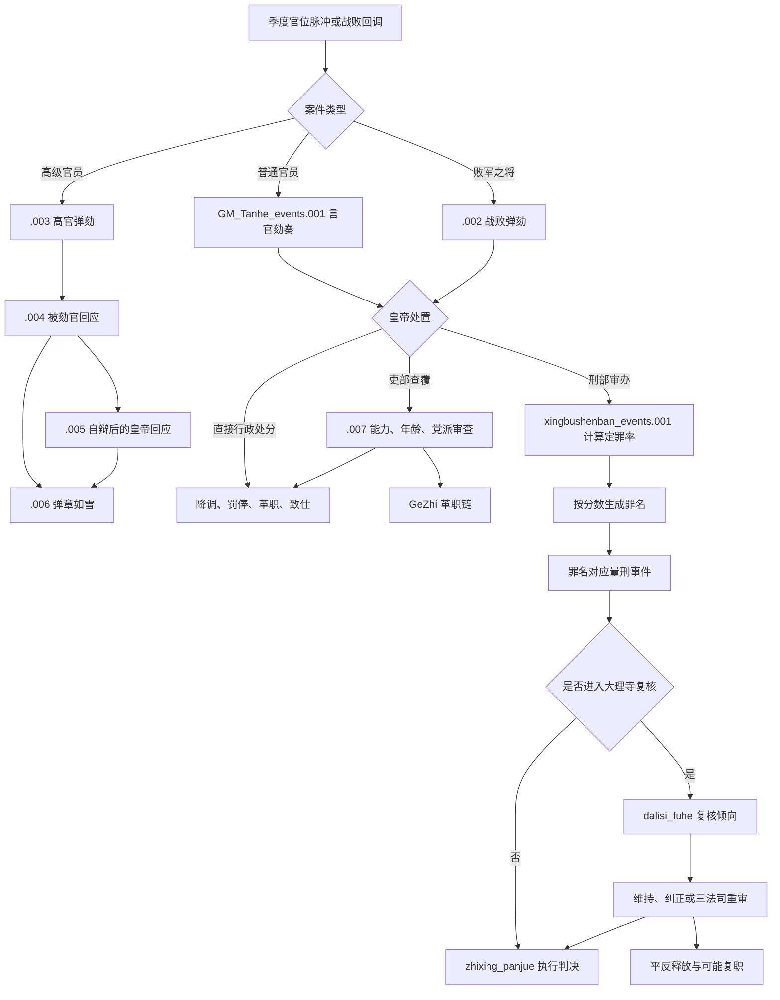
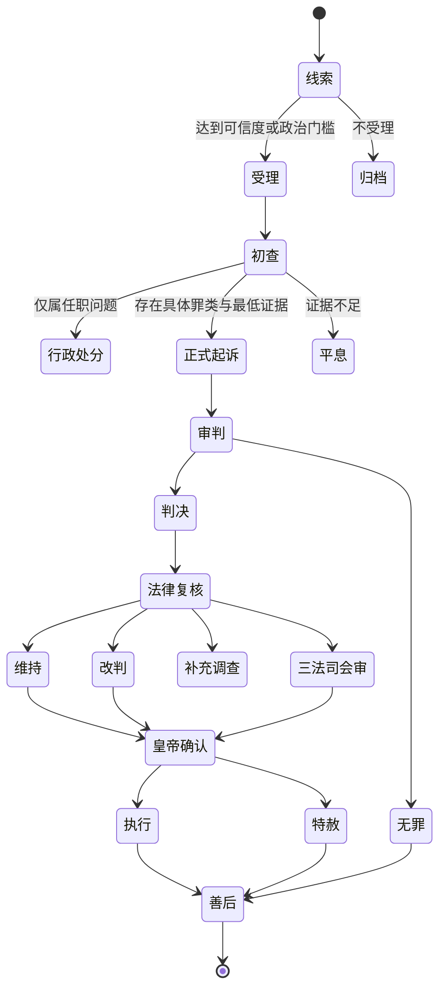

# 监察、弹劾与司法流程

> 文档性质：参考模组机制解析 + 新 Mod 机制选型  
> 证据等级：脚本事实以 **S1** 标注；设计建议以 **D** 标注；疑似缺陷以 **R** 标注。  
> 本文范围：六科、都察院、巡按、吏部查覆、刑部审办、大理寺复核、三法司复审，以及它们与皇权、朋党和官僚再生产的关系。锦衣卫等非常监察另见 `09B`。

## 1. 结论先行

参考模组已经实现了一条可玩的“弹劾—查覆/审判—量刑—复核—执行”链，并把官位、朋党、皇权、健康、能力和官员关系接进结果。它的主要价值不在写实法制，而在证明以下 CK3 技术路线可行：

1. 用季度脉冲、战败回调和官员状态触发案件；
2. 用保存作用域在多名官员之间传递被劾人、言官、主审官和复核官；
3. 用人物变量累计“定罪率”，再转成罪名与量刑事件；
4. 用人物旗标记录在审、停职、原官职、判决和恢复资格；
5. 用官职、党派关系和皇权改变案件走向；
6. 用大理寺复核与皇帝最终确认制造制度间博弈。

但其案件模型把“罪名、证据、程序、派系偏见和定罪概率”压缩进一个数值，且多处重新从全世界随机寻找带旗标的人。**多个案件并行时，存在把甲案的结果判给乙案当事人的高风险。** 新 Mod 应保留事件链体验，重做案件数据和作用域隔离。

历史唯物主义的转译也不能停留在“清官惩治贪官”：监察司法既可能约束官僚攫取，也可能成为皇权、官僚集团、地方利益集团和新兴社会力量争夺人身、财产与政治资格的工具。程序正义本身是力量对比的阶段性结晶，不是悬浮于物质关系之外的中立装置。

## 2. 源码导航

### 2.1 主要入口

| 机制 | 主要文件/ID | 作用 |
|---|---|---|
| 官位季度脉冲 | `common/on_action/yan_on_action.txt`：`guanwei_events_pulse` | 按权重发起普通或高级官员弹劾 |
| 战败弹劾 | `common/on_action/GM_liuguan_on_action.txt`：`commander_loser_tanhe` | 战败后抽取统兵官与监察官 |
| 弹劾事件组 | `events/GM_Tanhe_events.txt`：`.001`—`.007` | 言官劾奏、高官连劾、吏部查覆 |
| 刑部审办 | `events/xingbushenban_events.txt`：`.001` 起 | 定罪率、罪名、判决与复核 |
| 判决执行 | `common/scripted_effects/GM_xingfa_effects.txt`：`zhixing_panjue` | 处刑、杖刑、革职、抄没、退休等 |
| 大理寺复核 | 同上：`dalisi_fuhe` | 重新计算复核倾向并进入复核事件 |
| 释放与复职 | `common/on_action/GM_liuguan_on_action.txt`：`on_center_release_from_prison_effect` | 释放后尝试恢复中央旧职或进入候补状态 |
| 官职定义 | `common/court_positions/types/liuguan_court_position.txt` | 六科、都察院、刑部、大理寺等职位与适性 |
| 官僚分类触发器 | `common/scripted_triggers/liuguan_triggers.txt` | 九卿、六科、中央官、流官等角色集合 |

精确反查可配合：

- [脚本 ID 定位索引](02_参考模组脚本ID定位索引.md)
- [全事件触发与调用索引](02A_参考模组全事件触发与调用索引.md)
- [皇权数值调用与门槛索引](08A_皇权数值调用与门槛专项索引.md)

### 2.2 事件链总图

## 3. 监察机构如何映射到 CK3

### 3.1 六科与都察院

**S1：** 参考模组把六科给事中做成单人宫廷职位：吏科、户科、礼科、兵科、刑科、工科。`liuguan_liuke_trigger` 用于识别六科人员。其适性普遍以外交与谋略为主，常见形式为 `diplomacy × 2 + intrigue × 2`，并按 20/40/60/80 分档。

**S1：** 左都御史进入“九卿”集合；巡按御史挂在地方上级辖区，用于从地方官员中发起弹劾。中央官员集合还把内阁、锦衣卫、九卿、五军都督、翰林和六科纳入同一政治中心。

这种实现的优点是：

- 官员是可见人物，能有党派、关系、性格、能力和个人风险；
- 任命本身就是皇帝与党派争夺监察入口的行为；
- 不需要另造一套完全脱离 CK3 人物系统的官署模拟器。

局限是：

- 单个职位等同整个机构，容易让制度能力完全取决于一个人的属性；
- 六科的“封驳、稽核、信息汇总”与都察院的“巡按、纠举、监察”没有稳定分工；
- 机构档案、办案人员、地方信息网络和行政容量没有独立状态。

**D：** 新 Mod 继续让堂官和关键言官人格化，但机构能力另存为国家/机构变量。人物决定方向、偏见和政治后果，机构变量决定吞吐量、证据质量与执行可靠度。

### 3.2 九卿与三法司

**S1：** `liuguan_jiuqing_trigger` 所定义的九卿包含六部尚书、左都御史、大理寺卿和通政使。刑部承担主审和量刑入口，大理寺承担法律复核，都察院既提供弹劾人员，也可成为监督与会审的一极。

参考模组由此形成了一个很清楚的制度冲突：

| 环节 | 机构资源 | 可能偏向 |
|---|---|---|
| 发案 | 六科、巡按、都察院 | 议题选择权、政治曝光 |
| 行政查覆 | 吏部 | 官员资历、能力、党派保护 |
| 刑事审办 | 刑部 | 证据解释权、定罪与罪名塑造 |
| 法律复核 | 大理寺 | 维持、减刑、纠错或拖延 |
| 监察复审 | 都察院/三法司 | 追责主审者或扩大案件 |
| 最终确认 | 皇帝 | 皇权、危机处置与政治交易 |

## 4. 案件如何被触发

### 4.1 季度脉冲

**S1：** `yan_on_action.txt` 的季度可玩角色脉冲调用 `guanwei_events_pulse`。当根角色为大明皇帝时，其随机事件权重为：

- 60：无弹劾事件；
- 35：`GM_Tanhe_events.001`，普通官员言官劾奏；
- 5：`GM_Tanhe_events.003`，高级官员弹劾。

这意味着在条件满足时，每季度有 40/100 的权重进入弹劾链，其中高级政治案件明显更少。

**优点：** 简单、稳定、能周期性制造政治议程。  
**R：** 脉冲不会自然反映真实违法、财政压力和社会冲突；帝国规模扩大时仍按固定频率发案，且可能把“监察活跃”误写成随机噪声。

### 4.2 普通官员候选条件

**S1：** `.001` 要求皇帝雇有左都御史，并且当前没有 `Data_tuiju` 等冲突状态。被劾者大体是：

- 大明体系内有领地的 AI 官员；
- 头衔低于王国级，通常属于三司制或卫所制地方官；
- 上级辖区存在巡按御史；
- 未在与皇帝交战；
- 未处于已审办、已弹劾、致仕、革职、署理等状态。

候选“问题”至少包括一项：

- 朋党关系数量达到约 25；
- 贪婪且持金达到 600；
- 谋杀者；
- 弑亲者；
- 年龄达到 75；
- `gouxian` 达到 4。

这里混合了违法、政治结社、财富、年龄和官僚考核指标。它能够制造案件，却没有区分“犯罪、行政不适任、政治威胁和道德批评”。

### 4.3 高级官员弹劾

**S1：** `.003` 从中央高级官员中选择被劾者，并选择左都御史、六科或地方监察人员作为言官。触发理由与普通案件相近，但结果不会立刻审判，而是进入被劾者回应与弹章扩散链。

这条链适合模拟：

- 高官拥有发声、动员同党和请求君主保护的能力；
- 皇帝必须先决定是否公开处理；
- 弹劾是否升级取决于官僚网络，而不是单次检举。

### 4.4 战败弹劾

**S1：** `commander_loser_tanhe` 在战败后以 30% 分支寻找败军统帅和相应监察官，数日后触发 `.002`；未触发时设置约六个月冷却。监察官选择会明确排除与被劾将领同党的角色。

这是一个可复用的事件驱动范式：

`军事失败 → 寻找责任主体 → 监察机关介入 → 皇帝选择追责强度`

它比单纯季度随机更有因果感，但仍需避免“所有失败都归罪个人”，并接入军饷、训练、补给、指挥权冲突和错误战略等结构性原因。

## 5. 普通弹劾的皇帝选项

**S1：** `.001` 选出被劾者、言官与刑部尚书后，皇帝可以：

1. 命吏部查覆：皇权约增加 2，进入 `.007`；
2. 命刑部审办：一般先羁押，1—3 个月后进入刑部链，皇权约增加 2；
3. 降一级；
4. 降调地方；
5. 罚俸一年；
6. 革职；
7. 勒令致仕；
8. 驳回弹劾。

**S1：** 若被劾者处在权臣所控制的优势党派内，多个不利选项会转入“封还/阻挠”类事件，说明行政处分并非皇帝点选后就必然落实。

设计意义：同一弹劾可以被处理为行政、人事、刑事或政治问题，给玩家提供速度、合法性和冲突成本不同的路径。

**R：未定义作用域疑点。** `.001` 的部分触发或选择条件在保存 `tanheren` 之前就引用 `scope:tanheren` 的朋党关系，可能无法实现作者想要的“排除同党言官”。与此相对，战败弹劾明确写出了排除同党的逻辑。因此普通弹劾中同党互劾或选人异常应视为实际风险。

## 6. 高官弹劾与“弹章如雪”

### 6.1 四段升级

**S1：** 高官链由四个核心事件组成：

1. `.003`：言官弹劾，皇帝可留中不发或直接驳回；
2. `.004`：被劾高官自辩、沉默，或在特定条件下为言官求情；
3. `.005`：皇帝回应自辩，可安抚、处罚言官、宽免言官或继续沉默；
4. `.006`：“弹章如雪”，原言官动员最多四名同党官员继续追击。

被劾者若由 AI 控制通常会选择自辩。若被劾者沉默，脚本以 60/40 权重决定是否升级；皇帝安抚后的随机表为 70/10 权重，换算为 87.5%/12.5%，并非字面 70%；皇帝继续不回应时则为 90/10。

### 6.2 这条链模拟了什么

- 高官的政治资本使其不容易直接进入刑案；
- “留中”不是不行动，而是对信息公开与议程的控制；
- 言官不是孤立个人，其组织关系能把单案变成集体行动；
- 皇帝的模糊回应可能刺激更多弹章；
- 处罚言官能够暂时压制案件，却会改变官僚预期和政治信誉。

### 6.3 实现缺陷

**R：数量处理不一致。** `.006` 可保存原言官外加 `tanheren_02` 至 `_05`，即最多五名参与者；部分处罚分支只处理原言官及 `_02`—`_04`，可能漏掉 `_05`。

**D：** 新 Mod 不按固定“四名同党”扩散，而计算：

`扩散意愿 = 议题利益 × 组织动员 × 证据可信度 × 皇帝迟疑 × 公共关注 - 镇压风险`

为控制性能，只具体生成 0—3 名关键联署人，其余支持度记入案件的“官僚压力”变量。

## 7. 吏部查覆

### 7.1 参考模组判定

**S1：** `.007` 由吏部尚书给出行政调查结果：

- 若吏部尚书与被劾者同党：倾向保护，仅使被劾者损失约 200 威望；
- 年龄至少 65，或健康值不高于约 2.3：勒令致仕；
- 官阶对应主能力不足：降调；
- 被劾者属于其他党派，或具有贪婪、冷酷、残虐、懒惰、怯懦、急躁、暴怒、专断等特质：革职；
- 其他情况：以威望损失收束。

能力门槛大体为：

| 官员类型 | 王国级 | 公国级 | 伯爵级 | 男爵级 |
|---|---:|---:|---:|---:|
| 文官主要能力（管理） | 18 | 15 | 13 | 10 |
| 武官主要能力（军事） | 18 | 16 | 15 | 10 |

### 7.2 机制评价

这不是刑事审判，而是“借弹劾启动一次人事审查”。它把年龄、健康、能力与品行放在同一分支中，适合用来清理失能官员，也清楚展示了掌握吏部就能保护同党或排挤异党。

**D：** 新设计把它明确命名为“行政查覆”，只处理：

- 任职资格；
- 考成记录；
- 财产申报与回避规则；
- 履职事实；
- 是否需要移送刑事调查。

吏部可以建议降调、停职、致仕或移送，但不能直接制造刑事罪名。这样能让人事权、监察权和司法权既相连又不混同。

## 8. 刑部审办：一个数值如何变成罪名

### 8.1 主审官与定罪率

**S1：** `xingbushenban_events.001` 是隐藏事件。若存在刑部尚书就令其主审，否则生成或抽取临时刑部书吏。被劾者获得一个初始随机 `dingzuilv`，大致在 0—50 之间，再叠加：

- 主审官的谋略和学识；
- 被劾者的谋略反向抵消；
- 来自京察案件时，主考官学识加成；
- 主审官与被劾者的党派关系。

**S1：党派偏置。** 主审官若与被劾者属于对立党派，会得到更强的定罪加成；若同党，则扣减定罪率；无明确同党关系时通常仍按主审官谋略增加。

### 8.2 分数直接生成罪名

| 定罪率 | 生成罪名 |
|---:|---|
| ≥ 80 | 谋反 |
| > 70 且 < 80 | 结党 |
| > 60 且 ≤ 70 | 僭越/违制 |
| > 50 且 ≤ 60 | 贪墨 |
| > 40 且 ≤ 50 | 放荡/失德 |
| 其余 | 诬告或罪名不成立 |

这里最关键的问题是：**最初弹劾的事实理由没有决定被调查的罪名；同一个综合分数既代表“证据够不够”，又决定“究竟犯了什么罪”。** 一个被指控贪墨的人，可能因为主审官能力高、党派敌对而被算法升级为谋反。

### 8.3 新 Mod 的拆分方案

**D：** 至少拆成四个维度：

| 维度 | 含义 | 主要来源 |
|---|---|---|
| 指控罪类 `offense_type` | 案件在查什么 | 弹章、审计、现场事件、情报 |
| 证据强度 `evidence_strength` | 事实支持程度 | 文书、证人、物证、账簿、口供 |
| 程序完整 `procedure_integrity` | 是否依法取证、回避和复核 | 机构能力、时间、干预、酷刑 |
| 政治压力 `political_pressure` | 希望定罪或平反的权力 | 皇权、党派、舆论、军队、资本和地方网络 |

定罪只回答“当前罪类是否成立”；政治压力可以改变判决、证据呈现和执行，却不能神奇地把贪墨事实变成谋反事实。若要追加罪名，必须产生新线索并经过追加起诉环节。

## 9. 量刑与判决执行

### 9.1 参考模组量刑菜单

**S1：** 不同罪名进入不同事件，皇帝可在高度严厉到宽免之间选择。主要选项包括：

| 罪类 | 代表性判决 |
|---|---|
| 谋反 | 族诛、凌迟、斩首/夺爵、革职、赦免 |
| 结党 | 斩首、抄没、夺爵革职、革职、致仕、赦免 |
| 僭越/违制 | 杖毙、夺爵革职、革职、致仕、罚俸、赦免 |
| 贪墨 | 剥皮、杖六十、抄没、夺爵革职、革职、致仕、赦免 |
| 放荡/失德 | 罚没、革职、致仕、罚俸、杖三十、赦免 |
| 诬告/罪名不成立 | 释放被劾者，并可降调、闲置、革职或杖责言官 |

`zhixing_panjue` 根据判决旗标统一执行。杖三十约有 25% 致死、75% 受伤后释放；杖六十约为 50%/50%。此外还处理死刑、抄没、革职、致仕、流放等结果。

### 9.2 判决不只是人物惩罚

新 Mod 中每项判决都应明确改变物质与组织关系：

- 革职：腾出职位，改变党派控制和行政容量；
- 抄没：财产流向国库、内帑、办案集团或地方执行者；
- 族诛：摧毁亲族网络，但增加精英恐惧、隐匿资产和集体反抗；
- 赦免：换取短期和解，也可能损伤司法信誉；
- 杖刑与酷刑：强化恐惧式统治，却降低真实信息质量；
- 平反复职：修复程序信誉，同时触怒既得利益和原办案集团。

**D：** 判决应由法律上限、证据、程序、皇帝干预和执行能力共同约束。玩家仍能违法加重或减轻，但必须承担“违法裁断”这一明确政治行为的后果，不能只付一笔皇权数值。

## 10. 大理寺复核与三法司重审

### 10.1 复核算法

**S1：** `dalisi_fuhe` 先保存刑部认定的罪类，重置并随机生成一个复核数值，再选择大理寺卿。其党派关系直接改变复核倾向：

- 刑部主审与大理寺卿同党：约 +15，较容易维持原判；
- 被告与大理寺卿同党：约 -15，较容易推翻或减轻；
- 大理寺卿属于某党而被告不是其同党：约 +10。

这清楚表达了“机构相互制衡并不自动中立”：若两个机关被同一组织占据，复核可能变成相互背书；若分属不同集团，也可能成为纠错或夺权战场。

### 10.2 复核结果

**S1：** 复核事件大体可以：

- 维持并执行原判；
- 提出法律异议；
- 下调死刑或重刑一级；
- 命三法司重审；
- 在重审中证明谋反并扩大追究同党；
- 判为冤案并释放。

纠正链可将若干死刑逐级降为较轻刑罚，例如凌迟、斩首、杖毙、杖六十之间的转换；皇帝也能拒绝复核意见、强行执行原判。

### 10.3 逻辑限制

**R：** 当前复核逻辑对“谋反”给予较明确的阈值分支，其他罪类常以随机方式进入维持或法律纠正，复核分数与原始证据的对应较弱。

**R：** 重审后的 `dingzuilv` 生命周期和清理并不统一，存在陈旧变量留在人物身上的可能。

**D：** 新设计中，大理寺复核不重新随机发明事实，主要检查：

- 法律适用是否正确；
- 关键证据是否可采；
- 是否存在刑讯、回避失败或越权；
- 判决是否超出法定区间；
- 是否需要补充调查或三法司会审。

## 11. 平反、释放与复职

**S1：** 参考模组在办案前记录部分官员的旧品级和中央官职。`on_center_release_from_prison_effect` 在释放时检查旧职位是否空缺：空缺时可以恢复；已被他人占据时，则转入其他状态或候补逻辑。

这是很值得保留的设计，因为“平反”不能让期间发生的人事变化凭空消失。它自然产生新的冲突：

- 复职者与继任者争位；
- 原党派要求补偿；
- 新任官员拒绝承认旧案无效；
- 皇帝可用虚衔、异地任职、退休待遇或经济补偿和解；
- 平反会重写此前清洗带来的党派力量变化。

**D：** 新 Mod 为重大案件记录 `former_office`、`lost_income`、`confiscated_property`、`family_damage` 和 `successor`，但只生成 1—2 个关键善后事件，避免细枝末节无限膨胀。

## 12. 已确认的实现风险

### 12.1 最高优先级：案件串线

**R：严重。** 刑部隐藏事件从传入的 `scope:beitanheren` 计算定罪率；但后续若干罪名事件的触发器和 `immediate` 又从 `any_living_character` 中随机寻找带有“已被审办”旗标的人，而不是继续使用原案件作用域。

若两个案件在时间上重叠，可能出现：

1. 甲案计算了甲的定罪率；
2. 结果事件随机抓到同样带旗标的乙；
3. 乙收到甲案罪名或判决；
4. 原主审官、言官和复核官作用域进一步错配。

季度弹劾、1—3 个月审办延迟、战败案件与京察案件可以重叠，因此这不是纯理论问题。

### 12.2 重复事件 ID

**R：严重。** `xingbushenban_events.028` 在文件中被定义两次。前者是谋反案三法司重审，后者注释/标题显然意图作为另一个事件（本地化似指向 `.030`），却仍使用 `.028`。CK3 加载时可能覆盖、冲突或使预期事件不可达。编码前必须改成唯一 ID，并重建所有调用关系。

### 12.3 未保存作用域与人数漏处理

- 普通弹劾选择言官时提前引用尚未保存的 `tanheren`；
- “弹章如雪”最多保存五名参与者，但部分处罚只覆盖四名；
- 多处以全局人物扫描代替显式当事人作用域；
- 临时主审书吏、案件旗标、定罪变量的统一清理边界不清楚。

### 12.4 罪名与证据塌缩

- 性格、年龄、财富、结党和犯罪混作发案理由；
- 一个分数同时决定有罪概率与罪名严重度；
- 主审官的能力和党派关系可以把案件“升级成另一种罪”；
- 复核再次随机，而非重审具体证据；
- 诬告成立后往往只惩罚言官，无法区分善意错误、程序失败和恶意构陷。

## 13. 新 Mod 的案件状态机

### 13.1 只详细模拟重大案件

**D：双层模拟。**

- **常规监察层：** 以年度/季度聚合变量表示查办数量、积案、追回财产、冤案率、官僚恐惧和地方执行率，不创建人物事件链。
- **重大案件层：** 仅当涉案者是关键官员、主要阶级代表、重大产业/土地利益、军事集团或历史危机节点时，创建一条完整人物案件。

这样既能表现制度长期作用，又不会让玩家每季度处理随机官员弹劾。

### 13.2 状态流程

### 13.3 建议案件字段

重大案件以皇帝、帝国主头衔或专用不可见“案件载体”保存，至少包含：

| 字段 | 类型 | 用途 |
|---|---|---|
| `case_id` | 数字/旗标 | 唯一案件编号和调试识别 |
| `case_stage` | 枚举旗标 | 当前流程阶段 |
| `accused` | 保存作用域 | 被告 |
| `accuser` | 保存作用域 | 首名检举者 |
| `investigator` | 保存作用域 | 初查负责人 |
| `prosecutor` | 保存作用域 | 起诉方 |
| `trial_judge` | 保存作用域 | 刑部主审 |
| `reviewer` | 保存作用域 | 大理寺/三法司复核负责人 |
| `offense_type` | 枚举 | 贪墨、违制、叛乱、渎职、侵产等 |
| `evidence_strength` | 0—100 | 证据综合强度 |
| `evidence_reliability` | 0—100 | 证据真实性与可采性 |
| `procedure_integrity` | 0—100 | 回避、时限、刑讯和审级完整度 |
| `political_pressure_convict` | 0—100 | 推动定罪的组织力量 |
| `political_pressure_acquit` | 0—100 | 推动平反的组织力量 |
| `public_salience` | 0—100 | 社会关注与示范效应 |
| `sentence_type` | 枚举 | 判决结果 |
| `deadline` | 日期/阶段变量 | 防止案件悬挂 |

CK3 脚本不适合真正动态对象集合。MVP 建议只允许同一帝国存在 **1 个重大详案槽位**，其余进入常规聚合；案件结束后统一清理所有旗标、变量和保存作用域。扩展版可增加到 2—3 个固定槽，但不做无限数组。

### 13.4 证据类型

| 证据 | 获取方式 | 优点 | 风险 |
|---|---|---|---|
| 官署账簿 | 审计、税收、仓储事件 | 可验证、适合贪墨案 | 可伪造、地方数据缺失 |
| 文书通信 | 搜查、截获、党派泄密 | 可连接组织网络 | 上下文误读、伪造 |
| 证人 | 同僚、胥吏、民众、军士 | 能引出新线索 | 收买、恐吓、派系偏见 |
| 物证 | 财产、军械、赃物 | 直观 | 栽赃、执行者侵吞 |
| 口供 | 正常讯问或刑讯 | 快速 | 刑讯显著降低可靠度 |
| 秘密情报 | 锦衣卫/私人网络 | 快、可触及隐蔽网络 | 程序合法性低，容易被操控 |

证据采用 2—4 个类型标签即可，不建立逐件物品数据库。视觉上向玩家显示“证据强/弱、来源多样/单一、程序可靠/可疑”。

## 14. 历史唯物主义解释框架

### 14.1 监察司法不是中立机器

监察机构的行动能力来自：

- 国家财政能否供养专业官僚与地方调查网络；
- 文书、交通、识字率和统计能力；
- 监察官从何种阶层和教育体系再生产；
- 皇帝、内阁、官僚党派、地方豪强、军队和商业资本谁掌握任命；
- 财产制度和税制把哪些行为定义为合法收益、灰色惯例或犯罪；
- 被统治群体是否拥有举告、联署和公共表达渠道。

因此“反腐强度上升”不一定意味着廉洁：也可能意味着财政危机下的抄没筹款、中央对地方的再集中、旧官僚对新商人/产业集团的打击，或皇权摧毁独立组织。

### 14.2 阶级与组织如何进入案件

重大案件给每个参与集团计算四项利益：

1. **财产利益：** 罚没、税负、土地与产业控制权；
2. **职位利益：** 案后谁填补空缺、谁控制官署；
3. **制度利益：** 是否强化有利于本集团的程序和先例；
4. **安全利益：** 是否形成可反向清洗本集团的工具。

集团不会永远支持“严刑”或“程序正义”。当它控制司法时可能主张效率；当它成为目标时又会要求复核和法定程序。这种立场变化正是力量关系的表现，不应简化为固定善恶标签。

### 14.3 腐败的结构性来源

新设计中的腐败风险至少受以下变量影响：

`腐败压力 = 低薪与欠俸 + 官位投资回收 + 地方寻租机会 + 家族负担 + 不透明裁量 - 审计能力 - 合法晋升机会 - 可预期惩罚`

性格只改变个人响应，不是腐败的唯一原因。即使全是“正直”人物，若俸禄长期拖欠、地方权力缺乏监督、官位通过昂贵教育与关系取得，寻租仍会再生产。

### 14.4 司法结果如何改变力量对比

- 清洗一个党派会改变内阁、六部和地方官位控制；
- 抄没会把资产从官僚家族转移给国库、内帑或执行机关；
- 族诛会破坏家族网络，也会推动精英联合自保；
- 对商人和工场主的选择性执法会改变资本积累路径；
- 对农民、军户和工匠集体行动的刑事化会提高短期秩序、积累长期激进化；
- 公正审判会提升制度合法性，却可能限制皇帝快速动员和临时征敛；
- 冤案平反能扩大程序联盟，也会暴露国家内部矛盾。

## 15. 历史阶段中的监察司法

| 阶段 | 主要矛盾 | 监察司法的典型作用 | 新罪类/议题 |
|---|---|---|---|
| 重建与集中 | 中央与地方军事—豪强力量 | 清理地方割据、确立官僚纪律 | 侵占军田、隐匿户口、军令违抗 |
| 官僚常态化 | 皇权、内阁、六部与言官 | 程序化考核，也可能党争化 | 考成造假、请托、结党、言路压制 |
| 商业化深化 | 土地兼并、银税、商帮与官绅 | 保护税源或选择性打击新资本 | 逃税、垄断、工场事故、金融欺诈 |
| 财政—军事危机 | 欠饷、边患、灾荒与征敛 | 战败追责、抄没筹款、镇压集体行动 | 军饷侵吞、屯田崩坏、哗变、抗税 |
| 再工业化改革 | 新产业、旧特权与国家动员 | 建立监管，也可能成为旧集团封锁工具 | 机器破坏、专利争议、劳工组织、污染 |
| 革命/反革命 | 国家合法性和财产秩序重构 | 特别法庭、清算、赦免与制度重建 | 反革命、非法征用、工人委员会冲突 |

阶段不自动决定立场。同一套监察机构可以被改革派用于清理特权，也可被旧利益集团用于阻断改革；革命司法也可能扩大参与或蜕变为新的强制等级。

## 16. 玩家博弈与非一边倒平衡

### 16.1 五条可持续路线

| 路线 | 短期收益 | 长期代价 | 主要反制 |
|---|---|---|---|
| 皇权直断 | 快速、可越过被俘获官署 | 冤案、恐惧、信息失真 | 官僚怠工、结盟自保、继承后反扑 |
| 机构制衡 | 合法性与纠错率高 | 慢、易积案、需高财政容量 | 任命俘获、程序拖延、文书垄断 |
| 党派轮替监督 | 能相互揭露 | 选择性执法、政治周期化 | 建立回避制、公开证据、跨党复核 |
| 社会参与监察 | 线索多、可突破官官相护 | 告讦泛滥、动员外溢 | 受理门槛、反报复保护、虚假举告处罚 |
| 秘密强制路线 | 对高威胁目标快速有效 | 程序信誉崩坏、特务机构自主化 | 法定授权、期限、预算和外部复核 |

没有一条路线提供永久最优解。财政、战争、生产方式、社会组织和当前官署控制决定其效果。

### 16.2 皇帝决策评分

AI 和玩家提示可以围绕：

`处置收益 = 威胁降低 + 党派收益 + 财政收益 + 群体支持 + 制度信誉变化 - 行政损失 - 误判风险 - 反弹风险 - 时间成本`

玩家界面只显示等级和主要原因，不暴露全部精确数值，保留不完全信息。

### 16.3 失败不是“什么也没发生”

- 证据不足：目标暂时安全，但案件进入政治记忆；
- 审判拖延：积案、证人流失、官僚不满增长；
- 强行定罪：短期去除目标，程序联盟与反对组织壮大；
- 平反：信誉恢复，但原办案集团受威胁；
- 执行失败：地方保护、军队抗命或财产转移暴露国家能力边界；
- 特赦：可交换合作，也可能被理解为法律可交易。

## 17. CK3 技术选型

### 17.1 推荐载体

| 数据/行为 | CK3 载体 | 原因 |
|---|---|---|
| 监察堂官、主审、被告 | 人物 + 宫廷职位 | 复用关系、能力、党派、健康和任命 |
| 机构能力 | 皇帝/主头衔变量或修正 | 少量稳定数值，便于缓存和 UI |
| 重大案件 | 固定案件槽 + 保存作用域 | 防止全局随机串线 |
| 案件阶段 | 互斥旗标或单一枚举式变量 | 易验证、易清理 |
| 证据与程序 | 小范围 0—100 变量 | 可计算、无需创建海量角色 |
| 常规执法 | 年度聚合 scripted effect | 性能稳定 |
| 重大节点 | character_event / letter_event | 保留人物戏剧与选择 |
| 官署动作 | character interaction / decision | 玩家主动立案、催审、特赦、会审 |
| 长期后果 | modifiers、opinion、prestige、dread、control 等 | 复用本体反馈 |

### 17.2 严禁的实现方式

- 每月扫描全世界所有人物寻找违法者；
- 在后继事件中用 `any_living_character` 随机重选案件当事人；
- 用同一个变量同时表示罪名、证据、定罪和刑罚；
- 给每个普通地方官生成完整 8—12 步审判链；
- 用人物之间的全连接关系表示所有联署和证据网络；
- 不设超时和死亡清理，让案件永久挂起。

### 17.3 性能预算

MVP 建议：

- 帝国级重大详案同时最多 1 件；
- 每年主动评估重大线索 1 次，战争/灾荒/改革事件可额外发案；
- 候选池先按关键职位、强烈矛盾和最近行为缩小，再抽样 3—8 人；
- 每案核心事件 5—8 个，最长不超过 18 个月；
- 常规案件每年聚合结算一次；
- 党派压力读取缓存后的集团变量，不遍历所有成员关系；
- 每个阶段都设置 `case_deadline`，超时自动归档并产生后果；
- 被告、皇帝、主审或主头衔失效时进入统一清理效果。

## 18. AI 行为边界

AI 不能只按“好人轻判、坏人重判”。应分别评分：

- 对被告的政治威胁；
- 证据和程序可信度；
- 本党与支持阶层的利益；
- 皇权/制度合法性的当前稀缺程度；
- 官署是否被己方控制；
- 战争和财政是否要求快速处理；
- 判决将创造的先例是否可能反噬；
- 被告职位空缺后的继任收益与行政损失。

建议 AI 人格只作为权重：专断者更容忍违法直断，谨慎者更偏复核，贪婪者重视抄没，仁慈者偏减刑；但在生存危机和集团压力下都可改变行为。

## 19. UI 与玩家信息

重大案件界面至少展示：

1. 当前阶段与剩余期限；
2. 被告、检举者、主审和复核者；
3. 指控罪类；
4. 证据强弱、来源多样性和程序可信度；
5. 推动定罪/平反的主要集团；
6. 可选处置的速度、合法性、财政和反弹方向；
7. 判决后职位、财产和集团力量变化。

不需要显示“87.3% 定罪”。推荐显示“证据薄弱/相互印证/高度可靠”“程序受干预”“同党主审”“地方执行存疑”等可解释状态。

## 20. 编码前验收清单

### 20.1 作用域与唯一性

- [ ] 每个事件 ID 唯一，自动扫描无重复；
- [ ] 所有后继事件只读取当前案件保存作用域；
- [ ] 不以全局旗标随机重选被告、主审或言官；
- [ ] 同一帝国的案件槽有锁，进入和退出均可验证；
- [ ] 人物死亡、失位、换朝、战争和存档升级均有清理路径。

### 20.2 规则一致性

- [ ] 指控罪类与证据分离；
- [ ] 定罪与量刑分离；
- [ ] 行政不适任与刑事犯罪分离；
- [ ] 党派偏置改变调查、程序和政治压力，不直接凭空改写事实；
- [ ] 非法皇帝干预有明确成本和后续先例；
- [ ] 平反会处理旧职、继任者和已转移财产。

### 20.3 游戏性与性能

- [ ] 常规案件聚合，重大案件人格化；
- [ ] 玩家不会被季度随机弹劾刷屏；
- [ ] 每条强硬路线都有制度和社会反作用；
- [ ] 每条程序路线都有时间、财政和机构俘获成本；
- [ ] AI 能完成立案、审判、复核、执行和善后；
- [ ] 压力测试中无全世界人物月度扫描和关系全连接。

## 21. 对后续文档的接口

- `09B 锦衣卫与非常监察`：负责秘密情报、越级提审、诏狱、抄家与机构自主化；其证据必须标记为“秘密来源/程序风险”，而不是直接保证有罪。
- `10 军功、卫所与战争政治`：战败问责需要区分战略错误、补给崩溃、军饷拖欠、将领抗命和真实能力。
- `11 财政、人口、贸易与社会`：贪墨、逃税、兼并和抄没必须接入真实财政与财产流向。
- `14 阶级力量与生产方式模型`：案件改变集团资源、组织度、意识形态和国家合法性。
- `15 历史阶段与转型路径`：商业化、工业化和革命阶段生成不同监管冲突与司法形式。
- `18 编码规格与数据字典`：固定案件字段、旗标命名、清理效果、事件模板和自动验证脚本。

## 22. 本模块最终取舍

参考模组最值得复用的是：以官职人物为制度代理人、让党派影响审查、让皇帝在行政处分和刑事审判之间选择、设置复核与平反链。最不应照搬的是：全局随机重选当事人、用单值生成罪名、无限依赖人物旗标和把结构性腐败化为坏性格抽奖。

新 Mod 的目标不是做一部逐条法典，而是让玩家感受到：**谁能提出问题、谁能生产证据、谁能解释法律、谁能执行判决，以及案件后谁获得职位和财产，都是国家权力与阶级力量运动的一部分。**
