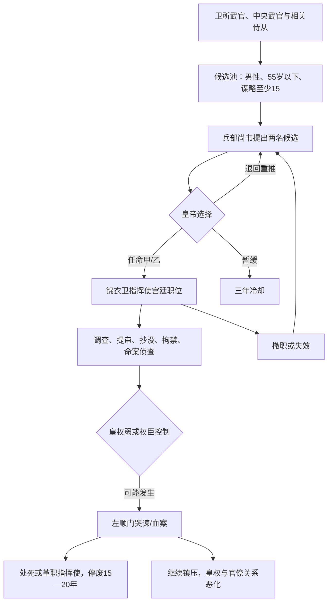
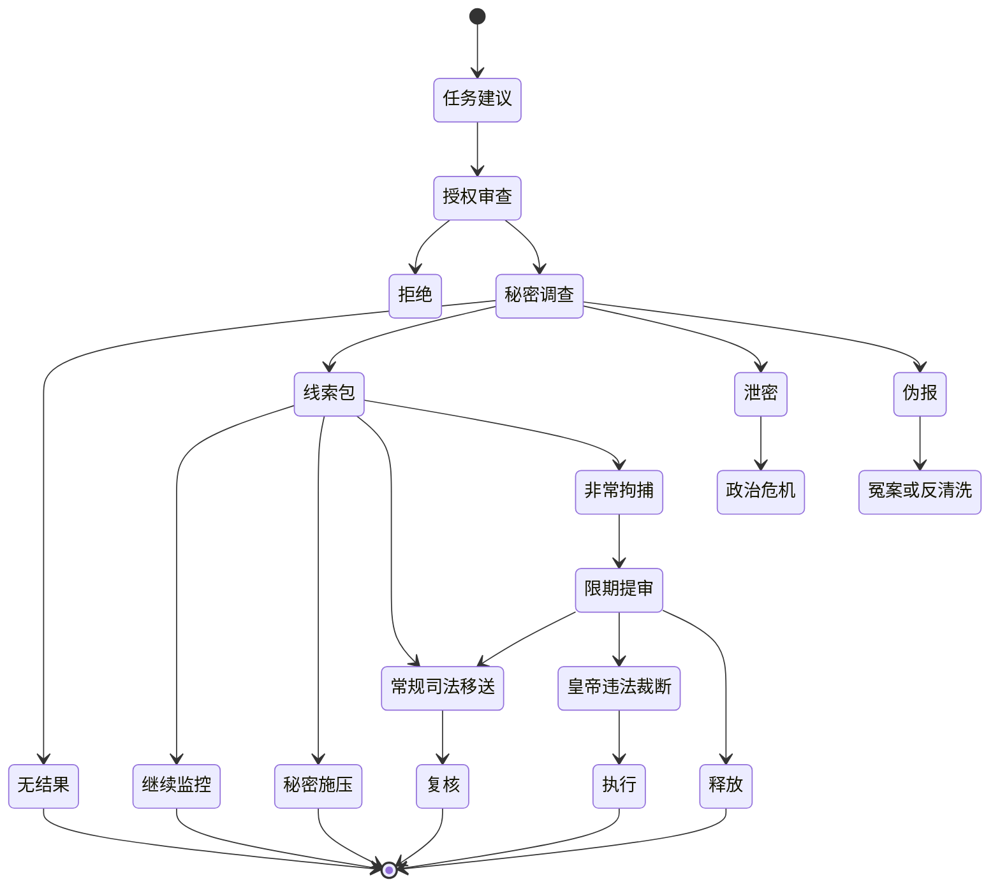

# 锦衣卫与非常监察

> 文档性质：参考模组机制解析 + 新 Mod 机制选型  
> 证据等级：脚本事实以 **S1** 标注；新设计以 **D** 标注；疑似缺陷与兼容风险以 **R** 标注。  
> 与常规监察、刑部和大理寺的接口见 [09A 监察、弹劾与司法流程](09A_监察弹劾与司法流程.md)。

## 1. 结论先行

参考模组把锦衣卫做成了一个相当完整的“非常权力”子系统，而非单纯属性加成。它包括：

1. 从卫所武官中推举两名候选人，由皇帝任命锦衣卫指挥使；
2. 用宫廷职位为皇帝提供谋略、恐怖值和大量计谋能力；
3. 皇帝指定官员和调查方向，经过 3—6 个月取得或未取得强牵制；
4. 以强牵制为法律/政治授权，发动提审、抄家、索取地契或其他处分；
5. 允许直接处决、族诛、发配，或移交刑部；
6. 提供独立诏狱界面，玩家可选择罪名、讯问/刑讯、刑期和死刑形式；
7. 允许特赦、减刑、加刑、流放和刑期结束处理；
8. 在皇权过低或权臣控制时触发官僚哭谏与暴力反作用，甚至停废锦衣卫 15—20 年；
9. 抄没财产时把约两成转入内帑、八成转入国家现金，使秘密强制与财政相连。

这套实现的最大价值是证明：CK3 可以通过“宫廷职位 + 互动 + 强牵制 + 自定义 GUI + 人物变量/旗标 + 监禁/秘密/资产效果”构建一个可操作的情报—强制机构。

但参考实现主要把锦衣卫当作皇帝的强力按钮，机构本身缺少预算、组织忠诚、自主利益、信息质量、执行渗漏和反向控制。新 Mod 应把它设计成**高速度、低程序、信息不稳定、可被滥用但也会组织化自保的非常机构**，而不是永久提高皇帝所有阴谋能力的万能外挂。

## 2. 源码导航

| 子系统 | 主要文件/ID | 作用 |
|---|---|---|
| 指挥使职位 | `common/court_positions/types/99_yan_court_positions.txt`：`court_jinyiwei_position` | 候选资格、适性、薪俸、皇帝加成、任免效果 |
| 推举候选 | `events/tuiju_events.txt`：`tuiju_events.007` | 构建候选池并选出两人 |
| 任命 | `events/shouguan_events.txt`：`shouguan_events.015` | 皇帝任命、驳回或暂缓 |
| 皇帝互动 | `common/character_interactions/Jinyiwei_interaction.txt` | 调查、抄家、两类提审、查案、中止、拘禁、索取地契 |
| 调查/提审事件 | `events/yanjinyiwei_events.txt` | 调查方向、强牵制、提审判决、抄没、制度反作用 |
| 命案侦查 | `events/xingbushenban_events.txt`：`.022`—`.024` | 从谋杀秘密寻找案件、调查成功/失败 |
| 冤案清理 | 同上：`.021` | 平反、赔偿、罢黜刑部与锦衣卫责任人 |
| 诏狱逻辑 | `common/scripted_guis/zhaoyu_gui.txt` | 列表、审讯、刑讯、罪名、判决、刑期与结案 |
| 诏狱窗口 | `gui/zhaoyu_windows.gui` | 独立可交互界面 |
| 窗口入口 | `gui/illusion_government_index_windows.gui` | 打开窗口并更新囚犯/看守列表 |
| 刑期效果 | `common/scripted_effects/yan_qita_effects.txt`：`zuiming_set_effect` | 革官、服刑、流放地、倒计时与监禁迁移 |
| 刑期事件 | `events/GM_zuiming_events.txt` | 到期释放/处死和监禁状态纠偏 |
| 私产抄没 | `common/scripted_effects/yan_effects.txt`：`clear_sichan` | 清空私产并分流内帑/国库 |
| 特制牵制 | `common/hook_types/zz_yan_hook_types.txt` | 通虏、欺君、结党、枉法、取利、失德、暗害等强牵制 |
| 杂项财政 | `common/scripted_effects/yan_OA_effects.txt`：`zaxiang_zhichu_effect` | 年度计算缇骑侦缉费用 |

精确定位还可使用：

- [参考模组脚本 ID 定位索引](02_参考模组脚本ID定位索引.md)
- [参考模组全事件触发与调用索引](02A_参考模组全事件触发与调用索引.md)
- [参考模组源码文件索引](01_参考模组源码文件索引.md)

## 3. 机构生命周期

### 3.1 候选来源

**S1：** `tuiju_events.007` 的候选主要来自卫所制有领地武官、皇帝廷臣以及下级封臣廷臣。常见要求是：

- 年龄不高于 55；
- 成年、有能力、未被监禁、AI、男性；
- 有流官出身资格和武官身份；
- 官位低于脚本所设高阶阈值；
- 谋略至少 15；
- 不属于皇帝宗室；
- 不是大学士、六科、奴隶、致仕者、革职者等；
- 未在近期被否决或处于转迁冷却。

候选按一套升迁/资历评分排序，选出前两名。兵部尚书作为推举人出现在任命事件中。皇帝可选择其中一人、花费政治资源要求重推，或设置三年冷却暂不任命。

### 3.2 物质与组织含义

参考实现把锦衣卫首脑放在“军事出身—皇帝亲信—中央正三品”链条中，而不是文官科举常规晋升。这一结构很适合历史唯物主义转译：

- 它的组织资源来自武装人员、宫廷近侍和皇帝直接授权；
- 它绕过文官官僚的专业与程序垄断；
- 它能帮助皇帝打击既有官僚集团；
- 但其成员的晋升、俸禄和安全依赖机构扩权，因而会形成自身再生产需求。

**D：** 新 Mod 应保留军事/亲军来源，但允许不同改革路线改变招募基础：世袭军户型、皇帝私人型、职业情报官型、党组织保卫型、议会/内阁监督型。来源决定忠诚对象和长期失控方式。

## 4. 指挥使宫廷职位

### 4.1 参考模组效果

**S1：** `court_jinyiwei_position` 只有一个席位，以谋略为主能力，适性主要是 `intrigue × 2`，20/40/60/80 分档。职位本身给任职者额外谋略，并按适性向皇帝提供：

- 每月恐怖值约 0.5—2.5；
- 计谋强度、保密度和成功率；
- 敌对/私人计谋能力与抗性；
- 额外谋略型计谋能力；
- 最大敌对计谋数约 +3 至 +15。

收到职位时，人物获得锦衣卫特质、离廷限制、中央武官资格和正三品官位；主头衔保存 `jinyiwei_character` 人物变量。撤职花费威望，并使皇权约减少 10。

### 4.2 平衡评价

**R：过度泛化。** 指挥使适性会增强皇帝几乎所有敌对计谋，并最多增加 15 个敌对计谋槽。它把“国家侦缉机构”直接等同于“皇帝个人同时执行大量暗杀/绑架等计谋”，容易让一项任命压倒其他政治机制。

**D：** 新设计把机构能力限定在：

- 发现威胁与秘密；
- 调查特定案件；
- 反间谍和宫廷保卫；
- 执行合法或非法拘捕；
- 对重大政治事件提供情报优势。

一般暗杀、勾引和私人计谋不获得无条件巨额加成。最多给少量敌对计谋槽，并要求情报预算和任务分配。

### 4.3 任免数据风险

**R：全局清扫。** 任命事件和职位接收效果会遍历 `every_living_character`，移除所有“不持有该职位但有锦衣卫特质”的人物，而没有限制同一帝国。该逻辑可能误伤其他政权或兼容模组人物，并且是昂贵的全世界扫描。

**R：撤职后陈旧引用。** 撤职效果先移除主头衔的 `jinyiwei_character`，随后又把它设回被撤职者，可能导致界面或后继逻辑继续把旧任当现任。

新 Mod 必须：

- 只操作当前主头衔保存的现任；
- 任命前先检查旧任并做局部清理；
- 撤职后清空引用，不再写回；
- 用职位持有者作为唯一真值，特质和缓存只是派生状态。

## 5. 皇帝可用互动

| 互动 | 前置 | 结果 |
|---|---|---|
| `jinyiwei_diaocha` 调查 | 皇帝有指挥使；目标为本国官爵人员；当前无调查 | 选择调查方向，3—6 个月后报告 |
| `jinyiwei_zhongzhi_diaocha` 中止 | 皇帝正在调查 | 全局移除被调查旗标并解除调查锁 |
| `jinyiwei_tishen` 提审一 | 已有通虏/欺君/结党强牵制 | 进入相应提审、直接判决或移交刑部 |
| `jinyiwei_tishen2` 提审二 | 已有枉法/取利/失德强牵制 | 进入较轻罪类提审与处分 |
| `jinyiwei_chaojia` 抄家 | 有前三类强牵制且目标有私产 | 皇权约 -5，选择仅抄财产或连坐女眷 |
| `suoqu_diqi` 索取地契 | 有前三类强牵制且目标有地契文物 | 每年一次，转移一件地契 |
| `zhaoling_jujin` 诏令拘禁 | 已有本体监禁理由 | 直接软禁并记录中央旧职 |
| `jinyiwei_chaan` 查案 | 皇帝对自己使用 | 从重大人物谋杀秘密中挑选案件侦查 |

**S1：** 这些互动全部 `ai_will_do base = 0`，所以参考实现基本是玩家专属。AI 皇帝不会主动使用调查、抄家、提审、拘捕或查案链。

**D：** 新 Mod 必须为 AI 提供低频、受预算和政治目标约束的行为；否则玩家与 AI 在国家能力上不是同一游戏。

## 6. 指定调查：从方向选择到强牵制

### 6.1 调查状态

**S1：** 皇帝发起调查后：

- 目标获得 `bei_diaocha`；
- 皇帝获得 `jinxing_diaocha`，因此同一时间只允许一项指定调查；
- 保存指挥使与目标作用域；
- 皇帝选择六种调查方向；
- `dingzuilv` 保存在皇帝身上；
- 初始随机值、指挥使谋略与目标谋略共同决定分数；
- 3—6 个月后报告，可结案或继续调查。

### 6.2 六类方向

| 调查方向 | 初始随机上限 | 额外线索 | 成功后强牵制 |
|---|---:|---|---|
| 里通外虏 | 30 | 境外盟友数量 | `litong_wailu_hook` |
| 欺君罔上 | 35 | 指挥使与目标为宿敌/仇敌 | `qijun_wangshang_hook` |
| 结党营私 | 40 | 一定数量高官朋党关系 | `jiedang_yingsi_hook` |
| 枉法诬贤 | 45 | 学识与官位不匹配 | `wangfa_wuxian_hook` |
| 违禁取利 | 50 | 金钱达到 500；极贫则减分 | `weijin_quli_hook` |
| 放荡不检 | 55 | 好色加分、贞洁大幅减分 | `fangdang_bujian_hook` |

报告时分数达到 50 即坐实，皇帝取得相应强牵制；否则罪名不实。继续调查会重置分数并用更高的随机区间再计算，意味着投入更多时间通常更容易得到想要的结果。

### 6.3 调查逻辑评价

优点：

- 玩家先选择政治目标，再等待机构行动；
- 指挥使和目标的谋略形成对抗；
- 一次只查一人，性能和界面都易控制；
- 强牵制把调查结果接入大量 CK3 既有互动。

问题：

- 玩家可以先选罪名，再由随机分数“找到”罪名；
- 继续调查重置随机值，不积累明确证据；
- 金钱多、党友多或性格好色直接等同可定罪事实；
- 指挥使党派、阶级利益、忠诚和收买没有系统性作用；
- 调查本身没有预算、线人损耗、泄密、反侦察和地区触达差异；
- 强牵制一旦生成就是强力政治许可证，证据质量不再重要。

### 6.4 阈值分支缺陷

**R：不可达高档。** 结党调查先判断“朋党高官数量 ≥5”并加 5，之后才以 `else_if` 判断 ≥10、≥15、≥20。所有更高数量也先满足 ≥5，因此后面三档永远不可达。正确写法应从最高阈值向下判断，或使用相互独立且明确定义的分段。

### 6.5 新 Mod 调查模型

**D：** 调查不直接选择“要给目标定什么罪”，而选择任务目标：

- 审计财产与税务；
- 反间谍与境外联系；
- 追踪政治组织与资金；
- 查证暴力/谋杀；
- 查验军政渎职；
- 监控改革破坏或非法镇压。

输出是“线索包”，包括事实类别、来源、可信度、程序合法性和是否可公开。皇帝可以合法移送，也可以伪造/夸大为政治罪，但后者会留下可被平反和反攻的程序痕迹。

## 7. 强牵制如何成为非常授权

**S1：** 七种锦衣卫相关牵制都被定义为 `strong = yes`。它们不只是意见修正，而被许多官职、人事、爵位和处分互动识别为合法或半合法理由。部分互动消费一个牵制后即可绕过皇权门槛或避免无理由惩罚成本。

这是一种很高效的技术组合：

`调查结果 → 特制强牵制 → 既有互动权限`

但“强牵制”同时承担了证据、罪名、法律理由和政治把柄四种语义。新 Mod 建议分成：

- `dossier_hook`：秘密档案，仅用于施压和秘密互动；
- `criminal_reason`：公开法律理由，可用于拘捕/起诉；
- `disputed_charge`：被争议的指控，可被复核；
- 案件变量：保存证据和程序质量。

这样公开起诉不会自动暴露所有秘密来源，也不会让一份低可信密报永久等价于确凿犯罪。

## 8. 提审与直接裁断

### 8.1 重罪提审

**S1：** 对通虏、欺君和结党三类强牵制，皇帝可进入 `.0004`—`.00061` 事件链。目标通常被软禁并记录旧职，15—30 日后由锦衣卫结案。部分正直、虔诚、仁慈或勇敢人物有 80/20 权重进入“狱中绝笔/自杀”与继续受审分支。

结案选项按罪类有所不同，代表性处置包括：

- 立即处死；
- 夷三族或大范围亲属连坐；
- 革职、抄没、发配或将家属转为奴隶；
- 贬为庶人；
- 移交刑部；
- 赦免并释放。

直接重刑往往降低皇权值，移交刑部则可能增加皇权，体现“制度化处置提供合法性”的设计意图。

### 8.2 较轻罪提审

**S1：** 枉法、违禁取利和放荡不检通过第二组互动进入 `.0007`—`.00091`，选项主要为革职发配、罚赎、去衣受杖和赦免。它仍由锦衣卫直接控制提审与结案，但刑罚范围较窄。

### 8.3 移交刑部

**S1：** 重罪链可以把目标移交给刑部事件 `.011`—`.016`。脚本用随机权重、人物特质和关系判断“罪名成立/不实”，后者又可进入冤案清理 `.021`。

这使锦衣卫与常规司法不是完全隔离：玩家可以先通过秘密机构取得目标和口供，再选择用刑部程序确认。但由于锦衣卫已经伤害、羁押甚至诱导目标，后续程序并不天然恢复中立。

### 8.4 冤案平反

**S1：** `.021` 可释放仍存活的受害者、支付约 500 补偿，并革职制造冤案的刑部官员与锦衣卫指挥使；皇帝也可花费威望与皇权拒绝平反。责任人通过全局变量传递。

**R：单例全局案件。** `fanan_mubiao`、`fanan_xingbu` 和 `fanan_jinyiwei` 是全局单例变量。若冤案链重叠，后案可能覆盖前案责任人。应与 09A 的重大案件槽统一，不另建一组全局状态。

## 9. 抄家、私产与地契

### 9.1 私产分流

**S1：** `jinyiwei_chaojia` 需要皇帝持有前三类重罪强牵制、目标有私产且不在若干高级功爵保护范围内。发动时皇权约减少 5。

`clear_sichan` 清零目标 `sichan_value`，并大致按：

- 20%：进入皇帝内帑；
- 80%：转为皇帝金钱，文本语义为国库收入。

这比只给固定金币更有结构意义：秘密警察的行动直接改变官僚家族资产、国家财政与皇帝私人财力。

### 9.2 女眷连坐

**S1：** 皇帝可选择仅抄没财产，也可把目标的女性近亲和配偶拘禁、剥夺原有身份、转为奴隶并移入皇帝宫廷。该分支对目标施加额外仇恨。

从机制角度，它模拟“家产、家族劳动力和政治身份一并被国家剥夺”；但当前实现主要把女性亲属作为可掠夺资源，缺少广泛社会与精英反作用。

**D：** 新 Mod 将“连坐强度”作为政治选择：

- 仅追缴非法所得；
- 全部财产没收；
- 限制亲族任官和迁徙；
- 家族拘禁/流放；
- 极端肉体清洗。

强度越高，短期财政与恐惧越大，长期资产隐匿、精英联合、人才外逃、地下资本和复仇网络越强。

### 9.3 索取地契缺陷

**S1：** `suoqu_diqi` 允许皇帝每年从有重罪牵制的目标处转移地契类文物。

**R：选择类型错误。** 当目标只有 100、500 或 1000 亩地契时，后续 `random_character_artifact` 仍筛选 `diqi_50mu`。结果可能找不到对象，互动显示可用却没有转移任何地契。每个分支应筛选与前置检查相同的类型，或统一从所有合法地契中按价值排序。

### 9.4 新设计中的财产执行

抄没不应 100% 自动到库：

`实际入库 = 可查明资产 × 地方执行率 × 账目透明度 - 执行侵吞 - 提前转移 - 执行成本`

其中一部分可被锦衣卫截留形成“小金库”，一部分被地方官绅隐藏，一部分进入内帑。玩家可要求审计，代价是降低机构忠诚并暴露自身过去的违法命令。

## 10. 命案侦查

### 10.1 参考流程

**S1：** `jinyiwei_chaan` 触发 `xingbushenban_events.022`：

1. 在本国范围寻找重要官员、宗室、驸马、爵臣等人物的谋杀秘密；
2. 最多向皇帝展示三名死者；
3. 皇帝选择一案；
4. 以 50/50 权重决定 30—60 天后查实或失败；
5. 查实时找到 `死者.killer`，可满门抄斩、凌迟、革职下狱或压下；
6. 失败时可廷杖锦衣卫，25% 致死、75% 重伤，或不追究。

### 10.2 性能与作用域风险

**R：三次全人物—秘密扫描。** 事件连续三次遍历 `every_living_character`，在每个人物下寻找谋杀秘密，再反复覆盖保存作用域。虽然秘密目标限制在本国重要人物，外层仍是全世界人物扫描，成本高且结果不稳定。

**R：调查者串线。** 选案时把死者保存为某个锦衣卫人物的变量；结果事件又随机寻找一个有锦衣卫特质的人，而不是使用原调查者。若存在陈旧特质、任命切换或兼容模组人物，可能找错变量和案件。

**D：** 新设计只从缓存的“本国最近重大非正常死亡”列表抽取 1—3 件。案件保存明确的调查者和目标；调查成功率来自机构能力、时间、凶手反侦察和证据，而不是固定 50/50。

## 11. 官僚反作用与锦衣卫停废

### 11.1 左顺门链

**S1：** 每次指定调查事件结束后，如果皇权不高于 0，或帝国已被权臣控制，会以 50% 权重在约 15 天后触发“左顺门哭谏”。皇帝可：

- 处死指挥使并停废锦衣卫约 15 年；
- 革职指挥使并停废约 20 年；
- 继续支持机构，可能发生官员受伤、死亡或“左顺门血案”。

血案中，锦衣卫指挥使可能被年轻官员击杀，皇帝再选择处死/革职凶手或停废锦衣卫，并承受额外皇权损失。

### 11.2 这条链的意义

这是一处很好的长期制衡设计：

- 皇帝在强势时使用非常机构成本较低；
- 皇权弱或权臣当道时，秘密强制可能成为引爆官僚集体行动的导火索；
- 指挥使是可牺牲代理人；
- 停废不是永久科技锁，而是 15—20 年的制度周期；
- 暴力镇压可能杀死反对者，也可能让机构首脑丧命。

### 11.3 实现风险

**R：关系作用域脆弱。** 部分事件通过自定义 `jinyiwei_zhihuishi` 关系重新寻找指挥使，而任命、继承和死亡时的关系维护分散在多个文件。职位持有者、人物变量和关系三套真值可能不一致。

**D：** 新 Mod 只以宫廷职位持有者为权威来源；缓存变量每次使用前校验。反作用概率还应接入：官僚组织度、言路状态、军队忠诚、社会恐惧、案件公开程度和被打击阶层，而不是只看单一皇权。

## 12. 诏狱自定义界面

### 12.1 界面结构

**S1：** `zhaoyu_windows.gui` 注册为独立脚本化窗口。打开时执行三个更新效果：

- `update_zhaoyu_list`：皇帝直接关押、尚未服刑的囚犯；
- `update_zhaoyu_fuxing_list`：皇帝及下属监狱中的服刑犯；
- `update_zhaoyu_kanshou_list`：选择一名骑士作为看守形象。

主界面允许选择囚犯进入提审。提审界面展示囚犯、看守、受伤/认罪状态，并允许选择罪名、审问方式、刑讯方式、刑期和判决。

### 12.2 可选罪名

**S1：** 玩家可直接在界面选择 11 类罪名：

1. 谋反；
2. 谋逆；
3. 奸党；
4. 枉法；
5. 七杀；
6. 六赃；
7. 匿税；
8. 抢夺；
9. 通奸；
10. 略卖；
11. “莫须有”。

罪名只是一个 `GM_zuiming` 数值，当前结案效果并未把罪名差异稳定转为不同法定刑区间；玩家可以先定任意罪名，再选任意刑罚。

### 12.3 审问与刑讯

普通审问：

| 方法 | 每次认罪值变化 |
|---|---:|
| 讯问 | -5 至 +5 |
| 诱供 | -1 至 +6 |
| 威压 | -2 至 +5 |
| 恐吓 | -5 至 +10 |

刑讯：

| 方法 | 认罪值变化 | 单次伤害变量 |
|---|---:|---:|
| 笞刑 | 0 至 +2 | 0.01—0.02 |
| 杖刑 | -1 至 +3 | 0.01—0.03 |
| 拶指 | -2 至 +5 | 0.03—0.05 |
| 夹棍 | -3 至 +7 | 0.05—0.08 |
| 烙刑 | -5 至 +10 | 0.10—0.20 |
| 立枷 | -5 至 +15 | 0.15—0.30 |

认罪值达到 100 后才可按界面条件结案。伤害累计达到人物健康值时会直接因酷刑死亡；退出/结案时把伤害变量转换为受伤状态和短期修正。

### 12.4 判决与刑期

**S1：** 玩家可设置年、月、日刑期，并选择：

- 流放；
- 绞监候；
- 斩监候；
- 绞立决；
- 斩立决；
- 凌迟。

服刑列表还允许特赦、减刑和加刑。死刑旗标决定刑期结束事件的死亡方式；非死刑到期后释放并尝试返回原籍。

### 12.5 游戏性评价

这个界面展示了极强的技术能力：列表数据模型、人物动画、脚本化按钮、人物变量与即时效果都能正常组合。它适合作为“自定义国家机关面板”的技术参考。

但它把玩家主要操作变成反复点击审问/刑讯，直到随机“认罪”达到 100。机械上存在三个问题：

- 认罪次数取代了证据和案情；
- 越残酷的手段通常越快，长期制度成本几乎不在同一界面反馈；
- 玩家可先任意选择罪名，再用酷刑制造认罪，结果容易退化为单向施暴模拟。

**D：** 新 Mod 复用面板技术，不复用“点击酷刑刷进度”核心循环。面板改为“情报与非常案件控制台”：展示线索来源、机构任务、预算、渗透、合法授权、泄密风险、羁押状态和复核期限。酷刑是一次高代价政策选择，而非可无限重复的小游戏。

## 13. 刑期与服刑实现

### 13.1 参考状态机

`zuiming_set_effect` 会：

- 废黜被判刑的统治者；
- 清除官位和文武身份；
- 添加 `fu_xing` 特质；
- 设定流放地、服刑到期日期与离廷限制；
- 把人物转移到执行地并重新监禁；
- 安排到期事件 `.001`；
- 同时启动每月纠偏事件 `.002`。

到期时，死刑犯按绞、斩或凌迟旗标死亡；普通服刑者移除状态、释放并返回原籍或旅行回去。

### 13.2 严重性能泄漏

**R：最高优先级。** `GM_zuiming_events.002` 每次触发后无条件在一个月后再次触发自身，没有“仍在服刑”触发器，也没有刑满后的停止分支。即使 `.001` 已移除 `fu_xing` 和到期变量，`.002` 仍会终身每月继续排队。

后果是：每一个曾被判刑的人都会永久增加一个月度事件循环；长期存档中事件数量只增不减。

正确做法：

- 最优：用监禁/移动相关 on_action 或低频年度纠偏，不为每人开永久循环；
- 若保留自循环：事件必须以 `has_trait = fu_xing`、仍存活且到期日在未来为触发条件，失败不再续订；
- 服刑结束、死亡、政权灭亡和地点失效都调用统一清理效果。

### 13.3 判决旗标清理不完整

**R：** `zhaoyu_jiean` 清理 `panjue1/2/3/4`，却没有统一清理 `panjue2a` 与 `panjue3a`；若切换判决时各分支也未完全互斥，人物可能残留旧判决旗标。凌迟分支还误移除若干“判决旗标”而非对应死刑旗标，命名与语义混乱。

新 Mod 采用：

- 单一 `sentence_type` 枚举变量；
- 单一 `sentence_end_date`；
- `apply_sentence`、`commute_sentence`、`finish_sentence` 三个统一效果；
- 自动测试确保任意时刻只有一种判决。

## 14. 财政与国家能力

**S1：** 年度杂项支出把 `jinyiwei_funds` 设为指挥使谋略乘 0.2—0.5 的随机倍数，并从国库/皇帝金钱扣除。该数值进入总杂项支出显示。

优点是明确承认情报机构需要持续财政。问题是：

- 费用只取决于首脑谋略，不取决于帝国规模、任务数量或网络覆盖；
- 玩家不能主动设定预算；
- 更能干的首脑反而只表现为更贵；
- 预算不足不会降低调查成功率或导致欠饷、勒索和私营化；
- `global_var` 对多政权/多实例扩展不安全。

**D：建议变量：**

| 变量 | 含义 |
|---|---|
| `security_budget` | 年度正式预算 |
| `black_budget` | 内帑、抄没和秘密资金 |
| `network_coverage` | 地区和阶层触达 |
| `professionalism` | 档案、训练和分析能力 |
| `institutional_loyalty` | 对皇帝/内阁/党组织/自身的忠诚结构 |
| `autonomy` | 自行选案、隐匿信息和截留资源能力 |
| `public_fear` | 威慑与社会恐惧 |
| `information_distortion` | 迎合上意、刑讯和伪报造成的失真 |
| `legal_constraint` | 授权、期限、复核和预算审计强度 |

`有效情报能力 = 预算 × 专业化 × 覆盖 × 忠诚修正 - 信息失真 - 反渗透 - 腐败`

预算越高不必然越可靠；若考核只奖励“发现敌人”，机构会制造敌人和口供。

## 15. 历史唯物主义解释

### 15.1 非常机构为何出现

它通常不是因为君主单纯“残暴”，而是因为既有国家机器不能满足统治集团的需求：

- 常规官僚被既有利益集团控制；
- 信息层层过滤，中央无法知道地方和军队真实状态；
- 财政、军事或继承危机要求更快动员；
- 新改革要突破旧程序和地方产权网络；
- 皇帝缺乏可依赖的社会组织，只能建设私人化武装官署。

因此锦衣卫的扩张可能在早期真实提升国家信息和执行能力；问题在于其组织利益会随扩张固化。

### 15.2 它服务谁

不要把“国家”当作无阶级主体。每次任务都要回答：

- 谁提供名单和线索？
- 谁从目标倒台后取得职位、土地、商路或产业？
- 抄没财产进入国库、内帑、机构小金库还是执行者私人账户？
- 被监控的是官僚、宗室、军队、地主、商人、工场主、工人组织还是农民结社？
- 情报结论能否被公开质证？

同一机构可以帮助中央打击侵吞军饷的地方豪强，也可以替旧官绅压制新兴资本、替资本打击劳工组织，或替革命政权镇压旧统治网络。阶级性质来自任务、资源和控制结构，不来自机构名称。

### 15.3 强制机构的相对自主性

锦衣卫拥有秘密、武装、监狱、抄没和君主接近权后，会产生自身利益：

- 扩大威胁定义以证明预算合理；
- 隐瞒失败和夸大线索；
- 掌握皇帝与大臣的秘密并反向施压；
- 截留抄没财产和经营灰色网络；
- 在继承时选择支持能保护机构的候选人；
- 与某一党派、军头、商业集团或宫廷集团结盟。

**D：** 当 `autonomy` 与掌握秘密过高时，皇帝不能无成本撤换首脑。撤换可能触发档案泄露、栽赃、兵变、政变支持或证据销毁。改革机构也需要替代情报渠道，否则废除只会让国家失明。

## 16. 历史阶段与非常权力

| 阶段 | 扩张动力 | 主要任务 | 典型反作用 |
|---|---|---|---|
| 王朝集中 | 清理地方武装与功臣网络 | 反叛、军政监察、宫廷保卫 | 功臣集团联合、官僚要求程序化 |
| 官僚常态 | 皇帝突破六部/内阁过滤 | 监控高官、党争、秘密奏报 | 言官抗争、档案政治、选择性执法 |
| 商业化 | 税源、商帮与土地资产增长 | 匿税、走私、商官勾连 | 对新资本勒索、资本收买机构 |
| 财政军事危机 | 欠饷、战败、民变 | 快速拘捕、抄没筹款、反间谍 | 信息迎合、误抓、军民激进化 |
| 再工业化改革 | 旧官绅阻挠、新产业监管 | 保护工程、反破坏、经济情报 | 产业集团俘获、镇压劳工、技术官僚化 |
| 革命/反革命 | 旧国家机器瓦解 | 保卫新政权、清算或地下反抗 | 特别机构常态化、新特权阶层形成 |
| 法治化转型 | 统治联盟需要可预期秩序 | 反间谍、重大有组织犯罪 | 旧秘密档案和人员如何处置 |

阶段不是升级树。职业化可能提高准确性，也可能增强压制效率；法治化降低皇帝任意性，却可能让有资源者更擅长利用程序。

## 17. 新 Mod 的非常调查状态机

每个非常案件沿用 09A 的重大案件槽，额外字段为：

- `authorization_type`：口谕、诏令、内阁同意、紧急法授权；
- `source_secrecy`：来源暴露风险；
- `dossier_strength`：秘密档案强度；
- `fabrication_risk`：伪报/迎合风险；
- `operation_cost`：任务预算；
- `collateral_damage`：对无关人员和组织的伤害；
- `agency_autonomy_gain`：任务使机构获得多少自主资源；
- `transfer_deadline`：非常拘押必须移送或结案的期限。

## 18. 玩家路线与长期制衡

| 路线 | 优点 | 结构性代价 | 可行改革 |
|---|---|---|---|
| 皇帝私人鹰犬 | 忠于个人、决策最快 | 继承脆弱、信息迎合、私人化抄没 | 双线情报、财务审计、继承交接 |
| 官僚化情报署 | 专业、记录稳定 | 容易被文官党派俘获 | 任期、交叉任命、外部复核 |
| 内阁监督型 | 合法性高、误判少 | 慢、秘密易泄、危机响应弱 | 紧急授权与事后审查 |
| 军事保卫型 | 对叛乱和边患强 | 军队政治化、政变风险 | 文官预算权、分离侦查与执行 |
| 群众动员型 | 线索广、能突破旧网络 | 告密泛滥、派系清算、基层恐惧 | 证据门槛、反报复、轮换与公开纠错 |
| 产业安全型 | 保护工程和技术 | 容易被大企业/官营体系俘获 | 劳工代表、公共审计、利益回避 |

没有“彻底废除就永久更好”或“无限扩权就最强”。国家在危机中需要信息和执行，但越依赖单一秘密机构，越难知道该机构提供的信息是否真实。

## 19. AI 行为

AI 每年最多评估少量任务，并按以下评分：

`任务价值 = 威胁严重度 + 政治收益 + 财政收益 + 改革推进 + 情报缺口 - 预算 - 泄密 - 冤案 - 机构扩权 - 反弹`

约束：

- 同时只有 1 项重大秘密调查；
- 不对随机低级人物浪费详案；
- 证据很弱时更偏继续监控或秘密施压；
- 皇权低、官僚组织度高时谨慎非常拘捕；
- 战争和叛乱迫近时更容忍紧急授权；
- 机构自主性过高时优先建设替代渠道，再撤换首脑；
- AI 能移交刑部、释放、平反和审计抄没，不只会重刑。

人格改变权重但不取代物质约束：多疑者更常立案，专断者偏违法裁断，贪婪者偏抄没，谨慎者重视交叉核验；财政破产时任何人格都可能依赖抄没。

## 20. 性能和技术边界

### 20.1 推荐实现

- 指挥使继续用单席宫廷职位；
- 机构能力放在帝国主头衔变量，不用全局变量；
- 一次只开 1 个重大任务槽；
- 地区覆盖按 6—12 个宏区聚合，不给每个伯爵领建线人对象；
- 情报来源用标签和数值，不创建大量秘密人物；
- 最近重大死亡、叛乱、财政异常和改革破坏通过 on_action 写入短列表；
- 自定义 GUI 只读取缓存列表，按钮调用统一 scripted effect；
- 每个任务设置明确截止日期和清理效果；
- 常规监控年度聚合，只有关键人物进入事件链。

### 20.2 禁止模式

- `every_living_character` × `random_secret` 多次扫描；
- 以人物自循环事件做永久月度监控；
- 同时用职位、关系、特质、全局变量保存同一个现任；
- 玩家无限点击刑讯累积认罪；
- 调查成功直接生成不可争议的强牵制；
- 抄没 100% 到账且没有执行侵吞；
- 给机构首脑提供 +15 敌对计谋槽等全局性碾压加成。

### 20.3 MVP 性能预算

- 每个帝国每年指定调查不超过 1 次；
- 重大案件候选池最多抽样 8 人；
- 最近异常事件缓存不超过 12 项；
- 每案事件节点不超过 6—8 个；
- 任务最长 18 个月，超时自动失败/归档；
- 服刑不启用每人每月自循环；
- 机构年度结算只遍历关键官职和缓存集团；
- 所有 GUI 列表在打开时局部更新，不遍历世界人物。

## 21. 已确认问题清单

| 优先级 | 问题 | 影响 | 新实现要求 |
|---|---|---|---|
| P0 | `GM_zuiming_events.002` 无条件永久月循环 | 长期存档事件泄漏 | 服刑结束立即停止，优先取消自循环 |
| P0 | 任命/接任用全世界人物清扫锦衣卫特质 | 兼容性与性能风险 | 只清理当前帝国旧任 |
| P0 | 冤案责任用三个全局单例变量 | 并案时互相覆盖 | 并入唯一案件槽 |
| P1 | 结党调查先判 ≥5，后续高档不可达 | 组织规模影响失真 | 从最高阈值向下 |
| P1 | 命案侦查三次全人物—秘密扫描 | 高成本、结果覆盖 | 使用最近重大死亡缓存 |
| P1 | 结果事件随机重找锦衣卫 | 案件串线 | 保存原调查者作用域 |
| P1 | 撤职后主头衔仍指向旧任 | 陈旧人物引用 | 撤职统一清空 |
| P1 | 结案未清 `2a/3a` 等旗标 | 多重判决和死刑错误 | 单一判决枚举 |
| P2 | 索取高档地契仍筛选 50 亩类型 | 互动无效果 | 类型一致或统一选择器 |
| P2 | AI 所有锦衣卫互动权重为 0 | 玩家独占系统 | 编写受约束 AI 路径 |
| P2 | 调查与刑讯缺少机构预算/失真 | 单向强力按钮 | 加入预算、可靠度、自主性和反作用 |

## 22. 编码前验收清单

### 数据一致性

- [ ] 现任只以宫廷职位持有者为真值；
- [ ] 机构变量位于帝国主头衔，不用跨政权 global；
- [ ] 每案有唯一 ID、目标、调查者和截止日期；
- [ ] 强牵制、公开犯罪理由与秘密档案语义分开；
- [ ] 任免、死亡、继承、停废和政权切换均能清理缓存；
- [ ] 判决使用单一枚举，无法同时存在两种死刑。

### 游戏性

- [ ] 秘密路线更快，但证据公开性和程序合法性更低；
- [ ] 常规司法更慢，但能降低冤案与反弹；
- [ ] 抄没改变内帑、国库、机构小金库和集团资产；
- [ ] 机构拥有自主利益，可被审计、改革、分拆或失控；
- [ ] 废除机构会造成情报真空，不是无成本道德升级；
- [ ] 酷刑提高口供/恐惧，但降低信息可靠度并增加死亡、平反和激进化；
- [ ] AI 能使用、约束和改革机构。

### 性能

- [ ] 无全世界人物—秘密嵌套扫描；
- [ ] 无刑满后继续运行的循环事件；
- [ ] 无无限增长的人物旗标、关系和列表；
- [ ] GUI 打开和关闭均清理临时状态；
- [ ] 100 年压力测试中非常案件事件量不随已结案人数线性累积。

## 23. 对后续模块的接口

- `10 军功、卫所与战争政治`：锦衣卫人事基础、亲军来源、军头和政变风险。
- `11 财政、人口、贸易与社会`：正式预算、黑金、抄没入库、地契与资产隐匿。
- `14 阶级力量与生产方式模型`：不同阶级对机构的控制、恐惧和反组织。
- `15 历史阶段与转型路径`：商业化、工业化、革命和法治化对任务与控制结构的改变。
- `16 重大事件与危机博弈`：战败、叛乱、谋杀、改革破坏和继承危机的紧急授权。
- `17 AI、平衡与性能预算`：任务频率、候选缓存和长期事件上限。
- `18 编码规格与数据字典`：案件槽、机构变量、判决枚举、清理效果与自动测试。

## 24. 本模块最终取舍

参考模组最值得复用的不是酷刑按钮，而是它证明了一个机构可以同时连接：人物任命、财政、调查等待、强牵制、拘捕、司法移交、财产流向、服刑状态和独立界面。

新 Mod 应把非常监察设计成一项真正的国家建设选择：它能帮助玩家突破既有官僚和地方网络，也会因为秘密、武装、预算与抄没权而形成新的物质利益。玩家真正锻炼的不是“该给谁上刑”，而是如何在信息不足、危机压力、程序约束、阶级冲突和机构自主化之间维持一个能行动、又不被自身强制机器反向支配的政权。
