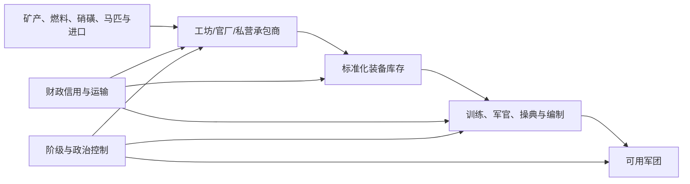

# 兵种、军器与军事现代化

> 文档性质：参考模组兵种/资源专项解析 + 新 Mod 再工业化军事接口  
> 证据等级：脚本事实以 **S1** 标注；新设计以 **D** 标注；疑似缺陷与兼容风险以 **R** 标注。  
> 军功、卫所、五军都督府与军头政治见 [10 军功、卫所与战争政治](10_军功卫所与战争政治.md)。

## 1. 结论先行

参考模组使用三层方法表达军事变化：

1. 以自定义兵士类型表现传统骑步军、火器军、特殊家丁、新军、机枪和近代火炮；
2. 以全局“军器库存”季度结算和平生产、外购、战时消耗与缺装惩罚；
3. 以建立新军决议设置一个政权变量，瞬间关闭旧军招募并开启三种新军。

它证明的可行技术是：CK3 的 `men_at_arms_types`、政权/头衔变量、自定义财政资源、季度 on_action 和角色修正可以拼出“军备—军队”系统。特别是军器短缺能够同时削弱火器、骑步兵、攻城和伤亡控制，已经比单纯加减战斗力更接近后勤系统。

但现有军器产量直接按 `max_military_strength` 计算，等于军队越大就凭空生产越多军器；兵种招募本身并不实际扣除军器；“建立新军”只要求国祚 150 年和 50000 财政，一次点击即可从鸟铳跳到机枪和近代炮。新 Mod 应把它改为**生产能力—标准化—装备库存—训练编制—军队政治归属**五段链，使军事现代化成为再工业化的结果、财政与阶级斗争的焦点，而不是时间到点后的兵种升级。

## 2. 源码导航

| 子系统 | 主要文件/ID | 作用 |
|---|---|---|
| 常规与新军兵种 | `common/men_at_arms_types/zz_yan_maa_types.txt` | 骑军、甲骑、亲军、火器、新军、机枪、火炮等 |
| 家丁/地方特殊兵 | `common/men_at_arms_types/liuguan_maa_types.txt` | 狼兵、苍头、关宁、达兵、倭丁、天雄军 |
| 新军开关 | `common/scripted_triggers/99_yan_triggers.txt`：`is_set_xinjun`、`no_set_xinjun` | 根据 `h_greatming.var:GM_xinjun` 控制兵种可招募性 |
| 建立新军 | `common/decisions/99_yan2_decision.txt`：`GM_bianlian_xinjun` | 国祚与财政门槛，设置新军变量 |
| 军器初始化 | `common/scripted_effects/yan_found_GM_effects.txt` | 初始化库存、收支、外购数量与价格 |
| 军器季度结算 | `common/on_action/yan2_on_action.txt`：`junqi_shouru` | 生产、外购、战时消耗和缺装状态 |
| 军器增减 | `common/scripted_effects/yan_effects.txt`：`add_junqi`、`remove_junqi` | 库存与本季收支记账 |
| 外购/出售界面 | `common/scripted_guis/jingcang_gui.txt` | 调整外购量、出售库存 |
| 军器数值 | `common/script_values/zz_yan_values.txt`、`zz_yan2_values.txt` | 数量、成本、收入和窗口显示 |
| 缺军器惩罚 | `common/modifiers/99_yan_modifiers.txt`：`jundui_quejunqi` | 全军战力、火器和攻城惩罚 |
| 家丁传统 | 同文件：`Army_*` 与 `*_ruwei` | 家族兵种权和皇帝轮戍权 |
| 地方军编成 | `common/scripted_effects/liuguan_effects.txt` | 按头衔层级与发展度自动补充火器军团 |
| 家丁决议 | `common/decisions/liuguan_decision.txt` | 获得家族兵种传统并周期生成军队 |
| 边军轮戍 | `common/character_interactions/liuguan_interaction.txt`：`bianjun_rujing` | 皇帝临时取得特殊兵种招募权 |

精确 ID 与文件行可查：

- [参考模组脚本 ID 定位索引](02_参考模组脚本ID定位索引.md)
- [参考模组源码文件索引](01_参考模组源码文件索引.md)
- [参考模组资产索引](03_参考模组资产索引.md)

## 3. 参考模组兵种谱系

### 3.1 旧制常备军

**S1：** 在尚未设置 `GM_xinjun` 时，明帝、卫所和宗藩按身份可招募以下自定义兵种：

| ID | 定位 | 关键特点 | 主要权限 |
|---|---|---|---|
| `qijun` | 轻骑军 | 追击、掩护较高，平原较强 | 财政制政权，旧制阶段 |
| `jiaqi` | 甲骑 | 高伤害重骑，山地湿地惩罚大 | 非皇帝的卫所/宗藩 |
| `xiaoqi` | 骁骑 | 皇帝专属强化重骑 | 明帝且旧制阶段 |
| `pianxiangche` | 偏厢车 | 极高韧性与掩护，大量克制远射/步兵 | 旧制财政军队 |
| `bujun` | 步军 | 低成本散兵，林地适应 | 旧制财政军队 |
| `qinbin` | 亲兵 | 非皇帝高级步兵 | 卫所/宗藩 |
| `qinjun` | 亲军 | 皇帝专属强化重步兵 | 明帝且旧制阶段 |
| `paoche` | 炮车 | 非主战阶段攻城器械，攻城层级 8 | 旧制或清政权条件 |
| `folangjipao` | 佛郎机炮 | 高平原伤害、低韧性、兼具少量攻城 | 旧制财政军队 |
| `niaochongshou` | 鸟铳手 | 百人编制火器步兵，湿地/冬季受损 | 旧制财政军队 |

常规兵种全部以 `treasury` 支付招募与维护，说明参考模组已经把国家/官府财政与人物私人黄金区分开。

### 3.2 新军兵种

**S1：** 设置 `GM_xinjun` 后开放：

| ID | 定位 | 核心参数与特点 |
|---|---|---|
| `xinjun` | 新军步兵 | 火器类，150 人一叠，伤害约 80，最多 4 个军团，几乎克制所有传统兵种 |
| `xinjun_jiqiang` | 新军机枪 | 每叠 6 人，伤害约 400，对骑兵等克制极高，最多 4 个军团 |
| `xinjun_pao` | 新军火炮 | 每叠 6 门，攻城层级约 48、攻城值约 5，最多 3 个军团 |

这些单位明显用于架空近代化或再工业化阶段，而不是明代常规火器细分。

**R：瞬时替代。** 新旧兵种只由一个布尔开关区分；建立新军后旧兵种的 `can_recruit` 变为不满足，但已经存在的旧兵团不会自动解散或转制。结果是新旧军会并存，却没有训练、换装、军官来源和财政冲突的解释。

### 3.3 家丁与地方军

**S1：** 地方特殊兵种包括：

| ID | 社会/地域原型 | 战场定位 | 权利来源 |
|---|---|---|---|
| `lang_bing` | 土司狼兵 | 山地、森林、丛林散兵 | 土司政府 |
| `cangtou_jun` | 将门苍头/家兵 | 大编制散兵 | `Army_cangtou` 家族修正或轮戍 |
| `guanning_jun` | 关宁铁骑 | 极高伤害重骑 | `Army_guanning` 家族修正或轮戍 |
| `da_bing` | 达兵 | 高追击轻骑 | `Army_dabing` 家族修正或轮戍 |
| `wo_ding` | 降倭夷丁 | 强化重步兵 | `Army_woding` 家族修正或轮戍 |
| `tianxiong_jun` | 天雄军 | 高韧性、高掩护弓兵 | `Army_tianxiong` 家族修正或轮戍 |

这些兵种的 `ai_quality` 多为 1000，AI 会强烈偏好。其可招募性不由文化创新决定，而由政府、家族修正、皇帝轮戍修正，或皇帝廷臣中是否有对应将门决定。

**R：权限外溢。** 皇帝只要廷臣中存在某将门或相关高军职人物，也可能获得特殊兵种招募资格。这很方便，但没有表达该将门是否同意、能否动员兵源，以及兵团究竟忠于皇帝还是将主。

## 4. 地方军团的自动生成

**S1：** `liuguan_effects.txt` 在卫所头衔/任职替换后，按接任者最高头衔层级和领域总发展度，直接创建或升级佛郎机、鸟铳和炮车军团。例如高发展的大型卫所可一次得到多组佛郎机、十余组鸟铳和若干炮车；男爵级则可能只得到少量鸟铳。

这是一种性能友好的抽象：用发展度作为地方财政、人口、工匠和后勤的综合代理，不逐县计算装备生产。

**R：继任即补满。** 军团在头衔转手时创建，容易出现“换官即凭空得到装备”；也可能被反复转任触发，需检查 `create_maa_or_upgrade_regiment_effect` 的上限与去重行为。它没有读取军器库存、地方工坊、战争损失或财政信用。

**D：** 新 Mod 保留“发展度是承载能力”的思路，但只用于计算编制上限。实际建军必须同时满足装备库存、军饷信用和训练时间。

## 5. 军器库存结算

### 5.1 初始化与数据结构

**S1：** 建国初始化创建全局变量：

```text
global_var:junqi_value        # 当前军器库存
global_var:junqi_shouru       # 本季度收入
global_var:junqi_zhichu       # 本季度支出
global_var:buy_junqi_value    # 每季度外购数量
global_var:buy_junqi_price    # 外购单价，初始约 2.5
```

**R：全局单例。** 使用 `global_var` 意味着整个游戏世界只有一套同名库存。若存在多个中国政权、南北朝廷、革命政权或继承政权，它们无法天然拥有独立军器仓库。新 Mod 应把库存放在国家主头衔或政权载体上。

### 5.2 和平产出

**S1：** 明帝季度脉冲 `junqi_shouru` 先把收入设为：

```text
军器季度产出 = 最大军事力量 × 0.02 × 工部加成
工部加成 ≈ 1 + 工部尚书管理能力 ÷ 20
```

如果没有工部尚书，脚本把加成变量设为 0，因此本地产出可降为零。之后把外购量额外加入库存。

**R：因果倒置。** 最大军事力量本应消耗军器，却被当作军器生产基础。扩军会自动增加装备生产，不需要工匠、矿产、燃料、工坊、运输或资本投入。

### 5.3 战时消耗

**S1：** 只要皇帝处于战争且最大军事力量大于零，季度消耗约为：

```text
军器季度消耗 = 最大军事力量 × 0.10
```

因此不考虑实际动员人数、战斗频率、兵种类型或战争前线；一场小规模远方战争也会按全部最大军力消耗。库存小于零时归零并给皇帝添加 `jundui_quejunqi`；库存恢复为正则移除。

**R：边界错误。** 清除短缺使用 `junqi_value > 0`，触发短缺使用 `< 0`，而结算后负数又立刻归零。库存恰好为 0 时可能既不触发新短缺，也不移除旧短缺，状态取决于上一季度。

### 5.4 外购和出售

**S1：** 自定义界面允许调整每季度外购数量，并按 `数量 × 单价` 计算支出。库存还可按外购价九折左右出售。这把海外贸易和军需市场接入了国家资源。

**D：** 新 Mod 把外购来源区分为：海商进口、朝贡贸易、走私、国内承包商和战时盟国援助。它们提供同一种装备数量，但分别增加商人资本、外部依赖、腐败、技术扩散或外交义务。

## 6. 缺军器惩罚

**S1：** `jundui_quejunqi` 是施加在皇帝上的全军修正，效果包括：

- 硬伤亡约 `+50%`；
- 攻城器械攻城效率约 `-35%`；
- 火器伤害、韧性、追击、掩护约 `-65%`；
- 重步、枪兵、弓兵、骑兵、散兵多项伤害/韧性约 `-35%`；
- 部分追击和掩护再受约 `-35%`。

优点是短缺并非只惩罚火器：甲胄、弓弩、马具、火药和维修不足会让全军受损。火器对标准化供给更敏感，因此惩罚更重。

**R：全有或全无。** 库存从 1 降到 0 可能让全军立刻遭受巨大惩罚，库存 1 与库存 100000 在战斗表现上又没有区别。它也没有地方差异、前线优先级和不同装备类别。

**D：** 新 Mod 使用三档供给而不是连续逐兵团运算：

| 装备满足率 | 状态 | 效果方向 |
|---:|---|---|
| ≥100% | 充足 | 正常；可积累战备储备 |
| 60%—99% | 紧张 | 维护费上升，补员慢，火器轻度下降 |
| 20%—59% | 短缺 | 火器和攻城显著下降，伤亡增加 |
| <20% | 崩溃 | 军团失去作战能力，兵变与抢掠风险高 |

只对国家或主要战区计算满足率，不逐支军队实时计算。

## 7. 建立新军决议

### 7.1 参考触发

**S1：** `GM_bianlian_xinjun`：

- 仅明帝可见；
- 要求明朝国祚至少约 150 年；
- 花费约 50000 财政库；
- 效果只是在 `h_greatming` 设置 `GM_xinjun = 0`；
- 该变量存在本身就是“已经建立新军”的布尔判断。

决议没有读取技术、教育、装备库存、工坊、海外接触、政治支持、旧军阻力或战败压力。也没有事件链和 AI 权衡。

### 7.2 游戏性问题

1. **时间门槛代替生产力。** 国祚长不等于具备机床、冶金、化工或军官教育；新兴政权反而永远更难现代化。
2. **一次性财政代替持续产业。** 支付 50000 后，新式单位的后续成本并未绑定工业产能。
3. **机枪与线列步兵同时解锁。** 技术阶段没有层次，玩家缺少中期路线选择。
4. **旧军没有政治反应。** 卫所、将门和既有军官不会因失去预算与地位而结盟反改革。
5. **新军没有忠诚来源。** 新军究竟忠于皇帝、国家、内阁、军官团、党派还是阶级组织没有机制差异。

## 8. 新 Mod 的军事生产链

### 8.1 五段模型



**D：** 每段只用少量聚合变量，不做 Victoria 式逐商品经济：

| 层 | 推荐变量 | 说明 |
|---|---|---|
| 原料 | `strategic_material_access` | 国内、贸易、走私和殖民来源的综合可得性 |
| 产能 | `military_industry_capacity` | 官营工场与民营军需的有效产出 |
| 标准化 | `arms_standardization` | 口径、零件、检验、仓储和维修统一度 |
| 库存 | `arms_stockpile` | 可供换装、补充和战时消耗的装备 |
| 训练 | `training_capacity` | 教官、学校、操典和营地容量 |
| 运输 | `military_logistics` | 粮道、驿路、漕运、港口和铁路阶段能力 |

### 8.2 产出公式

```text
季度装备产出 = 军工产能
               × 原料满足系数
               × 标准化系数
               × 劳动稳定系数
               × 管理/腐败系数

战时装备消耗 = 实际动员规模
               × 兵种装备强度
               × 作战烈度
               × 后勤损耗系数
```

“劳动稳定系数”让工匠、矿工和产业工人的处境进入军事系统：压低工资可短期省钱，却增加怠工、偷盗、罢工和革命组织；提高待遇会增强产业工人力量和政治要求。

## 9. 军事现代化阶段

**D：** 不按固定年份自动升级，使用五个可回退/停滞的阶段：

| 阶段 | 主体兵制 | 技术与组织门槛 | 核心矛盾 |
|---|---|---|---|
| I 卫所—家丁并存 | 军户、亲军、边镇家丁 | 传统工坊和地方供养 | 国家名义军与将门私人控制 |
| II 火器扩散 | 鸟铳、佛郎机、炮车混编 | 海贸/仿制、火药供应、教练 | 火器成本与旧军地位 |
| III 标准化新军 | 制式步枪/火炮、常备编制 | 官厂、标准化、军校、稳定税收 | 中央集权与地方抵制 |
| IV 再工业化军队 | 机枪、现代炮兵、铁路/轮船后勤 | 机器制造、煤铁、化工、资本 | 官营、商办或工人控制 |
| V 群众战争/总体战 | 大规模征兵、政治动员 | 行政渗透、教育、交通、意识形态 | 国家动员与阶级自主性 |

每个阶段都不是必然“更好”：职业新军昂贵且可能政变；群众军廉价且能长期作战，却可能带来社会革命；依赖商办军工扩张快，却让资本家控制国家信用和军需。

## 10. 三条军工所有制路线

### 10.1 官营军工

**优势：** 国家直接控制、标准化较快、危机时优先供军。  
**代价：** 官僚寻租、财政刚性、工匠身份固化、失败时全国一起短缺。  
**政治支持：** 皇权官僚、兵部、部分技术官僚。  
**反对：** 商人资本、地方势力、要求自主的产业工人。

### 10.2 商办与承包制

**优势：** 快速筹资、利用海贸、分散扩产。  
**代价：** 价格操纵、质量参差、战争债务、承包商左右政策。  
**政治支持：** 海商、金融资本、地方士绅和改革派。  
**反对：** 保守官僚、担心商人坐大的皇权派、反剥削组织。

### 10.3 公社/国民或革命军工

**优势：** 高动员、群众维修和分散生产、政治认同强。  
**代价：** 高度依赖意识形态和基层组织，标准化与专业管理可能不足。  
**政治支持：** 工人组织、革命军、基层士兵。  
**反对：** 旧官僚、将门、资本所有者和依赖私有专利的技术集团。

**D：** 三条路线都可赢得战争，但会创造不同的统治联盟。军事现代化不应只有“点科技”，而应改变谁控制工厂、信贷、干部、装备和军队。

## 11. 兵种不作为科技直线

### 11.1 推荐兵种层级

新 Mod 首版只需以下功能类，不必模拟所有历史名号：

| 功能类 | CK3 载体 | 主要依赖 | 政治含义 |
|---|---|---|---|
| 传统卫所步军 | 散兵/枪兵 MAA | 军户与地方粮饷 | 基层世袭军职 |
| 边镇骑兵 | 轻/重骑 MAA | 马政、边镇和将门 | 地方军头力量 |
| 早期火器营 | 火器 MAA | 火药、进口/仿制 | 海贸与技术官僚崛起 |
| 炮车/攻城队 | siege MAA | 重型军器与运输 | 国家财政和工部能力 |
| 标准化新军 | 火器 MAA | 军工、军校、财政信用 | 职业军官集团 |
| 近代炮兵/机枪队 | 小编制高强度 MAA | 再工业化与高维护 | 工业与后勤垄断 |
| 民团/革命武装 | 事件军或低维护 MAA | 群众组织与意识形态 | 士兵/群众自主力量 |

### 11.2 解锁与维持分离

拥有技术只允许“尝试建立”，实际维持还需资源。推荐条件：

```text
can_recruit = 技术知识 + 政治授权 + 至少一处训练基地
effective_strength = 装备满足率 + 军饷信用 + 训练水平 + 忠诚/组织度
```

这样不会因玩家解锁一次创新就永久获得无条件强军。

## 12. 军器、资本主义与阶级变迁

军事需求是资本主义崛起的重要加速器，但不应写成自动进步：

1. 朝廷为战争向商人借款，形成可交易债权与稳定利息阶层；
2. 大额军需合同推动集中生产、雇佣劳动和质量标准；
3. 官厂把工匠从身份义务转为工资劳动，或加强强制劳动；
4. 矿山、运输和港口扩张制造新的产业工人；
5. 承包商可能购买官位、控制舆论并要求财产权保障；
6. 工人也可能因集中劳动、识字和共同风险形成组织；
7. 军事危机为国家强制征用提供理由，也为反战和革命提供群众基础。

**D：** 每次重大扩军至少同时改变两项：`国家财政依赖、商人资本力量、产业工人组织、地方士绅负担、军官集团力量`。玩家不能只拿到战斗加成而不改变社会结构。

## 13. 重大博弈事件模板

### 13.1 海商军火合同

外敌迫近而库存不足。海商可在半年内补齐装备，但要求港口特许、税收抵押和合同司法。接受会救前线并提高资本力量；拒绝可保护官府控制，却可能战败；强征则短期得货、长期摧毁信用和走私网络合作。

### 13.2 官厂工匠罢工/逃亡

扩产和欠饷使工匠组织上升。镇压可恢复短期纪律但降低质量并推动地下组织；加薪提高成本和工人议价；允许自治工场提高积极性，却削弱官僚直接控制。

### 13.3 新旧军换装

装备只够三成部队。优先京营可保首都但激怒边镇；优先前线提高战胜率但增加军头力量；平均分配政治上安全却使所有部队都未形成完整战力；交给军官团决定会提高专业化与军官自治。

### 13.4 军火质量丑闻

战场炸膛或枪械失效。责任可能在承包商偷工、官员贪污、原料封锁或不切实际的赶工命令。公开审判提高制度信用但暴露国家弱点；秘密处理保护威望却让利益网继续存在。

### 13.5 铁路/漕运军事优先

军需运输与民生运输争夺同一能力。军事优先提高前线供给，却推高粮价并激化城市、农民与商人矛盾；民生优先维持社会稳定，却可能丢失战役窗口。

## 14. CK3 技术实现选型

### 14.1 可直接采用

- 自定义 `men_at_arms_types` 表达功能兵种与阶段差异；
- `can_recruit` 读取国家头衔变量、政府旗标、改革阶段和训练基地；
- 兵种的 `buy_cost`、维护费与最大军团数表达财政门槛；
- 国家头衔变量保存库存、产能、标准化与后勤；
- 季度 on_action 统一结算生产、消耗和外购；
- 分档角色修正表达军器满足率；
- 建筑或地产修正只提供产能/训练容量，不直接无限送兵；
- 决议启动改革，事件链决定所有制、军官来源和旧军安置。

### 14.2 需要二次验证

- 当前 CK3/已装 DLC 是否原生提供 `gunpowder`、`musketeer`、`carriage` 等 MAA 类型或由参考模组自行定义；
- `replace_gold_cost_by_treasury` 与自定义 `treasury` 成本在当前版本的精确行为；
- 已存在军团在 `can_recruit` 失效后能否升级、补员以及 AI 是否主动解散；
- 负 100% 招募成本是否有引擎下限；
- 头衔/地产级 MAA 与宫廷职位授予军团的当前版本兼容性；
- “溥天之下”内容包可复用的火器、军服、建筑与界面资产路径。

这些项目统一留到后续的“13 游戏本体与 DLC 技术映射”文档，用本地游戏文件确认。

### 14.3 不建议采用

- 为每个省份、每种枪炮保存库存；
- 每月按每支军团逐个扣装备；
- 用地图全部人物模拟军工劳工；
- 把机枪等终局单位与新军改革一次解锁；
- 使用世界全局变量保存某一个国家的资源；
- 以最大军力作为军器产量；
- 新任地方官自动生成完整装备军团；
- 只用一个严重负面修正在 0/1 库存间跳变。

## 15. 性能预算

**D：** 推荐结算频率和对象：

| 逻辑 | 频率 | 对象上限 |
|---|---|---:|
| 军器生产/消耗 | 每季度 | 每个主要中国政权 1 次 |
| 外购市场价格 | 每年或重大事件后 | 全局 1 次 |
| 军队满足率档位 | 每季度 | 政权 1 次 |
| 兵种改革资格 | 决议打开或年度 | 政权 1 次 |
| 地方训练基地 | 建成/摧毁时更新缓存 | 只处理变化地产 |
| 军工阶级影响 | 每年 | 5—7 个集团 |
| 战役烈度 | 战争开始/重大胜负时更新 | 主要战争 |

不要读取真实每名士兵数量去做连续库存扣除。使用 `实际动员规模档位 × 战争烈度档位 × 兵种结构档位` 即可提供足够策略差异。

## 16. 首版最小可行实现

### 16.1 变量

```text
state.var:arms_stockpile
state.var:military_industry_capacity
state.var:arms_standardization
state.var:training_capacity
state.var:military_logistics
state.var:arms_supply_tier
state.var:army_reform_stage
state.var:military_industry_ownership
```

### 16.2 兵种

- 传统卫所步军；
- 边镇骑兵；
- 早期火器营；
- 炮车；
- 标准化新军；
- 近代炮兵/机枪支援；
- 事件型民团/革命武装。

### 16.3 事件链

1. 军器短缺；
2. 外购合同；
3. 官厂扩建；
4. 新旧军换装；
5. 军官学校；
6. 将门反整编；
7. 工匠/产业工人组织；
8. 新军忠诚归属；
9. 战败倒逼改革；
10. 新军政变或倒向革命。

## 17. 验收标准

1. 军器产量来自军工与原料，而不是军队规模；
2. 招募或维持高装备兵种会真实增加库存压力；
3. 和平储备、战时消耗和外购救急形成可理解的循环；
4. 库存不足有至少三档影响，不在 0/1 间突变；
5. 新军需要生产、训练、财政和政治四类条件；
6. 旧军不会因一次决议无声消失，会形成谈判、抵制或反叛；
7. 军工所有制改变商人、官僚和工人力量；
8. 近代兵种强但维护和后勤脆弱，不能永久一边倒；
9. 多个中国政权各自拥有库存，不共享世界全局变量；
10. AI 能依据外敌、库存、财政信用和政治阻力分阶段改革；
11. 季度结算只处理政权聚合值，不扫描全世界军队与人物；
12. 每一种终局强军都有至少一种政治失控路径。

## 18. 与其他模块的接口

- 财政：军费、战争债、军需合同、关税与价格；
- 工业：矿产、官厂、民营工场、机器制造和运输；
- 阶级：海商/金融资本、技术官僚、产业工人、将门和士兵；
- 意识形态：忠君、国家主义、议会控制、党军和群众军；
- 外交：技术输入、军火禁运、贷款、援助和条约港；
- 战争政治：[10](10_军功卫所与战争政治.md) 决定谁得到新军、谁被裁撤、谁控制装备分配；
- 阶段系统：军事现代化既可推动再工业化，也可因财政崩溃、内战和反改革而回退。
