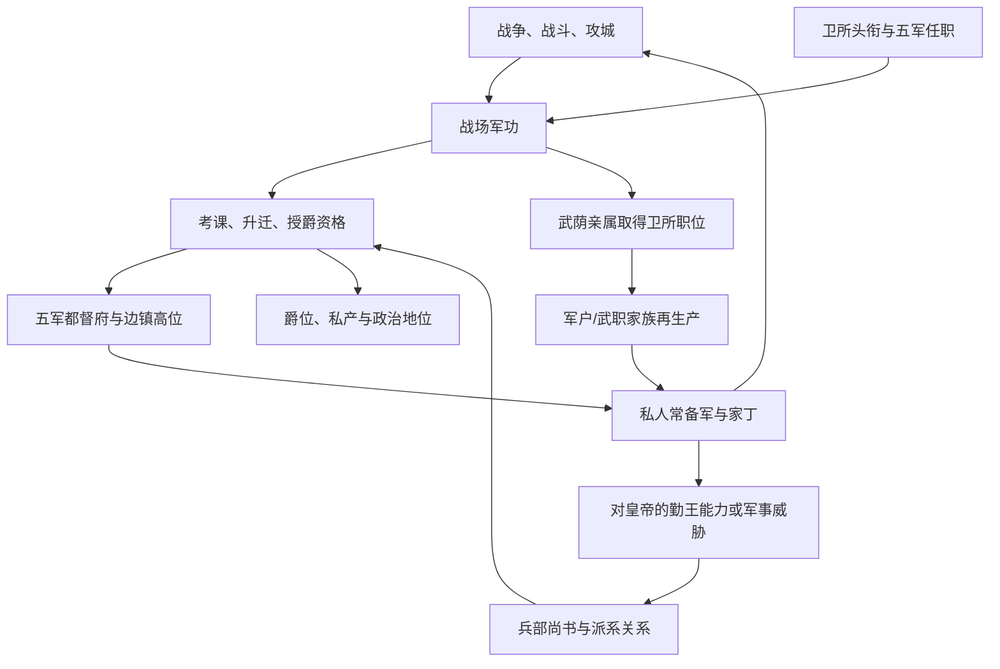

# 军功、卫所与战争政治

> 文档性质：参考模组机制解析 + 新 Mod 制度选型  
> 证据等级：脚本事实以 **S1** 标注；新设计以 **D** 标注；疑似缺陷与兼容风险以 **R** 标注。  
> 兵种、军器库存和新军切换见 [10A 兵种军器与军事现代化](10A_兵种军器与军事现代化.md)。

## 1. 结论先行

参考模组已经实现了一条完整的军事权力再生产链：

1. 战斗、攻城、战争胜负和任职产生或扣除人物军功；
2. 武官按卫所层级、官品、任职年限和出身接受周期考课；
3. 兵部尚书、同党关系和廷推决定谁更快进入高层；
4. 低层卫所采用父系长子继承，高层卫所采用候选池廷推；
5. 另有一套不依赖头衔继承的“世袭武官品级与驻地”人物变量；
6. 五军都督府以五个宫廷职位容纳最高级军头，并直接增强其私人常备军；
7. 军功可使授爵免去巨额财政和皇权成本，也可消耗军功为亲属换取卫所职位；
8. 巡抚、总督能够把家丁兵种固化为家族特权，皇帝再用轮戍把边军临时调入京师。

这套实现最值得复用的并不是具体数值，而是它证明 CK3 可以同时表达：

- 国家官僚体系中的武官仕途；
- 军户和武职家族的代际再生产；
- 皇帝、兵部、五军都督府和边镇之间的任命权竞争；
- 战功如何转换为爵位、职位、家产和私人武装；
- 战争如何改变统治联盟，而不只是改变国境。

它目前的主要问题是：军功可以随官位被动永久增长、授爵时不消耗，军队职位给的是人物私人军事加成，家丁召募又成本低且无补给；因此胜利者会累积成越来越稳定的军事贵族，失败和和平很难侵蚀其权力。新 Mod 应把军功拆为**战场声望、可核验功簿、军中拥护、朝廷承认**四种不同资本，并让它们在和平、欠饷、整编和政争中发生转化与损耗。

## 2. 源码导航

| 子系统 | 主要文件/ID | 作用 |
|---|---|---|
| 军功年度增长 | `common/on_action/GM_value_on_action.txt`：`jungongjishu_yearly_pulse` | 参战、头衔层级和五军职位的年度军功 |
| 战斗军功 | 同文件：`commander_jungong_pulse`、`commander_jungong_pulse_loser` | 胜败时统帅与骑士增减军功 |
| 攻城军功 | 同文件：`pocheng_jungong` | 按同地友军、统帅、军队所有者和骑士分配军功 |
| 战争结果 | 同文件战争结束效果 | 皇帝胜负改变皇权数值 |
| 入口接线 | `common/on_action/yan_on_action.txt` | `on_combat_end_*`、`on_siege_completion`、生日和季度脉冲 |
| 武官考课 | `common/on_action/GM_liuguan_on_action.txt`：`wuguan_kaoke` | 任期、资历、派系与官品驱动升迁 |
| 卫所政府 | `common/governments/99_yan_government_types.txt`：`weisuozhi_government` | 财政、可持有地、军事加成和政府旗标 |
| 卫所继承 | `common/laws/99_yan_succession_laws.txt` | 低级世袭与高级廷推两种继承法 |
| 世袭武职 | `common/on_action/GM_death_on_action.txt`：`shixi_wuguan_death_effect` | 武官品级与驻地在男性宗族亲属间传递 |
| 五军职位 | `common/court_positions/types/99_yan_court_positions.txt`：五个 `court_*jun_position` | 候选、适性、持有者加成和任免后果 |
| 五军候选 | `common/scripted_triggers/liuguan_triggers.txt`：`wujun_character_trigger` | 高级军职候选资格 |
| 五军任命 | `events/shouguan_events.txt`：`shouguan_events.018` | 五席依次补缺、两人廷推、皇帝选择 |
| 授爵 | `common/character_interactions/99_yan_fengjue.txt`：`shouyu_juewei` | 军功、财政、皇权与爵位转换 |
| 武荫 | 同文件：`yinzi_wuzhi` | 消耗军功给亲属换取卫所职位 |
| 功臣与追赠 | 同文件及 `GM_death_on_action.txt` | 生前入阁、死后赠爵和荣典 |
| 家丁与轮戍 | `common/decisions/liuguan_decision.txt`、`common/character_interactions/liuguan_interaction.txt` | 家族兵种特权、召兵和边军入京 |

精确定位可继续使用：

- [参考模组脚本 ID 定位索引](02_参考模组脚本ID定位索引.md)
- [参考模组全事件触发与调用索引](02A_参考模组全事件触发与调用索引.md)
- [参考模组源码文件索引](01_参考模组源码文件索引.md)

## 3. 权力循环总图



**S1：** 参考模组的军事系统不是单向的“打仗得奖励”，而是一个自我强化回路。战功和官位提高升迁、封爵与荫庇能力，荫庇又制造新的武官家族和私人兵力，私人兵力继续提高下一场战争的获利机会。

**D：** 新 Mod 必须在回路中加入反向力量：和平裁军、财政拖欠、功簿核验、军队伤亡、中央整编、地方社会冲突、将领更替和军队政治化。否则长期博弈会退化成最早获胜者永久滚雪球。

## 4. 军功的生成、损失与归属

### 4.1 年度增长

**S1：** `jungongjishu_yearly_pulse` 对成年男性卫所领主以及五军都督府任职者生效。未初始化时先设 `jungong = 0`，之后大致按以下方式增长：

| 条件 | 年度变化 |
|---|---:|
| 参加明帝主导的战争，且没有反抗最高领主 | +1 |
| 王国级军事头衔 | +1.5 |
| 公国级军事头衔 | +1 |
| 伯爵级军事头衔 | +0.5 |
| 男爵级军事头衔 | +0.25 |
| 有领地的五军都督府任职者 | +0.5 |
| 无领地的五军都督府任职者 | +2 |

这意味着军功同时代表真实战功、官职资历和身份威望。和平时期，高级军事领主仍会稳定积累；五军中的无地官员反而积累最快。

**R：概念混合。** “实际战功”和“在位资历”使用同一个永久变量，会让长期任职本身等价于反复获胜。脚本中未见通用上限、和平衰减或功簿争议机制。

### 4.2 战斗胜负

**S1：** 战斗结束通过原生 `on_combat_end_winner` 和 `on_combat_end_loser` 接入：

- 获胜统帅通常 `+2`；若统帅是明帝，则改给皇权约 `+2`；
- 获胜一方符合条件的骑士各约 `+0.5`；
- 失败统帅通常 `-4`；若是明帝，则皇权约 `-5`；
- 失败一方符合条件的骑士各约 `-1`。

奖惩明显不对称：一次败仗抵消约两次胜仗。这个方向适合表现军事声望脆弱，但因为年度被动增长存在，长期高级领主仍可熨平失败。

### 4.3 攻城分功

**S1：** `on_siege_completion` 调用 `pocheng_jungong`。脚本遍历攻城地点上的明方友军：

- 统帅分享约 `2 ÷ 同地友军数量`；
- 军队所有者分享约 `1 ÷ 同地友军数量`；
- 统帅军中的骑士共同分享约 3 点；
- 皇帝本人对应奖励转为皇权；
- 特定情况下可把皇帝军队的功劳记给锦衣卫相关职位持有人；
- 攻陷重要首都还会写入人物记忆。

**R：性能与归属风险。** 每次攻城结束遍历地点上的每支友军，并再次统计/遍历军中人物；大规模叠军时成本较高。以“每支军队”为外层循环也可能令同一攻城产生重复所有者功劳，而不是先确定主攻、督师、协攻三类责任。

### 4.4 战争结果

**S1：** 皇帝作为战争主要方时，战争结局还改变皇权：进攻胜利约 `+10`，防守胜利约 `+5`，无论攻守失败都可能约 `-20`。这使重大外战直接影响国内政治合法性。

**D：** 新 Mod 保留“战争结果改变政权威望”，但不直接用一条皇权值包办。至少分配到：

- 朝廷战争威望；
- 军官集团自信；
- 士兵纪律与忠诚；
- 财政信用；
- 民众战争负担；
- 边镇自治要求。

胜利可能同时提高政权威望和军头要价；失败也可能削弱皇帝，却给主战派、议和派或改革派不同的政治机会。

## 5. 军功如何转化为阶级权力

### 5.1 授爵

**S1：** `shouyu_juewei` 允许皇帝授予多级公、侯、伯爵。军事人物使用军功作为免成本或低成本合法性，大致阈值为：

| 爵位 | 军功门槛 |
|---|---:|
| 一等公 | 80 |
| 二等公 | 75 |
| 一等侯 | 70 |
| 二等侯 | 68 |
| 三等侯 | 65 |
| 一等伯 | 武官约 58；文官约 70 |
| 二等伯 | 武官约 50；文官约 65 |

达到军功或开国皇帝等条件时，授爵可免去常规的巨额内帑和皇权成本。没有相应正当性时，皇帝仍可强封，但大致需要 1500—5000 的财政资源，并损失约 10—35 皇权；受封人还会获得私产。

**R：军功未被消费。** 授爵只检查门槛，通常不扣除军功。同一份累积军功因而可以反复作为政治凭证，也不会因已经兑现为爵位而减少。

### 5.2 武荫

**S1：** `yinzi_wuzhi` 把军功直接转换为亲属职位：

- 约消耗 15 军功，可给家族成员取得男爵级卫所职位；
- 约消耗 30 军功，可取得伯爵级卫所职位；
- 同时转移相应头衔、政府和继承方式。

这是非常清楚的“个人战功资本 → 家族制度资产”转换。它比单纯给子女属性更能表现军事阶层形成。

### 5.3 功臣阁与追赠

**S1：** 军功约 40 可参与功臣相关荣典；死亡时，高军功武官和高官还可能获得赠爵、谥号或其他追荣。相关分支对公、侯、伯和高官使用 35—80 左右阈值。

**R：门槛不一致。** 某些死亡触发的外层资格与内部效果分支使用不同阈值，例如公爵、侯爵条件次序存在 80/60 或 60/70 的不一致，可能导致预期分支不可达或低阶分支先截获。

### 5.4 历史唯物主义解释

军功不是抽象荣誉，而是一种可兑换的政治资本。它之所以有效，是因为军事集团掌握组织化暴力，而朝廷需要用土地、职位、爵位和免税特权换取服从。随着兑换发生：

1. 战争创造新功臣；
2. 功臣要求把临时奖励固定为世袭财产；
3. 后代即使没有同等战功，也通过制度占有职位；
4. 国家军队逐渐被家族关系和地方利益分割；
5. 中央改革必须选择赎买、整编、清洗或承认这些既得利益。

**D：** 新 Mod 把“军功兑现”做成零和政治议程。授爵、赐田、免税、军职世袭、现金犒赏和荣誉勋章的成本不同，支持者也不同。玩家不能用一份军功同时兑换所有收益。

## 6. 卫所政府与两层继承

### 6.1 政府规则

**S1：** `weisuozhi_government` 允许有地和无地玩法，使用财政库资源，并用国库替代部分黄金成本。它以明式城堡为主要持有地，可持有军事、城市、城堡、关隘等多类地产，采用 `weisuo_vassal` 契约。政府修正包括：

- 武力 `+5`；
- 兵士招募成本 `-100%`；
- 从封臣获得月度财政库收入；
- 禁止创建支系，并限制通过子女婚姻形成联盟。

**R：免费招募风险。** `men_at_arms_recruitment_cost = -100` 可能使卫所统治者几乎无门槛扩军；实际效果仍需结合版本定义，但这是高风险平衡值。它也没有同步要求军户、军器、粮饷或训练资源。

### 6.2 低层军户世袭

**S1：** `weisuozhi_succession_law` 用于公国以下的卫所统治者，采用男性、最年长子嗣、单一继承人。它把基层卫所职位表现为军户家族的父系世袭资产。

### 6.3 高层卫所廷推

**S1：** `weisuozhi2_succession_law` 用于伯爵以上的卫所头衔，通过 `generate` 和 `pool_liuguan_succession` 生成继任者，不直接交给长子。这相当于把高层总兵、巡抚/总督级位置视为朝廷委任官，而不是封建领地。

### 6.4 人物变量式世袭武职

**S1：** `shixi_wuguan_death_effect` 另行处理 `shixi_wuguan_pinji` 与 `shixi_wuguan_location`。持有人死亡时，脚本按男性宗族亲属搜索：

1. 儿子、孙子；
2. 兄弟、侄子；
3. 叔伯、堂兄弟等；
4. 庶出、外室等身份降低优先级。

继承者得到原有武官品级、驻地和相关出身，并可能迁往任职地。这使“世袭武职资格”可以与 CK3 实际土地头衔分离。

**D：** 这一实现非常适合复用，但新 Mod 应把它从二元资格升级为三项家族资产：

- `military_household_quota`：可供国家征调的军户份额；
- `hereditary_office_claim`：对某卫所/营镇的任职权；
- `officer_network`：门生、家丁和旧部网络。

它们可以被财政破产、逃户、裁军、军事学校和跨区轮调分别侵蚀，而不是家族成员一继承就完整恢复。

## 7. 武官考课与兵部控制

### 7.1 晋升路径

**S1：** `wuguan_kaoke` 在成年男性卫所统治者生日时运行，按行政层级与武官品级标记升迁。可辨识的路径包括：

- 县级卫所与捕盗县丞；
- 府级游击、清军厅；
- 道级参将、兵备道；
- 巡抚层级副总兵、巡抚；
- 再向更高总兵和中央军职发展。

达到任期和资格时提高官品，并触发授官事件。武进士、进士、勋贵等出身通常升得更快，举人、恩荫居中，其他来源较慢。

### 7.2 党派与兵部尚书

**S1：** 与兵部尚书同党或关系网络相符时，等待时间会明显缩短，有的条件从多年缩至数月。这使兵部并非只提供全局修正，而是真正控制武官职业通道。

**D：** 新 Mod 把升迁判定公开为四个分项：

| 分项 | 代表什么 | 可被谁影响 |
|---|---|---|
| 战绩 | 胜负、守城、后勤、伤亡比 | 前线督师、军中舆论 |
| 资历 | 任期、官学、基层经历 | 官僚制度 |
| 政治可靠 | 对皇帝、内阁、党派或革命组织的忠诚 | 中央政治集团 |
| 组织控制 | 旧部、军户、家丁、军饷渠道 | 将领家族与地方社会 |

晋升某一人会提高对应集团在军队中的力量；压制战绩最强者虽可防军头，也会降低军队职业性。

## 8. 五军都督府

### 8.1 五个宫廷职位

**S1：** 中、左、右、前、后五军职位各只有一个席位，以武力为适性基础，主要分档阈值约为 25。候选可以是：

- 有领地的卫所高级统治者或勋贵；
- 高品级中央无地武官；
- 总兵、边镇将领、退休高级武官等；
- 排除皇室宗亲、现任多数文官职位、失能者和近期被驳回者。

职位向持有人提供大致相同的私人军事修正：

- 兵士维护费约 `-15%`；
- 骑士上限 `+2`；
- 兵士军团上限 `+3`；
- 行军速度 `+10%`；
- 硬伤亡约 `-10%`。

撤职使皇权约 `-25`，说明五军首脑具备很高政治议价能力。

**R：公器私化。** 这些修正落在任职者个人军队上，等于国家最高军事机关直接增强军头私人兵力。若这是有意表现军阀化，需要配套忠诚和叛乱；若目的是中央军令能力，则更适合把加成施加到皇帝、战争参与者或特定国家军团。

### 8.2 补缺流程

**S1：** `shouguan_events.018` 由季度脉冲触发，按中、左、右、前、后固定顺序寻找空缺。兵部尚书组织候选，按流官升迁评分选出前两人，皇帝可任命、退回重推或暂缓。任命后约四日再次触发自己，以继续填下一个空位，最多形成一串五次任命。

低阶有地候选可能被解除地方头衔并迁入京师；王国级大封臣则可能保留领地兼任。这一差别客观上允许最大军头同时掌握边镇和中央职位。

### 8.3 性能与状态风险

**R：候选扫描偏重。** 候选计数会依次遍历封臣、廷臣、外出廷臣及嵌套封臣廷臣，任命事件又使用 `every_living_character` 建候选池。只有空缺时才进入主要逻辑能缓解成本，但季度检查和连续补缺仍应避免全世界扫描。

**R：职位指针回写。** 五军职位撤销逻辑与锦衣卫职位类似：先删除主头衔上的旧持有人变量，随后又可能把被撤职者重新写回，产生陈旧人物指针。

**D：** 新 Mod 使用“领域内缓存候选名单”：每年或职位状态改变时重建一次，补缺事件只读取名单。所有职位人物指针必须在 `on_fire`、死亡、离境、政权更替时统一清理。

## 9. 家丁、边军与中央轮戍

### 9.1 家族兵种特权

**S1：** 巡抚或总督层级的卫所统治者可花费黄金与威望“征募家丁”，随机获得一个永久家族修正，对应苍头军、关宁铁骑、达兵、降倭夷丁或天雄军。随后每 5—10 年可花费约 300—500 黄金生成一支无补给、不可继承的特殊军队。

该权利属于 `house`，不是一名将领的临时能力。家丁因此是家族组织资产。

### 9.2 边军轮戍京师

**S1：** 皇帝可对拥有特殊家丁传统的公国级以上卫所统治者使用 `bianjun_rujing`。花费黄金与威望后，皇帝获得持续八年的对应“入卫”修正，并承担每月约 3.5 黄金成本；特殊兵种的招募条件据此向皇帝开放。

这实现了中央与边镇之间的交换：皇帝用财政换取可直接使用的边军，边镇家族保留兵源与组织传统。

### 9.3 平衡问题

**R：** 家丁军队 `uses_supply = no`，招募成本固定且 AI 权重极高；不同兵种的战斗价值差异很大，却多使用同一成本。家族修正永久存在，又没有军户逃亡、将领死亡、欠饷、地方冲突或被中央拆分的机制。

**D：** 新 Mod 将家丁定义为“依附关系”而不是凭空军团：

- 兵源来自军户、佃户、矿工、流民或招募市场；
- 维持依赖土地收益、军饷和首领威望；
- 连续作战会消耗家丁组织度；
- 中央轮戍会提高皇帝控制，也会令边镇担心被夺兵；
- 返乡后可带回军饷、武器、思想和政治经验；
- 长期欠饷可能转为兵变、抢掠、投靠地方豪强或革命力量。

## 10. 参考实现的系统性评价

| 维度 | 可复用之处 | 主要问题 | 新 Mod 处理 |
|---|---|---|---|
| 战争政治 | 战胜、战败、攻城都产生国内后果 | 归因较粗，皇权单值化 | 分战争威望、军中拥护、财政信用与民众负担 |
| 军功 | 可用于封爵与武荫 | 被动增长、几乎不衰减、封爵不消耗 | 功簿核验、争功、兑现后扣除、和平衰减 |
| 卫所 | 政府与继承法共同表达制度 | 免费招募、资源约束弱 | 军户、军器、粮饷、训练四项约束 |
| 武官仕途 | 任期、出身、兵部、党派均参与 | 晋升结果仍偏个人数值 | 每次晋升改变集团力量与军队专业化 |
| 五军都督府 | 五席、廷推、补缺流程清楚 | 全局扫描、职位加成私人化 | 缓存候选，区分军令权与私人军权 |
| 家丁 | 家族特权与中央轮戍形成政治交易 | 永久、低成本、无补给 | 兵源与供养基础可损耗，轮戍有双向风险 |
| AI | 多数决策有主动权重 | 缺少势力与财政风险判断 | 按安全、财政、派系、战争威胁算效用 |

## 11. 新 Mod 的军事权力模型

### 11.1 五项国家级状态

**D：** 推荐只保留五个宏观军事变量，避免人物级模拟爆炸：

| 变量 | 0—100 含义 | 高值好处 | 高值风险 |
|---|---|---|---|
| `army_professionalism` 职业化 | 训练、军官教育、标准操典 | 战斗稳定、伤亡较低 | 军官集团形成共同利益 |
| `central_command` 中央军令 | 编制、任命、调动由中央控制 | 集中用兵、反军阀 | 地方反应迟缓、政变收益高 |
| `military_fiscal_credit` 军事财政信用 | 国家按时供给粮饷军器 | 忠诚和补员稳定 | 财政被军事预算锁定 |
| `officer_corporatism` 军官集团化 | 军官共同身份与互助网络 | 专业意见和组织效率 | 抵制文官、形成军政集团 |
| `soldier_politicization` 士兵政治化 | 士兵对国家/阶级/意识形态的认同 | 可形成新式动员 | 兵变、革命或军人干政 |

### 11.2 四种军事政治资本

人物层面只对重要将领保存：

| 资本 | 来源 | 衰减 | 用途 |
|---|---|---|---|
| 战场声望 | 胜利、守城、冒险指挥 | 败仗和长期离军 | 争取前线服从、舆论支持 |
| 核验功簿 | 督师、兵部、监察机构确认 | 被翻案或发现冒功 | 合法升迁、封赏和荣典 |
| 军中拥护 | 旧部、分饷、共同伤亡 | 调任、欠饷、拆编 | 政变、抗命、护驾或倒戈 |
| 朝廷承认 | 皇帝/内阁/议政机构任命 | 政权更替、罢官 | 合法军令与国家预算 |

这样，一个百战名将可以军中拥护极高却不被朝廷承认；一个京官也可凭政治关系获得高承认却缺乏部队服从。博弈来自两者错位。

### 11.3 军事集团

**D：** 不逐个模拟普通士兵，使用 5—7 个政治集团：

1. 京营/亲军；
2. 边镇武官；
3. 卫所军户与基层武职家族；
4. 家丁与将门；
5. 文官兵部—督抚系统；
6. 新式军官和军事学堂；
7. 起义军、民团或革命武装（按阶段解锁）。

每组记录 `力量、组织度、对政权态度、改革立场、主要领袖`。人物只作为集团代理人，避免为全地图军官保存大量变量。

## 12. 重大事件博弈模板

### 12.1 边镇大捷后的封赏危机

**触发：** 对外重大胜利，某边将战场声望和军中拥护很高，朝廷财政紧张。  
**各方诉求：** 将领要爵位和军饷；兵部要调任分权；皇帝要功劳归于圣断；文官党派担心武人坐大；士兵要求兑现欠饷。  
**选择：** 足额封赏、只给虚衔、调入京师、拆分旧部、监察军功、发动舆论抹黑。  
**长期结果：** 形成忠诚功臣、财政透支、军头集团、兵变种子或专业军官制度。

### 12.2 欠饷与军器短缺

**触发：** 战争持续、军事财政信用低、装备供给不足。  
**博弈：** 户部主张缩军，兵部要求追加，地方士绅拒绝加派，商人愿意贷款但索要特许，士兵可能抢掠。  
**非一边倒：** 商业军需可迅速救急，却提高承包商与金融资本的权力；加税可能挽救前线，却推动农村反抗。

### 12.3 新军整编

**触发：** 新式军备与训练条件成熟。  
**博弈：** 是从旧卫所抽调、公开招募、雇佣失地农民，还是吸收家丁？由皇帝、内阁、地方督抚或新式军官控制？  
**风险：** 整编旧军降低短期战力；完全绕过旧军则使其成为反改革联盟；高政治教育会提升士兵动员，也可能产生独立革命主体。

### 12.4 勤王与政变

**触发：** 宫廷危机、继承危机或首都兵变。  
**玩家问题：** 哪些军队愿意来、多久到、谁支付、进京后是否撤离？  
**结果：** 勤王成功并不等于危机结束；进京军头可索取任命、清洗政敌、控制京营或扶立新君。

## 13. AI 决策边界

**D：** 军事 AI 不读取完整历史，只按可解释效用打分：

```text
任命效用 = 能力 + 政治可靠 + 派系收益 + 军中服从 - 军头威胁 - 财政成本
整编效用 = 外部威胁 + 旧军腐化 + 技术优势 - 既得利益反扑 - 短期战力损失
兵变倾向 = 欠饷 + 高伤亡 + 领袖动员 + 意识形态 - 镇压能力 - 合法性 - 已兑现利益
```

不同人格只调整权重。理性皇帝也可能容忍军头，因为外部战争的即时威胁高于未来政变风险；军头也可能忠诚，因为国家财政和爵位仍是其家族再生产的最佳渠道。

## 14. 性能与实现选型

### 14.1 推荐使用

- 原生战斗、围城和战争结束 on_action，只处理统帅、战争主要方和少量关键骑士；
- 宫廷职位表达兵部、五军、督师和新军首脑；
- 人物变量只给重要将领保存四种政治资本；
- `house_modifier` 表达将门传统，但增加期限或可损耗等级；
- 标题/政权变量保存五项宏观军事状态；
- 每季度处理财政与军器，每年处理集团力量与候选缓存；
- 重大任命和整编用事件链，不用每月全世界遍历。

### 14.2 禁止或严格限制

- 每次战斗遍历全部参战人物并长期保存变量；
- 季度 `every_living_character` 搜索候选；
- 无补给、无持续维护的永久特殊军团；
- 用一个军功变量同时表示能力、声望、合法性和部队忠诚；
- 让职位直接无限提高私人军团上限；
- 用 `random_list` 决定不可逆的家族军事传统而不给玩家信息与选择；
- 不清理人物/头衔变量指针。

### 14.3 建议缓存结构

```text
h_greatming.var:military_state_*           # 五项国家状态
h_greatming.var:military_candidate_list    # 年度重建的高阶候选
h_greatming.var:military_group_*            # 5—7个集团状态
important_general.var:battle_reputation     # 重要将领才有
important_general.var:verified_merit
important_general.var:troop_support
important_general.var:court_recognition
house.modifier:military_house_tier_N         # 可降级的将门传统
```

## 15. 实现验收标准

1. 打赢战争后，玩家必须面对封赏、财政和军头坐大的至少两项代价；
2. 打输战争不会只有数值惩罚，而会改变主战/议和、中央/地方和旧军/新军力量；
3. 军功兑现一次后不能无限重复使用；
4. 低层武职能够世袭，但军户逃亡和制度改革可以侵蚀它；
5. 高层任命同时考虑能力、政治可靠和军中控制，三者不能由一个属性代替；
6. 五军/兵部职位变化能够改变真实调兵或预算权，而不只是人物战斗加成；
7. 家丁和边军需要供养，有可能拒调、兵变或转化为国家军；
8. AI 能在外敌压力下容忍军头，也能在和平时尝试削藩整军；
9. 单次战斗和季度脉冲不进行全世界人物扫描；
10. 任何死亡、撤职、政权更替都清理职位指针和候选缓存。

## 16. 本模块对后续策划的接口

- 向财政模块输出：军饷、军器、赏银、爵禄与战争债务；
- 向阶级模块输出：军户、将门、职业军官、士兵和军需商人力量；
- 向改革模块输出：卫所清丈、募兵制、军官学校、中央军令、新军政治教育；
- 向意识形态模块输出：忠君军、国家军、党军、地方军和阶级军的忠诚对象；
- 向革命模块输出：士兵政治化、兵变、倒戈、军政权和武装群众；
- 向重大事件模块输出：边镇大捷、欠饷、勤王、政变、整编与战败危机；
- 向 [10A](10A_兵种军器与军事现代化.md) 输出：谁控制军器、谁有权建立何种军队，以及新军为何可能成为独立政治力量。
